# Design Modelling

## UML Models Overview

This document provides the complete set of UML architectural and behavioral models for the **Unified Patient Access & Clinical Intelligence Platform**. The diagrams translate the functional requirements defined in [spec.md](.propel/context/docs/spec.md) and the architectural decisions captured in [design.md](.propel/context/docs/design.md) into visual representations.

**Document Navigation:**

- **Architectural Views** — Static structure: System Context, Component, Deployment, Data Flow, and ERD diagrams derived from `design.md` decisions (AD-1 through AD-9, TR-001 through TR-022).
- **AI Architecture Diagrams** — RAG Pipeline and Trust-First verification flow, derived from `design.md` AIR requirements and Hybrid pattern selection.
- **Use Case Sequence Diagrams** — Dynamic behavioral flows: one Mermaid `sequenceDiagram` per use case (UC-001 through UC-012) from `spec.md`.

---

## Architectural Views

### System Context Diagram

Depicts the system boundary, its primary function, and its interactions with external actors and third-party services. Aligns with AG-2 (HIPAA by Design), AG-4 (Free-Tier Deployability), and NFR-006 (RBAC).

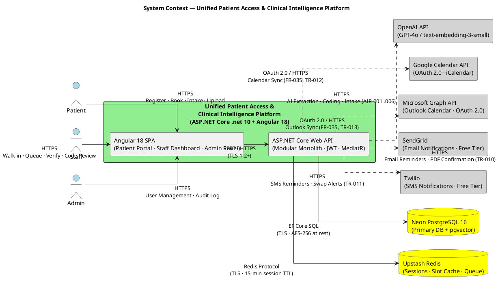
```plantuml
@startuml SystemContext-UnifiedPatientPlatform
left to right direction
skinparam componentStyle rectangle
skinparam linetype ortho

title System Context — Unified Patient Access & Clinical Intelligence Platform

actor Patient #LightBlue
actor Staff #LightBlue
actor Admin #LightBlue

rectangle "Unified Patient Access &\nClinical Intelligence Platform\n(ASP.NET Core .net 10 + Angular 18)" #LightGreen {
  component "Angular 18 SPA\n(Patient Portal · Staff Dashboard · Admin Panel)" as FE
  component "ASP.NET Core Web API\n(Modular Monolith · JWT · MediatR)" as BE
}

component "OpenAI API\n(GPT-4o / text-embedding-3-small)" as OpenAI #LightGray
component "Google Calendar API\n(OAuth 2.0 · iCalendar)" as GCal #LightGray
component "Microsoft Graph API\n(Outlook Calendar · OAuth 2.0)" as MSGraph #LightGray
component "SendGrid\n(Email Notifications · Free Tier)" as SendGrid #LightGray
component "Twilio\n(SMS Notifications · Free Tier)" as Twilio #LightGray

database "Neon PostgreSQL 16\n(Primary DB + pgvector)" as PostgreSQL #Yellow
database "Upstash Redis\n(Sessions · Slot Cache · Queue)" as Redis #Yellow

Patient --> FE : HTTPS\nRegister · Book · Intake · Upload
Staff --> FE : HTTPS\nWalk-in · Queue · Verify · Code Review
Admin --> FE : HTTPS\nUser Management · Audit Log

FE --> BE : REST / HTTPS\n(TLS 1.2+)

BE --> PostgreSQL : EF Core SQL\n(TLS · AES-256 at rest)
BE --> Redis : Redis Protocol\n(TLS · 15-min session TTL)

BE ..> OpenAI : HTTPS\nAI Extraction · Coding · Intake (AIR-001..006)
BE ..> GCal : OAuth 2.0 / HTTPS\nCalendar Sync (FR-035, TR-012)
BE ..> MSGraph : OAuth 2.0 / HTTPS\nOutlook Sync (FR-035, TR-013)
BE ..> SendGrid : HTTPS\nEmail Reminders · PDF Confirmation (TR-010)
BE ..> Twilio : HTTPS\nSMS Reminders · Swap Alerts (TR-011)

@enduml
```

---

### Component Architecture Diagram

Shows the modular monolith internal structure (AD-1), CQRS-via-MediatR boundaries (AD-2), and cross-cutting concerns through the API Gateway (AD-4). Aligns with NFR-001, NFR-006, NFR-016, TR-002, TR-019.

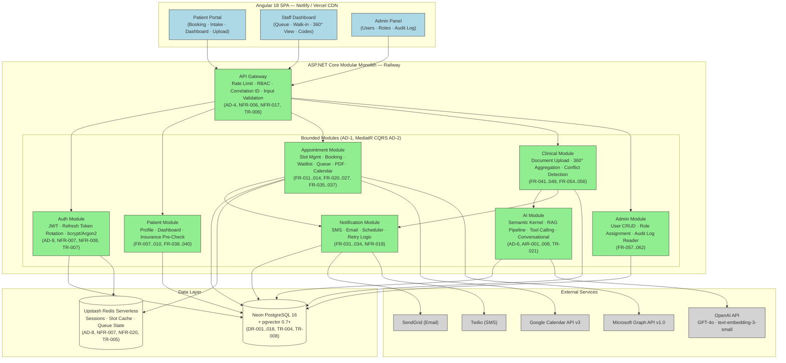
```mermaid
graph TB
    subgraph FrontendLayer["Angular 18 SPA — Netlify / Vercel CDN"]
        PatientUI["Patient Portal\n(Booking · Intake · Dashboard · Upload)"]
        StaffUI["Staff Dashboard\n(Queue · Walk-in · 360° View · Codes)"]
        AdminUI["Admin Panel\n(Users · Roles · Audit Log)"]
    end

    subgraph BackendLayer["ASP.NET Core Modular Monolith — Railway"]
        AG["API Gateway\nRate Limit · RBAC · Correlation ID · Input Validation\n(AD-4, NFR-006, NFR-017, TR-006)"]

        subgraph Modules["Bounded Modules (AD-1, MediatR CQRS AD-2)"]
            AuthMod["Auth Module\nJWT · Refresh Token Rotation · bcrypt/Argon2\n(AD-9, NFR-007, NFR-008, TR-007)"]
            PatientMod["Patient Module\nProfile · Dashboard · Insurance Pre-Check\n(FR-007..010, FR-038..040)"]
            ApptMod["Appointment Module\nSlot Mgmt · Booking · Waitlist · Queue · PDF · Calendar\n(FR-011..014, FR-020..027, FR-035..037)"]
            ClinicalMod["Clinical Module\nDocument Upload · 360° Aggregation · Conflict Detection\n(FR-041..049, FR-054..056)"]
            AIMod["AI Module\nSemantic Kernel · RAG Pipeline · Tool Calling · Conversational\n(AD-6, AIR-001..008, TR-021)"]
            NotifMod["Notification Module\nSMS · Email · Scheduler · Retry Logic\n(FR-031..034, NFR-018)"]
            AdminMod["Admin Module\nUser CRUD · Role Assignment · Audit Log Reader\n(FR-057..062)"]
        end
    end

    subgraph DataLayer["Data Layer"]
        PG[("Neon PostgreSQL 16\n+ pgvector 0.7+\n(DR-001..018, TR-004, TR-008)")]
        RDS[("Upstash Redis Serverless\nSessions · Slot Cache · Queue State\n(AD-8, NFR-007, NFR-020, TR-005)")]
    end

    subgraph ExternalServices["External Services"]
        OpenAI["OpenAI API\nGPT-4o · text-embedding-3-small"]
        GCal["Google Calendar API v3"]
        MSGraph["Microsoft Graph API v1.0"]
        SG["SendGrid (Email)"]
        TW["Twilio (SMS)"]
    end

    PatientUI & StaffUI & AdminUI --> AG

    AG --> AuthMod
    AG --> PatientMod
    AG --> ApptMod
    AG --> ClinicalMod
    AG --> AdminMod

    ClinicalMod --> AIMod
    ApptMod --> NotifMod
    ClinicalMod --> NotifMod

    AuthMod & PatientMod & ApptMod & ClinicalMod & AIMod & NotifMod & AdminMod --> PG
    AuthMod & ApptMod --> RDS

    AIMod --> OpenAI
    ApptMod --> GCal
    ApptMod --> MSGraph
    NotifMod --> SG
    NotifMod --> TW

    classDef frontend fill:#add8e6,stroke:#333
    classDef backend fill:#90ee90,stroke:#333
    classDef data fill:#ffffe0,stroke:#333
    classDef external fill:#d3d3d3,stroke:#333
    class PatientUI,StaffUI,AdminUI frontend
    class AG,AuthMod,PatientMod,ApptMod,ClinicalMod,AIMod,NotifMod,AdminMod backend
    class PG,RDS data
    class OpenAI,GCal,MSGraph,SG,TW external
```

---

### Deployment Architecture Diagram

Represents the Phase 1 cloud-landing-zone deployment across free-tier platforms. Aligns with AG-4 (Free-Tier Deployability), TR-014, TR-015, TR-016, TR-022, NFR-003, NFR-004, NFR-005.

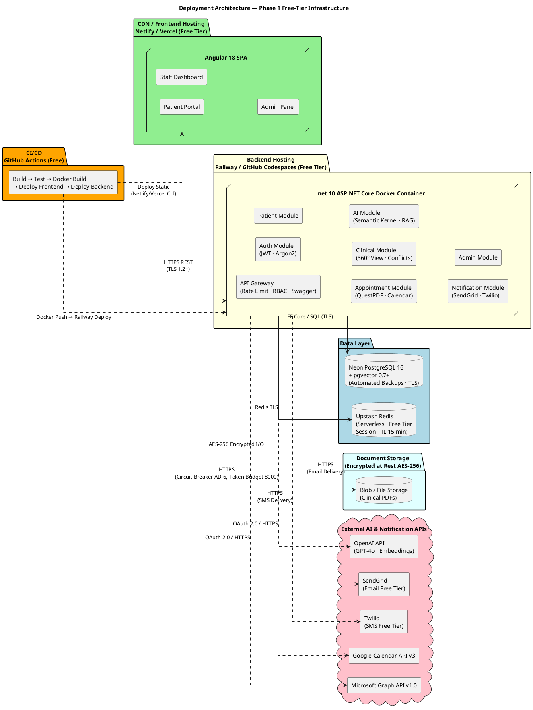
```plantuml
@startuml DeploymentArchitecture
left to right direction
skinparam componentStyle rectangle
skinparam linetype ortho

title Deployment Architecture — Phase 1 Free-Tier Infrastructure

package "CDN / Frontend Hosting\nNetlify / Vercel (Free Tier)" #LightGreen {
  node "Angular 18 SPA" as FE {
    component "Patient Portal" as FEP
    component "Staff Dashboard" as FES
    component "Admin Panel" as FEA
  }
}

package "Backend Hosting\nRailway / GitHub Codespaces (Free Tier)" #LightYellow {
  node ".net 10 ASP.NET Core Docker Container" as BE {
    component "API Gateway\n(Rate Limit · RBAC · Swagger)" as AGW
    component "Auth Module\n(JWT · Argon2)" as AuthC
    component "Patient Module" as PatC
    component "Appointment Module\n(QuestPDF · Calendar)" as ApptC
    component "Clinical Module\n(360° View · Conflicts)" as ClinC
    component "AI Module\n(Semantic Kernel · RAG)" as AIC
    component "Notification Module\n(SendGrid · Twilio)" as NotC
    component "Admin Module" as AdmC
  }
}

package "Data Layer" #LightBlue {
  database "Neon PostgreSQL 16\n+ pgvector 0.7+\n(Automated Backups · TLS)" as PGDB
  database "Upstash Redis\n(Serverless · Free Tier\nSession TTL 15 min)" as RDS
}

package "Document Storage\n(Encrypted at Rest AES-256)" #LightCyan {
  database "Blob / File Storage\n(Clinical PDFs)" as DocStore
}

cloud "External AI & Notification APIs" #Pink {
  component "OpenAI API\n(GPT-4o · Embeddings)" as OAPI
  component "SendGrid\n(Email Free Tier)" as SG
  component "Twilio\n(SMS Free Tier)" as TW
  component "Google Calendar API v3" as GCAL
  component "Microsoft Graph API v1.0" as MSG
}

package "CI/CD\nGitHub Actions (Free)" #Orange {
  component "Build → Test → Docker Build\n→ Deploy Frontend → Deploy Backend" as CICD
}

FE --> BE : HTTPS REST\n(TLS 1.2+)
BE --> PGDB : EF Core / SQL (TLS)
BE --> RDS : Redis TLS
BE --> DocStore : AES-256 Encrypted I/O
BE ..> OAPI : HTTPS\n(Circuit Breaker AD-6, Token Budget 8000)
BE ..> SG : HTTPS\n(Email Delivery)
BE ..> TW : HTTPS\n(SMS Delivery)
BE ..> GCAL : OAuth 2.0 / HTTPS
BE ..> MSG : OAuth 2.0 / HTTPS
CICD ..> FE : Deploy Static\n(Netlify/Vercel CLI)
CICD ..> BE : Docker Push → Railway Deploy

@enduml
```

#### Enhanced Deployment Details

> **Note:** No `infra-spec.md` has been generated for this project yet. The table below reflects Phase 1 free-tier targets derived from `design.md` Technical Requirements.

| Component        | Specification                                                             | Source                   |
| ---------------- | ------------------------------------------------------------------------- | ------------------------ |
| Frontend CDN     | Netlify / Vercel free tier, global CDN, LCP < 2.5s                        | TR-014, NFR-012          |
| Backend Compute  | Railway / GitHub Codespaces, stateless .net 10 Docker container            | TR-015, NFR-016          |
| Primary Database | Neon PostgreSQL 16 free tier, pgvector extension, automated daily backups | TR-004, DR-012           |
| Vector Store     | pgvector 0.7+ co-located in Neon PostgreSQL                               | TR-008, AIR-R01          |
| Cache / Sessions | Upstash Redis serverless, 15-min TTL, slot staleness ≤ 5s                 | TR-005, NFR-007, NFR-020 |
| AI Inference     | OpenAI API (GPT-4o), Azure OpenAI for HIPAA BAA production path           | TR-009, AIR-S01          |
| Email            | SendGrid free tier, retry logic, graceful degradation                     | TR-010, NFR-018          |
| SMS              | Twilio free tier, retry once on failure                                   | TR-011, NFR-018          |
| CI/CD            | GitHub Actions free tier, xUnit + Playwright gates                        | TR-016, TR-017           |

---

### Data Flow Diagram

Shows how data moves from external actors through processing layers into data stores. Derived from design.md AD-3 (Event-Driven Async), AD-7 (Immutable Audit), and DR-001 through DR-018.

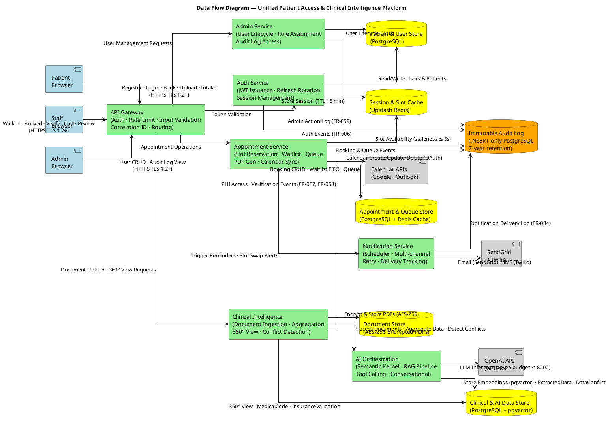
```plantuml
@startuml DataFlowDiagram
!define PROCESS rectangle
!define DATASTORE database
!define EXTERNAL component

left to right direction
skinparam linetype ortho

title Data Flow Diagram — Unified Patient Access & Clinical Intelligence Platform

EXTERNAL "Patient\nBrowser" as P #LightBlue
EXTERNAL "Staff\nBrowser" as S #LightBlue
EXTERNAL "Admin\nBrowser" as A #LightBlue
EXTERNAL "OpenAI API\n(GPT-4o)" as AI_EXT #LightGray
EXTERNAL "SendGrid\n/ Twilio" as NOTIF_EXT #LightGray
EXTERNAL "Calendar APIs\n(Google · Outlook)" as CAL_EXT #LightGray

PROCESS "API Gateway\n(Auth · Rate Limit · Input Validation\nCorrelation ID · Routing)" as AGW #LightGreen
PROCESS "Auth Service\n(JWT Issuance · Refresh Rotation\nSession Management)" as AUTH #LightGreen
PROCESS "Appointment Service\n(Slot Reservation · Waitlist · Queue\nPDF Gen · Calendar Sync)" as APPT #LightGreen
PROCESS "Clinical Intelligence\n(Document Ingestion · Aggregation\n360° View · Conflict Detection)" as CLIN #LightGreen
PROCESS "AI Orchestration\n(Semantic Kernel · RAG Pipeline\nTool Calling · Conversational)" as AIO #LightGreen
PROCESS "Notification Service\n(Scheduler · Multi-channel\nRetry · Delivery Tracking)" as NS #LightGreen
PROCESS "Admin Service\n(User Lifecycle · Role Assignment\nAudit Log Access)" as ADM #LightGreen

DATASTORE "Patient & User Store\n(PostgreSQL)" as PatDB #Yellow
DATASTORE "Appointment & Queue Store\n(PostgreSQL + Redis Cache)" as ApptDB #Yellow
DATASTORE "Clinical & AI Data Store\n(PostgreSQL + pgvector)" as ClinDB #Yellow
DATASTORE "Document Store\n(AES-256 Encrypted PDFs)" as DocStore #Yellow
DATASTORE "Immutable Audit Log\n(INSERT-only PostgreSQL\n7-year retention)" as AuditDB #Orange
DATASTORE "Session & Slot Cache\n(Upstash Redis)" as Cache #Yellow

P --> AGW : Register · Login · Book · Upload · Intake\n(HTTPS TLS 1.2+)
S --> AGW : Walk-in · Arrived · Verify · Code Review\n(HTTPS TLS 1.2+)
A --> AGW : User CRUD · Audit Log View\n(HTTPS TLS 1.2+)

AGW --> AUTH : Token Validation
AUTH --> PatDB : Read/Write Users & Patients
AUTH --> Cache : Store Session (TTL 15 min)
AUTH --> AuditDB : Auth Events (FR-006)

AGW --> APPT : Appointment Operations
APPT --> ApptDB : Booking CRUD · Waitlist FIFO · Queue
APPT --> Cache : Slot Availability (staleness ≤ 5s)
APPT --> NS : Trigger Reminders · Slot Swap Alerts
APPT --> CAL_EXT : Calendar Create/Update/Delete (OAuth)
APPT --> AuditDB : Booking & Queue Events

AGW --> CLIN : Document Upload · 360° View Requests
CLIN --> DocStore : Encrypt & Store PDFs (AES-256)
CLIN --> AIO : Process Documents · Aggregate Data · Detect Conflicts
AIO --> AI_EXT : LLM Inference (token budget ≤ 8000)
AIO --> ClinDB : Store Embeddings (pgvector) · ExtractedData · DataConflict
CLIN --> ClinDB : 360° View · MedicalCode · InsuranceValidation
CLIN --> AuditDB : PHI Access · Verification Events (FR-057, FR-058)

NS --> NOTIF_EXT : Email (SendGrid) · SMS (Twilio)
NS --> AuditDB : Notification Delivery Log (FR-034)

AGW --> ADM : User Management Requests
ADM --> PatDB : User Lifecycle CRUD
ADM --> AuditDB : Admin Action Log (FR-059)

@enduml
```

---

### Logical Data Model (ERD)

Represents all 16 domain entities defined in `design.md` Core Entities, their key attributes, and cardinality relationships. Aligns with DR-009 (referential integrity), DR-010 (soft delete), TR-003 (EF Core).

```mermaid
erDiagram
    PATIENT {
        uuid id PK
        string name
        string email UK
        string phone
        date dateOfBirth
        string passwordHash
        bool emailVerified
        string status
        timestamp createdAt
    }

    USER {
        uuid id PK
        string email UK
        string passwordHash
        string role
        string status
        timestamp lastLoginAt
        timestamp createdAt
    }

    SPECIALTY {
        uuid id PK
        string name
        string description
    }

    APPOINTMENT {
        uuid id PK
        uuid patientId FK
        uuid specialtyId FK
        uuid createdBy FK
        date date
        time timeSlotStart
        time timeSlotEnd
        string status
        string cancellationReason
        timestamp createdAt
    }

    WAITLIST_ENTRY {
        uuid id PK
        uuid patientId FK
        uuid currentAppointmentId FK
        date preferredDate
        string preferredTimeSlot
        timestamp enrolledAt
        string status
    }

    INTAKE_RECORD {
        uuid id PK
        uuid patientId FK
        uuid appointmentId FK
        string source
        jsonb demographics
        jsonb medicalHistory
        jsonb symptoms
        jsonb medications
        timestamp completedAt
    }

    CLINICAL_DOCUMENT {
        uuid id PK
        uuid patientId FK
        string fileName
        int fileSize
        string storagePath
        string mimeType
        string processingStatus
        timestamp uploadedAt
    }

    EXTRACTED_DATA {
        uuid id PK
        uuid documentId FK
        uuid patientId FK
        string dataType
        string fieldName
        string value
        decimal confidence
        int sourcePageNumber
        string sourceTextSnippet
    }

    DATA_CONFLICT {
        uuid id PK
        uuid patientId FK
        string fieldName
        string value1
        uuid sourceDocumentId1 FK
        string value2
        uuid sourceDocumentId2 FK
        string resolutionStatus
        string resolvedValue
        uuid resolvedBy FK
        timestamp resolvedAt
    }

    MEDICAL_CODE {
        uuid id PK
        uuid patientId FK
        string codeType
        string code
        string description
        decimal confidence
        uuid sourceDocumentId FK
        string verificationStatus
        uuid verifiedBy FK
        timestamp verifiedAt
    }

    AUDIT_LOG {
        uuid id PK
        uuid userId FK
        string action
        string entityType
        uuid entityId
        jsonb details
        string ipAddress
        timestamp timestamp
    }

    NOTIFICATION {
        uuid id PK
        uuid patientId FK
        uuid appointmentId FK
        string channel
        string templateType
        string status
        timestamp sentAt
        int retryCount
        timestamp lastRetryAt
    }

    INSURANCE_VALIDATION {
        uuid id PK
        uuid patientId FK
        string providerName
        string insuranceId
        string result
        timestamp validatedAt
    }

    QUEUE_ENTRY {
        uuid id PK
        uuid patientId FK
        uuid appointmentId FK
        int position
        timestamp arrivalTime
        string status
    }

    CALENDAR_SYNC {
        uuid id PK
        uuid patientId FK
        uuid appointmentId FK
        string provider
        string externalEventId
        string syncStatus
        timestamp syncedAt
    }

    NO_SHOW_RISK {
        uuid id PK
        uuid appointmentId FK
        decimal score
        jsonb factors
        timestamp calculatedAt
    }

    PATIENT ||--o{ APPOINTMENT : "books"
    PATIENT ||--o{ WAITLIST_ENTRY : "enrolls"
    PATIENT ||--o{ INTAKE_RECORD : "completes"
    PATIENT ||--o{ CLINICAL_DOCUMENT : "uploads"
    PATIENT ||--o{ EXTRACTED_DATA : "has"
    PATIENT ||--o{ DATA_CONFLICT : "has"
    PATIENT ||--o{ MEDICAL_CODE : "has"
    PATIENT ||--o{ NOTIFICATION : "receives"
    PATIENT ||--o{ INSURANCE_VALIDATION : "undergoes"
    PATIENT ||--o{ QUEUE_ENTRY : "has"
    PATIENT ||--o{ CALENDAR_SYNC : "syncs"

    SPECIALTY ||--o{ APPOINTMENT : "categorizes"
    USER ||--o{ AUDIT_LOG : "generates"

    APPOINTMENT ||--o{ NOTIFICATION : "triggers"
    APPOINTMENT ||--o{ WAITLIST_ENTRY : "linked via"
    APPOINTMENT ||--|| QUEUE_ENTRY : "has"
    APPOINTMENT ||--|| NO_SHOW_RISK : "assessed by"
    APPOINTMENT ||--o{ CALENDAR_SYNC : "syncs to"

    CLINICAL_DOCUMENT ||--o{ EXTRACTED_DATA : "produces"
    CLINICAL_DOCUMENT ||--o{ DATA_CONFLICT : "referenced in"
    CLINICAL_DOCUMENT ||--o{ MEDICAL_CODE : "sourced from"
```

---

### AI Architecture Diagrams

> **Applicable:** `design.md` contains AIR-001 through AIR-O04 and RAG/Hybrid pattern (AD-6). AI Architecture diagrams are required.

#### RAG Pipeline Diagram

Shows the two-phase pipeline: **Document Ingestion** (offline, async, AD-3) and **Query Runtime** (online, synchronous), plus **Guardrails** enforcing Trust-First verification (AG-1, AIR-S01–S04, AIR-R01–R03).

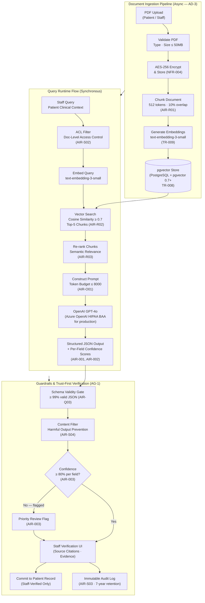
```mermaid
flowchart TD
    subgraph Ingestion["Document Ingestion Pipeline (Async — AD-3)"]
        direction TB
        UP["PDF Upload\n(Patient / Staff)"] --> VAL["Validate PDF\nType · Size ≤ 50MB"]
        VAL --> ENC["AES-256 Encrypt\n& Store (NFR-004)"]
        ENC --> CHK["Chunk Document\n512 tokens · 10% overlap\n(AIR-R01)"]
        CHK --> EMB["Generate Embeddings\ntext-embedding-3-small\n(TR-009)"]
        EMB --> PVEC[("pgvector Store\n(PostgreSQL + pgvector 0.7+\nTR-008)")]
    end

    subgraph QueryRuntime["Query Runtime Flow (Synchronous)"]
        direction TB
        QRY["Staff Query\nPatient Clinical Context"] --> ACL["ACL Filter\nDoc-Level Access Control\n(AIR-S02)"]
        ACL --> QEMB["Embed Query\ntext-embedding-3-small"]
        QEMB --> VSRCH["Vector Search\nCosine Similarity ≥ 0.7\nTop-5 Chunks (AIR-R02)"]
        PVEC --> VSRCH
        VSRCH --> RERANK["Re-rank Chunks\nSemantic Relevance\n(AIR-R03)"]
        RERANK --> PCONS["Construct Prompt\nToken Budget ≤ 8000\n(AIR-O01)"]
        PCONS --> LLM["OpenAI GPT-4o\n(Azure OpenAI HIPAA BAA\nfor production)"]
        LLM --> SOUT["Structured JSON Output\n+ Per-Field Confidence Scores\n(AIR-001, AIR-002)"]
    end

    subgraph Guardrails["Guardrails & Trust-First Verification (AG-1)"]
        direction TB
        SOUT --> SCHEMA["Schema Validity Gate\n≥ 99% valid JSON (AIR-Q03)"]
        SCHEMA --> CFILT["Content Filter\nHarmful Output Prevention\n(AIR-S04)"]
        CFILT --> CONF{"Confidence\n≥ 80% per field?\n(AIR-003)"}
        CONF -->|"Yes"| SVUI["Staff Verification UI\n(Source Citations · Evidence)"]
        CONF -->|"No — flagged"| FLAG["Priority Review Flag\n(AIR-003)"]
        FLAG --> SVUI
        SVUI --> AUDIT["Immutable Audit Log\n(AIR-S03 · 7-year retention)"]
        SVUI --> COMMIT["Commit to Patient Record\n(Staff-Verified Only)"]
    end

    Ingestion --> QueryRuntime
    QueryRuntime --> Guardrails
```

#### AI Sequence Diagram — Trust-First 360° View Generation

Shows the full RAG-powered aggregation flow for UC-008, including ACL filtering, circuit breaker, and staff verification. Traces to AIR-001, AIR-002, AIR-Q01, AIR-S02, AIR-O02.

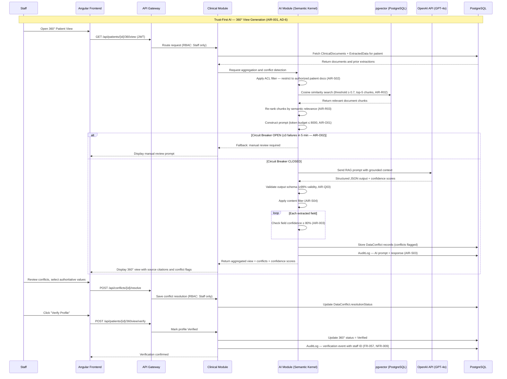
```mermaid
sequenceDiagram
    participant Staff as Staff
    participant Frontend as Angular Frontend
    participant Gateway as API Gateway
    participant Clinical as Clinical Module
    participant AIMod as AI Module (Semantic Kernel)
    participant VectorDB as pgvector (PostgreSQL)
    participant OpenAI as OpenAI API (GPT-4o)
    participant Postgres as PostgreSQL

    Note over Staff,Postgres: Trust-First AI — 360° View Generation (AIR-001, AD-6)

    Staff->>Frontend: Open 360° Patient View
    Frontend->>Gateway: GET /api/patients/{id}/360view (JWT)
    Gateway->>Clinical: Route request (RBAC: Staff only)
    Clinical->>Postgres: Fetch ClinicalDocuments + ExtractedData for patient
    Postgres-->>Clinical: Return documents and prior extractions

    Clinical->>AIMod: Request aggregation and conflict detection
    AIMod->>AIMod: Apply ACL filter — restrict to authorized patient docs (AIR-S02)
    AIMod->>VectorDB: Cosine similarity search (threshold ≥ 0.7, top-5 chunks, AIR-R02)
    VectorDB-->>AIMod: Return relevant document chunks

    AIMod->>AIMod: Re-rank chunks by semantic relevance (AIR-R03)
    AIMod->>AIMod: Construct prompt (token budget ≤ 8000, AIR-O01)

    alt Circuit Breaker OPEN (≥3 failures in 5 min — AIR-O02)
        AIMod-->>Clinical: Fallback: manual review required
        Clinical-->>Frontend: Display manual review prompt
    else Circuit Breaker CLOSED
        AIMod->>OpenAI: Send RAG prompt with grounded context
        OpenAI-->>AIMod: Structured JSON output + confidence scores
        AIMod->>AIMod: Validate output schema (≥99% validity, AIR-Q03)
        AIMod->>AIMod: Apply content filter (AIR-S04)

        loop Each extracted field
            AIMod->>AIMod: Check field confidence ≥ 80% (AIR-003)
        end

        AIMod->>Postgres: Store DataConflict records (conflicts flagged)
        AIMod->>Postgres: AuditLog — AI prompt + response (AIR-S03)
        AIMod-->>Clinical: Return aggregated view + conflicts + confidence scores
        Clinical-->>Frontend: Display 360° view with source citations and conflict flags
    end

    Staff->>Frontend: Review conflicts, select authoritative values
    Frontend->>Gateway: POST /api/conflicts/{id}/resolve
    Gateway->>Clinical: Save conflict resolution (RBAC: Staff only)
    Clinical->>Postgres: Update DataConflict.resolutionStatus

    Staff->>Frontend: Click "Verify Profile"
    Frontend->>Gateway: POST /api/patients/{id}/360view/verify
    Gateway->>Clinical: Mark profile Verified
    Clinical->>Postgres: Update 360° status = Verified
    Clinical->>Postgres: AuditLog — verification event with staff ID (FR-057, NFR-009)
    Clinical-->>Frontend: Verification confirmed
```

---

### Use Case Sequence Diagrams

> One sequence diagram per use case (UC-001 through UC-012) from [spec.md](.propel/context/docs/spec.md). Use case diagrams remain in `spec.md` only.

---

#### UC-001: Patient Self-Registers and Books an Appointment

**Source:** [spec.md#UC-001](.propel/context/docs/spec.md#UC-001)

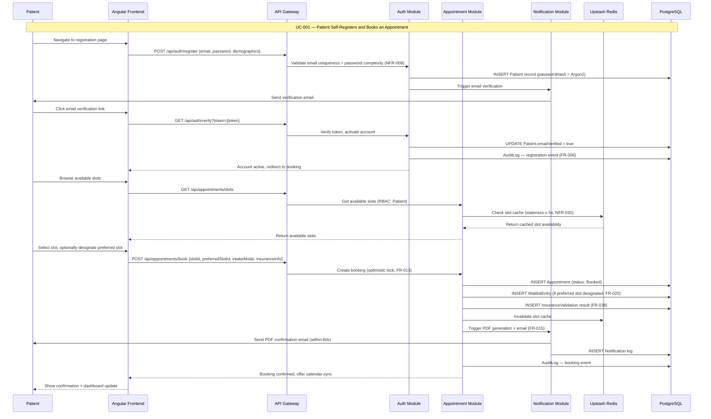
```mermaid
sequenceDiagram
    participant Patient as Patient
    participant Frontend as Angular Frontend
    participant Gateway as API Gateway
    participant Auth as Auth Module
    participant Appt as Appointment Module
    participant Notif as Notification Module
    participant Redis as Upstash Redis
    participant Postgres as PostgreSQL

    Note over Patient,Postgres: UC-001 — Patient Self-Registers and Books an Appointment

    Patient->>Frontend: Navigate to registration page
    Frontend->>Gateway: POST /api/auth/register {email, password, demographics}
    Gateway->>Auth: Validate email uniqueness + password complexity (NFR-008)
    Auth->>Postgres: INSERT Patient record (passwordHash = Argon2)
    Auth->>Notif: Trigger email verification
    Notif->>Patient: Send verification email
    Patient->>Frontend: Click email verification link
    Frontend->>Gateway: GET /api/auth/verify?token={token}
    Gateway->>Auth: Verify token, activate account
    Auth->>Postgres: UPDATE Patient.emailVerified = true
    Auth->>Postgres: AuditLog — registration event (FR-006)
    Auth-->>Frontend: Account active, redirect to booking

    Patient->>Frontend: Browse available slots
    Frontend->>Gateway: GET /api/appointments/slots
    Gateway->>Appt: Get available slots (RBAC: Patient)
    Appt->>Redis: Check slot cache (staleness ≤ 5s, NFR-020)
    Redis-->>Appt: Return cached slot availability
    Appt-->>Frontend: Return available slots

    Patient->>Frontend: Select slot, optionally designate preferred slot
    Frontend->>Gateway: POST /api/appointments/book {slotId, preferredSlotId, intakeMode, insuranceInfo}
    Gateway->>Appt: Create booking (optimistic lock, FR-013)
    Appt->>Postgres: INSERT Appointment (status: Booked)
    Appt->>Postgres: INSERT WaitlistEntry (if preferred slot designated, FR-020)
    Appt->>Postgres: INSERT InsuranceValidation result (FR-038)
    Appt->>Redis: Invalidate slot cache
    Appt->>Notif: Trigger PDF generation + email (FR-015)
    Notif->>Patient: Send PDF confirmation email (within 60s)
    Notif->>Postgres: INSERT Notification log
    Appt->>Postgres: AuditLog — booking event
    Appt-->>Frontend: Booking confirmed, offer calendar sync
    Frontend-->>Patient: Show confirmation + dashboard update
```

---

#### UC-002: Patient Completes AI-Assisted Conversational Intake

**Source:** [spec.md#UC-002](.propel/context/docs/spec.md#UC-002)

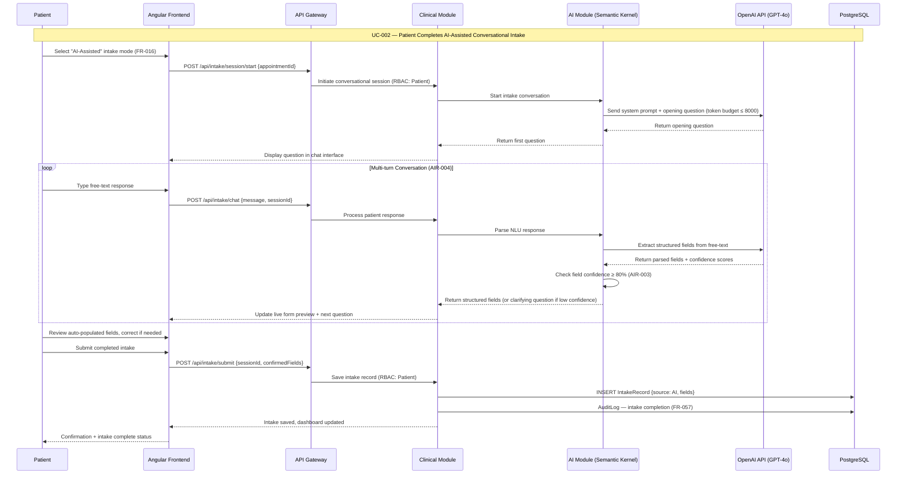
```mermaid
sequenceDiagram
    participant Patient as Patient
    participant Frontend as Angular Frontend
    participant Gateway as API Gateway
    participant Clinical as Clinical Module
    participant AIMod as AI Module (Semantic Kernel)
    participant OpenAI as OpenAI API (GPT-4o)
    participant Postgres as PostgreSQL

    Note over Patient,Postgres: UC-002 — Patient Completes AI-Assisted Conversational Intake

    Patient->>Frontend: Select "AI-Assisted" intake mode (FR-016)
    Frontend->>Gateway: POST /api/intake/session/start {appointmentId}
    Gateway->>Clinical: Initiate conversational session (RBAC: Patient)
    Clinical->>AIMod: Start intake conversation
    AIMod->>OpenAI: Send system prompt + opening question (token budget ≤ 8000)
    OpenAI-->>AIMod: Return opening question
    AIMod-->>Clinical: Return first question
    Clinical-->>Frontend: Display question in chat interface

    loop Multi-turn Conversation (AIR-004)
        Patient->>Frontend: Type free-text response
        Frontend->>Gateway: POST /api/intake/chat {message, sessionId}
        Gateway->>Clinical: Process patient response
        Clinical->>AIMod: Parse NLU response
        AIMod->>OpenAI: Extract structured fields from free-text
        OpenAI-->>AIMod: Return parsed fields + confidence scores
        AIMod->>AIMod: Check field confidence ≥ 80% (AIR-003)
        AIMod-->>Clinical: Return structured fields (or clarifying question if low confidence)
        Clinical-->>Frontend: Update live form preview + next question
    end

    Patient->>Frontend: Review auto-populated fields, correct if needed
    Patient->>Frontend: Submit completed intake
    Frontend->>Gateway: POST /api/intake/submit {sessionId, confirmedFields}
    Gateway->>Clinical: Save intake record (RBAC: Patient)
    Clinical->>Postgres: INSERT IntakeRecord {source: AI, fields}
    Clinical->>Postgres: AuditLog — intake completion (FR-057)
    Clinical-->>Frontend: Intake saved, dashboard updated
    Frontend-->>Patient: Confirmation + intake complete status
```

---

#### UC-003: Patient Completes Manual Intake Form

**Source:** [spec.md#UC-003](.propel/context/docs/spec.md#UC-003)

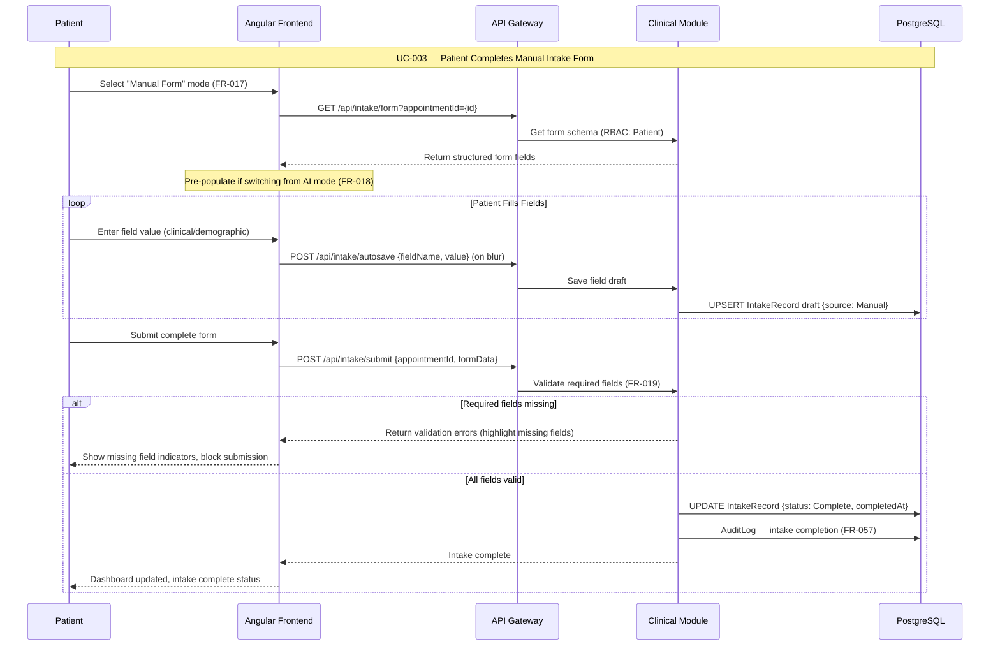
```mermaid
sequenceDiagram
    participant Patient as Patient
    participant Frontend as Angular Frontend
    participant Gateway as API Gateway
    participant Clinical as Clinical Module
    participant Postgres as PostgreSQL

    Note over Patient,Postgres: UC-003 — Patient Completes Manual Intake Form

    Patient->>Frontend: Select "Manual Form" mode (FR-017)
    Frontend->>Gateway: GET /api/intake/form?appointmentId={id}
    Gateway->>Clinical: Get form schema (RBAC: Patient)
    Clinical-->>Frontend: Return structured form fields

    Note over Frontend: Pre-populate if switching from AI mode (FR-018)

    loop Patient Fills Fields
        Patient->>Frontend: Enter field value (clinical/demographic)
        Frontend->>Gateway: POST /api/intake/autosave {fieldName, value} (on blur)
        Gateway->>Clinical: Save field draft
        Clinical->>Postgres: UPSERT IntakeRecord draft {source: Manual}
    end

    Patient->>Frontend: Submit complete form
    Frontend->>Gateway: POST /api/intake/submit {appointmentId, formData}
    Gateway->>Clinical: Validate required fields (FR-019)

    alt Required fields missing
        Clinical-->>Frontend: Return validation errors (highlight missing fields)
        Frontend-->>Patient: Show missing field indicators, block submission
    else All fields valid
        Clinical->>Postgres: UPDATE IntakeRecord {status: Complete, completedAt}
        Clinical->>Postgres: AuditLog — intake completion (FR-057)
        Clinical-->>Frontend: Intake complete
        Frontend-->>Patient: Dashboard updated, intake complete status
    end
```

---

#### UC-004: Preferred Slot Swap Triggered Automatically

**Source:** [spec.md#UC-004](.propel/context/docs/spec.md#UC-004)

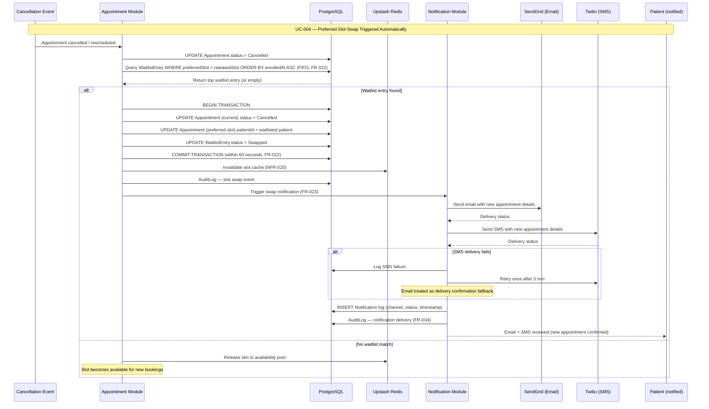
```mermaid
sequenceDiagram
    participant Trigger as Cancellation Event
    participant Appt as Appointment Module
    participant Postgres as PostgreSQL
    participant Redis as Upstash Redis
    participant Notif as Notification Module
    participant SendGrid as SendGrid (Email)
    participant Twilio as Twilio (SMS)
    participant Patient as Patient (notified)

    Note over Trigger,Patient: UC-004 — Preferred Slot Swap Triggered Automatically

    Trigger->>Appt: Appointment cancelled / rescheduled
    Appt->>Postgres: UPDATE Appointment.status = Cancelled
    Appt->>Postgres: Query WaitlistEntry WHERE preferredSlot = releasedSlot ORDER BY enrolledAt ASC (FIFO, FR-022)
    Postgres-->>Appt: Return top waitlist entry (or empty)

    alt Waitlist entry found
        Appt->>Postgres: BEGIN TRANSACTION
        Appt->>Postgres: UPDATE Appointment (current) status = Cancelled
        Appt->>Postgres: UPDATE Appointment (preferred slot) patientId = waitlisted patient
        Appt->>Postgres: UPDATE WaitlistEntry.status = Swapped
        Appt->>Postgres: COMMIT TRANSACTION (within 60 seconds, FR-022)
        Appt->>Redis: Invalidate slot cache (NFR-020)
        Appt->>Postgres: AuditLog — slot swap event
        Appt->>Notif: Trigger swap notification (FR-023)
        Notif->>SendGrid: Send email with new appointment details
        SendGrid-->>Notif: Delivery status
        Notif->>Twilio: Send SMS with new appointment details
        Twilio-->>Notif: Delivery status

        alt SMS delivery fails
            Notif->>Postgres: Log SMS failure
            Notif->>Twilio: Retry once after 5 min
            Note over Notif: Email treated as delivery confirmation fallback
        end

        Notif->>Postgres: INSERT Notification log (channel, status, timestamp)
        Notif->>Postgres: AuditLog — notification delivery (FR-034)
        Notif-->>Patient: Email + SMS received (new appointment confirmed)
    else No waitlist match
        Appt->>Redis: Release slot to availability pool
        Note over Appt: Slot becomes available for new bookings
    end
```

---

#### UC-005: Staff Creates a Walk-In Booking

**Source:** [spec.md#UC-005](.propel/context/docs/spec.md#UC-005)

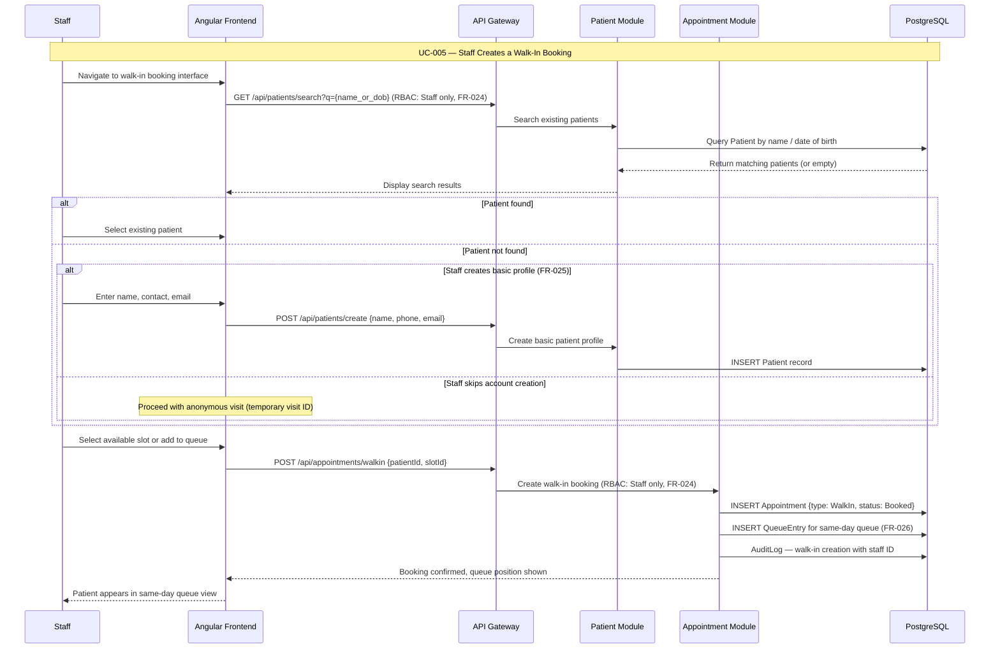
```mermaid
sequenceDiagram
    participant Staff as Staff
    participant Frontend as Angular Frontend
    participant Gateway as API Gateway
    participant PatientMod as Patient Module
    participant Appt as Appointment Module
    participant Postgres as PostgreSQL

    Note over Staff,Postgres: UC-005 — Staff Creates a Walk-In Booking

    Staff->>Frontend: Navigate to walk-in booking interface
    Frontend->>Gateway: GET /api/patients/search?q={name_or_dob} (RBAC: Staff only, FR-024)
    Gateway->>PatientMod: Search existing patients
    PatientMod->>Postgres: Query Patient by name / date of birth
    Postgres-->>PatientMod: Return matching patients (or empty)
    PatientMod-->>Frontend: Display search results

    alt Patient found
        Staff->>Frontend: Select existing patient
    else Patient not found
        alt Staff creates basic profile (FR-025)
            Staff->>Frontend: Enter name, contact, email
            Frontend->>Gateway: POST /api/patients/create {name, phone, email}
            Gateway->>PatientMod: Create basic patient profile
            PatientMod->>Postgres: INSERT Patient record
        else Staff skips account creation
            Note over Frontend: Proceed with anonymous visit (temporary visit ID)
        end
    end

    Staff->>Frontend: Select available slot or add to queue
    Frontend->>Gateway: POST /api/appointments/walkin {patientId, slotId}
    Gateway->>Appt: Create walk-in booking (RBAC: Staff only, FR-024)
    Appt->>Postgres: INSERT Appointment {type: WalkIn, status: Booked}
    Appt->>Postgres: INSERT QueueEntry for same-day queue (FR-026)
    Appt->>Postgres: AuditLog — walk-in creation with staff ID
    Appt-->>Frontend: Booking confirmed, queue position shown
    Frontend-->>Staff: Patient appears in same-day queue view
```

---

#### UC-006: Staff Marks Patient as Arrived

**Source:** [spec.md#UC-006](.propel/context/docs/spec.md#UC-006)

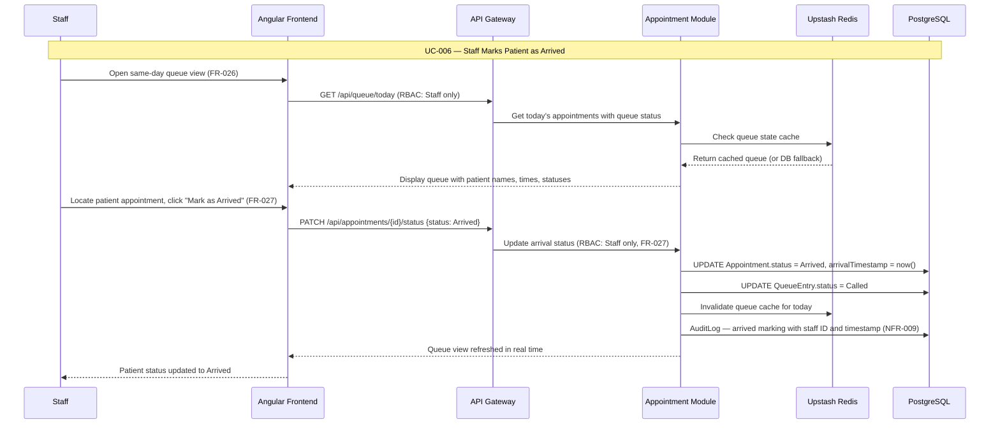
```mermaid
sequenceDiagram
    participant Staff as Staff
    participant Frontend as Angular Frontend
    participant Gateway as API Gateway
    participant Appt as Appointment Module
    participant Redis as Upstash Redis
    participant Postgres as PostgreSQL

    Note over Staff,Postgres: UC-006 — Staff Marks Patient as Arrived

    Staff->>Frontend: Open same-day queue view (FR-026)
    Frontend->>Gateway: GET /api/queue/today (RBAC: Staff only)
    Gateway->>Appt: Get today's appointments with queue status
    Appt->>Redis: Check queue state cache
    Redis-->>Appt: Return cached queue (or DB fallback)
    Appt-->>Frontend: Display queue with patient names, times, statuses

    Staff->>Frontend: Locate patient appointment, click "Mark as Arrived" (FR-027)
    Frontend->>Gateway: PATCH /api/appointments/{id}/status {status: Arrived}
    Gateway->>Appt: Update arrival status (RBAC: Staff only, FR-027)
    Appt->>Postgres: UPDATE Appointment.status = Arrived, arrivalTimestamp = now()
    Appt->>Postgres: UPDATE QueueEntry.status = Called
    Appt->>Redis: Invalidate queue cache for today
    Appt->>Postgres: AuditLog — arrived marking with staff ID and timestamp (NFR-009)
    Appt-->>Frontend: Queue view refreshed in real time
    Frontend-->>Staff: Patient status updated to Arrived
```

---

#### UC-007: Patient Uploads Clinical Documents

**Source:** [spec.md#UC-007](.propel/context/docs/spec.md#UC-007)

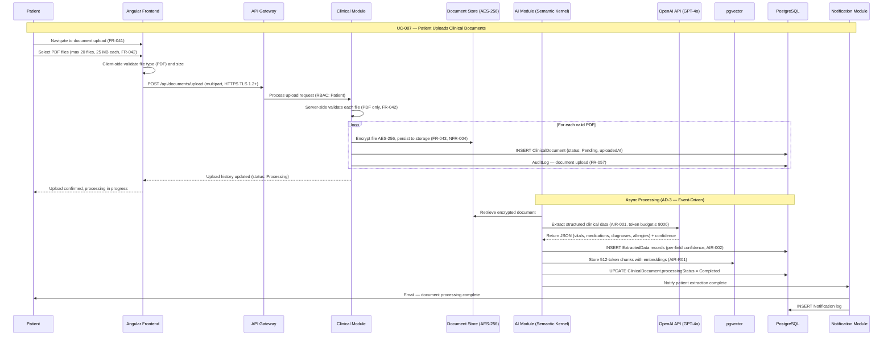
```mermaid
sequenceDiagram
    participant Patient as Patient
    participant Frontend as Angular Frontend
    participant Gateway as API Gateway
    participant Clinical as Clinical Module
    participant DocStore as Document Store (AES-256)
    participant AIMod as AI Module (Semantic Kernel)
    participant OpenAI as OpenAI API (GPT-4o)
    participant VectorDB as pgvector
    participant Postgres as PostgreSQL
    participant Notif as Notification Module

    Note over Patient,Notif: UC-007 — Patient Uploads Clinical Documents

    Patient->>Frontend: Navigate to document upload (FR-041)
    Patient->>Frontend: Select PDF files (max 20 files, 25 MB each, FR-042)
    Frontend->>Frontend: Client-side validate file type (PDF) and size
    Frontend->>Gateway: POST /api/documents/upload (multipart, HTTPS TLS 1.2+)
    Gateway->>Clinical: Process upload request (RBAC: Patient)
    Clinical->>Clinical: Server-side validate each file (PDF only, FR-042)

    loop For each valid PDF
        Clinical->>DocStore: Encrypt file AES-256, persist to storage (FR-043, NFR-004)
        Clinical->>Postgres: INSERT ClinicalDocument {status: Pending, uploadedAt}
        Clinical->>Postgres: AuditLog — document upload (FR-057)
    end

    Clinical-->>Frontend: Upload history updated (status: Processing)
    Frontend-->>Patient: Upload confirmed, processing in progress

    Note over AIMod,Postgres: Async Processing (AD-3 — Event-Driven)

    AIMod->>DocStore: Retrieve encrypted document
    AIMod->>OpenAI: Extract structured clinical data (AIR-001, token budget ≤ 8000)
    OpenAI-->>AIMod: Return JSON {vitals, medications, diagnoses, allergies} + confidence
    AIMod->>Postgres: INSERT ExtractedData records (per-field confidence, AIR-002)
    AIMod->>VectorDB: Store 512-token chunks with embeddings (AIR-R01)
    AIMod->>Postgres: UPDATE ClinicalDocument.processingStatus = Completed
    AIMod->>Notif: Notify patient extraction complete
    Notif->>Patient: Email — document processing complete
    Notif->>Postgres: INSERT Notification log
```

---

#### UC-008: System Generates 360-Degree Patient View

**Source:** [spec.md#UC-008](.propel/context/docs/spec.md#UC-008)

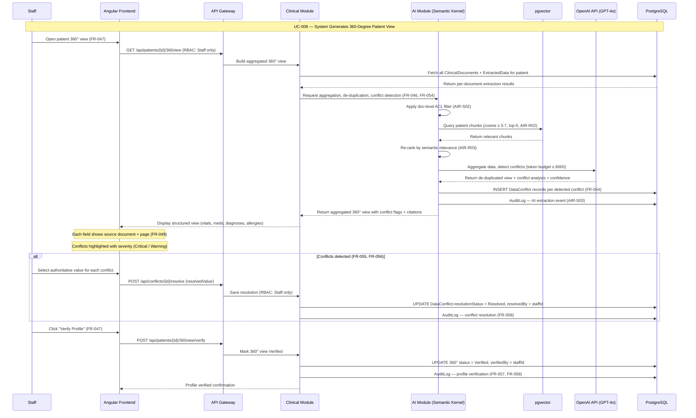
```mermaid
sequenceDiagram
    participant Staff as Staff
    participant Frontend as Angular Frontend
    participant Gateway as API Gateway
    participant Clinical as Clinical Module
    participant AIMod as AI Module (Semantic Kernel)
    participant VectorDB as pgvector
    participant OpenAI as OpenAI API (GPT-4o)
    participant Postgres as PostgreSQL

    Note over Staff,Postgres: UC-008 — System Generates 360-Degree Patient View

    Staff->>Frontend: Open patient 360° view (FR-047)
    Frontend->>Gateway: GET /api/patients/{id}/360view (RBAC: Staff only)
    Gateway->>Clinical: Build aggregated 360° view
    Clinical->>Postgres: Fetch all ClinicalDocuments + ExtractedData for patient
    Postgres-->>Clinical: Return per-document extraction results

    Clinical->>AIMod: Request aggregation, de-duplication, conflict detection (FR-046, FR-054)
    AIMod->>AIMod: Apply doc-level ACL filter (AIR-S02)
    AIMod->>VectorDB: Query patient chunks (cosine ≥ 0.7, top-5, AIR-R02)
    VectorDB-->>AIMod: Return relevant chunks
    AIMod->>AIMod: Re-rank by semantic relevance (AIR-R03)
    AIMod->>OpenAI: Aggregate data, detect conflicts (token budget ≤ 8000)
    OpenAI-->>AIMod: Return de-duplicated view + conflict analysis + confidence

    AIMod->>Postgres: INSERT DataConflict records per detected conflict (FR-054)
    AIMod->>Postgres: AuditLog — AI extraction event (AIR-S03)
    AIMod-->>Clinical: Return aggregated 360° view with conflict flags + citations

    Clinical-->>Frontend: Display structured view (vitals, meds, diagnoses, allergies)
    Note over Frontend: Each field shows source document + page (FR-049)
    Note over Frontend: Conflicts highlighted with severity (Critical / Warning)

    alt Conflicts detected (FR-055, FR-056)
        Staff->>Frontend: Select authoritative value for each conflict
        Frontend->>Gateway: POST /api/conflicts/{id}/resolve {resolvedValue}
        Gateway->>Clinical: Save resolution (RBAC: Staff only)
        Clinical->>Postgres: UPDATE DataConflict.resolutionStatus = Resolved, resolvedBy = staffId
        Clinical->>Postgres: AuditLog — conflict resolution (FR-058)
    end

    Staff->>Frontend: Click "Verify Profile" (FR-047)
    Frontend->>Gateway: POST /api/patients/{id}/360view/verify
    Gateway->>Clinical: Mark 360° view Verified
    Clinical->>Postgres: UPDATE 360° status = Verified, verifiedBy = staffId
    Clinical->>Postgres: AuditLog — profile verification (FR-057, FR-058)
    Clinical-->>Frontend: Profile verified confirmation
```

---

#### UC-009: Staff Reviews and Confirms Extracted Medical Codes

**Source:** [spec.md#UC-009](.propel/context/docs/spec.md#UC-009)

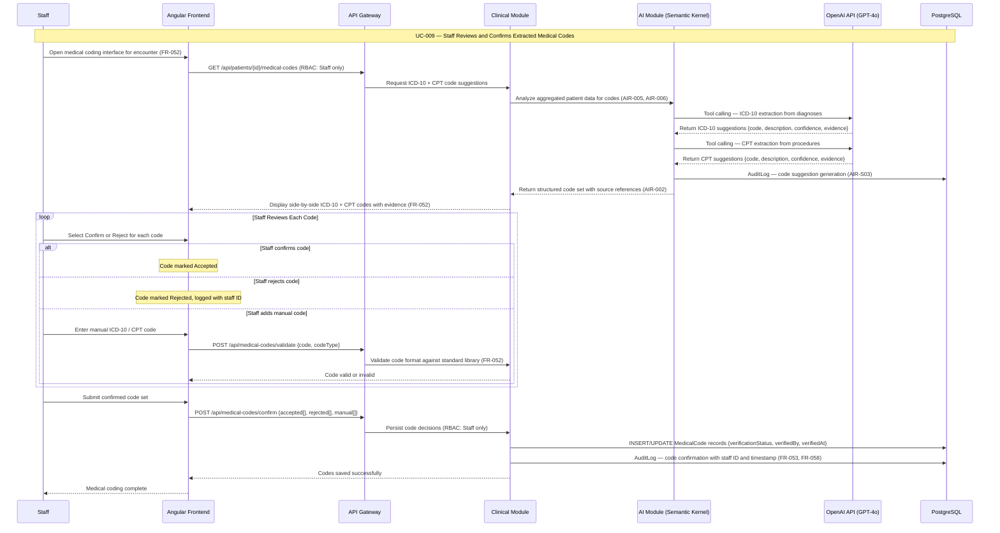
```mermaid
sequenceDiagram
    participant Staff as Staff
    participant Frontend as Angular Frontend
    participant Gateway as API Gateway
    participant Clinical as Clinical Module
    participant AIMod as AI Module (Semantic Kernel)
    participant OpenAI as OpenAI API (GPT-4o)
    participant Postgres as PostgreSQL

    Note over Staff,Postgres: UC-009 — Staff Reviews and Confirms Extracted Medical Codes

    Staff->>Frontend: Open medical coding interface for encounter (FR-052)
    Frontend->>Gateway: GET /api/patients/{id}/medical-codes (RBAC: Staff only)
    Gateway->>Clinical: Request ICD-10 + CPT code suggestions

    Clinical->>AIMod: Analyze aggregated patient data for codes (AIR-005, AIR-006)
    AIMod->>OpenAI: Tool calling — ICD-10 extraction from diagnoses
    OpenAI-->>AIMod: Return ICD-10 suggestions {code, description, confidence, evidence}
    AIMod->>OpenAI: Tool calling — CPT extraction from procedures
    OpenAI-->>AIMod: Return CPT suggestions {code, description, confidence, evidence}
    AIMod->>Postgres: AuditLog — code suggestion generation (AIR-S03)
    AIMod-->>Clinical: Return structured code set with source references (AIR-002)
    Clinical-->>Frontend: Display side-by-side ICD-10 + CPT codes with evidence (FR-052)

    loop Staff Reviews Each Code
        Staff->>Frontend: Select Confirm or Reject for each code

        alt Staff confirms code
            Note over Frontend: Code marked Accepted
        else Staff rejects code
            Note over Frontend: Code marked Rejected, logged with staff ID
        else Staff adds manual code
            Staff->>Frontend: Enter manual ICD-10 / CPT code
            Frontend->>Gateway: POST /api/medical-codes/validate {code, codeType}
            Gateway->>Clinical: Validate code format against standard library (FR-052)
            Clinical-->>Frontend: Code valid or invalid
        end
    end

    Staff->>Frontend: Submit confirmed code set
    Frontend->>Gateway: POST /api/medical-codes/confirm {accepted[], rejected[], manual[]}
    Gateway->>Clinical: Persist code decisions (RBAC: Staff only)
    Clinical->>Postgres: INSERT/UPDATE MedicalCode records {verificationStatus, verifiedBy, verifiedAt}
    Clinical->>Postgres: AuditLog — code confirmation with staff ID and timestamp (FR-053, FR-058)
    Clinical-->>Frontend: Codes saved successfully
    Frontend-->>Staff: Medical coding complete
```

---

#### UC-010: Admin Manages User Accounts

**Source:** [spec.md#UC-010](.propel/context/docs/spec.md#UC-010)

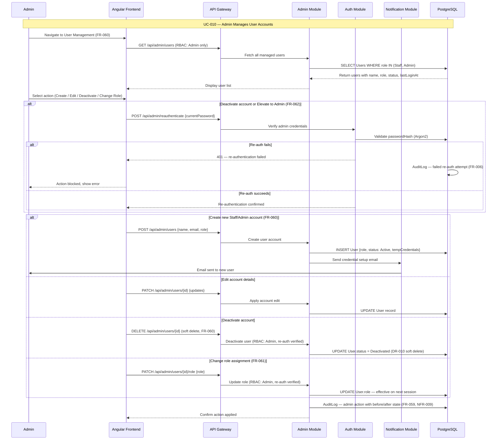
```mermaid
sequenceDiagram
    participant Admin as Admin
    participant Frontend as Angular Frontend
    participant Gateway as API Gateway
    participant AdminMod as Admin Module
    participant Auth as Auth Module
    participant Notif as Notification Module
    participant Postgres as PostgreSQL

    Note over Admin,Postgres: UC-010 — Admin Manages User Accounts

    Admin->>Frontend: Navigate to User Management (FR-060)
    Frontend->>Gateway: GET /api/admin/users (RBAC: Admin only)
    Gateway->>AdminMod: Fetch all managed users
    AdminMod->>Postgres: SELECT Users WHERE role IN (Staff, Admin)
    Postgres-->>AdminMod: Return users with name, role, status, lastLoginAt
    AdminMod-->>Frontend: Display user list

    Admin->>Frontend: Select action (Create / Edit / Deactivate / Change Role)

    alt Deactivate account or Elevate to Admin (FR-062)
        Frontend->>Gateway: POST /api/admin/reauthenticate {currentPassword}
        Gateway->>Auth: Verify admin credentials
        Auth->>Postgres: Validate passwordHash (Argon2)

        alt Re-auth fails
            Auth-->>Frontend: 401 — re-authentication failed
            Postgres->>Postgres: AuditLog — failed re-auth attempt (FR-006)
            Frontend-->>Admin: Action blocked, show error
        else Re-auth succeeds
            Auth-->>Frontend: Re-authentication confirmed
        end
    end

    alt Create new Staff/Admin account (FR-060)
        Frontend->>Gateway: POST /api/admin/users {name, email, role}
        Gateway->>AdminMod: Create user account
        AdminMod->>Postgres: INSERT User {role, status: Active, tempCredentials}
        AdminMod->>Notif: Send credential setup email
        Notif->>Admin: Email sent to new user
    else Edit account details
        Frontend->>Gateway: PATCH /api/admin/users/{id} {updates}
        Gateway->>AdminMod: Apply account edit
        AdminMod->>Postgres: UPDATE User record
    else Deactivate account
        Frontend->>Gateway: DELETE /api/admin/users/{id} (soft delete, FR-060)
        Gateway->>AdminMod: Deactivate user (RBAC: Admin, re-auth verified)
        AdminMod->>Postgres: UPDATE User.status = Deactivated (DR-010 soft delete)
    else Change role assignment (FR-061)
        Frontend->>Gateway: PATCH /api/admin/users/{id}/role {role}
        Gateway->>AdminMod: Update role (RBAC: Admin, re-auth verified)
        AdminMod->>Postgres: UPDATE User.role — effective on next session
    end

    AdminMod->>Postgres: AuditLog — admin action with before/after state (FR-059, NFR-009)
    AdminMod-->>Frontend: Confirm action applied
```

---

#### UC-011: System Sends Appointment Reminders

**Source:** [spec.md#UC-011](.propel/context/docs/spec.md#UC-011)

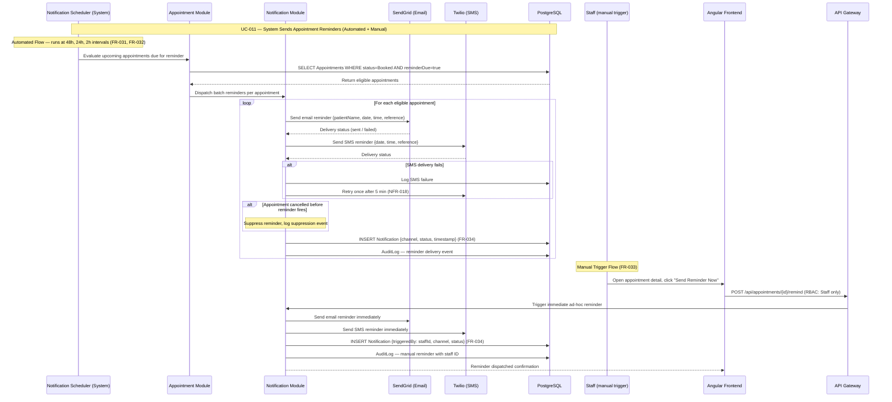
```mermaid
sequenceDiagram
    participant Scheduler as Notification Scheduler (System)
    participant Appt as Appointment Module
    participant Notif as Notification Module
    participant SendGrid as SendGrid (Email)
    participant Twilio as Twilio (SMS)
    participant Postgres as PostgreSQL
    participant Staff as Staff (manual trigger)
    participant Frontend as Angular Frontend
    participant Gateway as API Gateway

    Note over Scheduler,Postgres: UC-011 — System Sends Appointment Reminders (Automated + Manual)

    Note over Scheduler: Automated Flow — runs at 48h, 24h, 2h intervals (FR-031, FR-032)

    Scheduler->>Appt: Evaluate upcoming appointments due for reminder
    Appt->>Postgres: SELECT Appointments WHERE status=Booked AND reminderDue=true
    Postgres-->>Appt: Return eligible appointments
    Appt->>Notif: Dispatch batch reminders per appointment

    loop For each eligible appointment
        Notif->>SendGrid: Send email reminder {patientName, date, time, reference}
        SendGrid-->>Notif: Delivery status (sent / failed)
        Notif->>Twilio: Send SMS reminder {date, time, reference}
        Twilio-->>Notif: Delivery status

        alt SMS delivery fails
            Notif->>Postgres: Log SMS failure
            Notif->>Twilio: Retry once after 5 min (NFR-018)
        end

        alt Appointment cancelled before reminder fires
            Note over Notif: Suppress reminder, log suppression event
        end

        Notif->>Postgres: INSERT Notification {channel, status, timestamp} (FR-034)
        Notif->>Postgres: AuditLog — reminder delivery event
    end

    Note over Staff: Manual Trigger Flow (FR-033)

    Staff->>Frontend: Open appointment detail, click "Send Reminder Now"
    Frontend->>Gateway: POST /api/appointments/{id}/remind (RBAC: Staff only)
    Gateway->>Notif: Trigger immediate ad-hoc reminder
    Notif->>SendGrid: Send email reminder immediately
    Notif->>Twilio: Send SMS reminder immediately
    Notif->>Postgres: INSERT Notification {triggeredBy: staffId, channel, status} (FR-034)
    Notif->>Postgres: AuditLog — manual reminder with staff ID
    Notif-->>Frontend: Reminder dispatched confirmation
```

---

#### UC-012: Patient Syncs Appointment to External Calendar

**Source:** [spec.md#UC-012](.propel/context/docs/spec.md#UC-012)

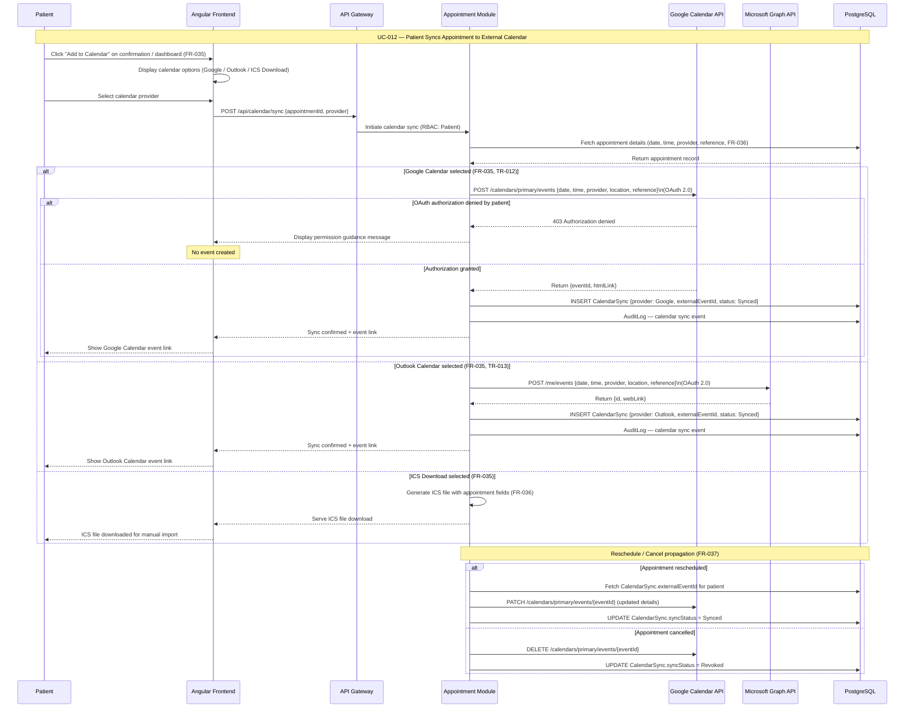
```mermaid
sequenceDiagram
    participant Patient as Patient
    participant Frontend as Angular Frontend
    participant Gateway as API Gateway
    participant Appt as Appointment Module
    participant GCal as Google Calendar API
    participant MSGraph as Microsoft Graph API
    participant Postgres as PostgreSQL

    Note over Patient,Postgres: UC-012 — Patient Syncs Appointment to External Calendar

    Patient->>Frontend: Click "Add to Calendar" on confirmation / dashboard (FR-035)
    Frontend->>Frontend: Display calendar options (Google / Outlook / ICS Download)
    Patient->>Frontend: Select calendar provider

    Frontend->>Gateway: POST /api/calendar/sync {appointmentId, provider}
    Gateway->>Appt: Initiate calendar sync (RBAC: Patient)
    Appt->>Postgres: Fetch appointment details (date, time, provider, reference, FR-036)
    Postgres-->>Appt: Return appointment record

    alt Google Calendar selected (FR-035, TR-012)
        Appt->>GCal: POST /calendars/primary/events {date, time, provider, location, reference}\n(OAuth 2.0)

        alt OAuth authorization denied by patient
            GCal-->>Appt: 403 Authorization denied
            Appt-->>Frontend: Display permission guidance message
            Note over Frontend: No event created
        else Authorization granted
            GCal-->>Appt: Return {eventId, htmlLink}
            Appt->>Postgres: INSERT CalendarSync {provider: Google, externalEventId, status: Synced}
            Appt->>Postgres: AuditLog — calendar sync event
            Appt-->>Frontend: Sync confirmed + event link
            Frontend-->>Patient: Show Google Calendar event link
        end

    else Outlook Calendar selected (FR-035, TR-013)
        Appt->>MSGraph: POST /me/events {date, time, provider, location, reference}\n(OAuth 2.0)
        MSGraph-->>Appt: Return {id, webLink}
        Appt->>Postgres: INSERT CalendarSync {provider: Outlook, externalEventId, status: Synced}
        Appt->>Postgres: AuditLog — calendar sync event
        Appt-->>Frontend: Sync confirmed + event link
        Frontend-->>Patient: Show Outlook Calendar event link

    else ICS Download selected (FR-035)
        Appt->>Appt: Generate ICS file with appointment fields (FR-036)
        Appt-->>Frontend: Serve ICS file download
        Frontend-->>Patient: ICS file downloaded for manual import
    end

    Note over Appt,Postgres: Reschedule / Cancel propagation (FR-037)

    alt Appointment rescheduled
        Appt->>Postgres: Fetch CalendarSync.externalEventId for patient
        Appt->>GCal: PATCH /calendars/primary/events/{eventId} (updated details)
        Appt->>Postgres: UPDATE CalendarSync.syncStatus = Synced
    else Appointment cancelled
        Appt->>GCal: DELETE /calendars/primary/events/{eventId}
        Appt->>Postgres: UPDATE CalendarSync.syncStatus = Revoked
    end
```
