## UML Models Overview

This document provides visual UML models for the Unified Patient Access & Clinical Intelligence Platform. The architectural views are derived from [design.md](.propel/context/docs/design.md) capturing system boundaries, component decomposition, deployment topology, data flows, and entity relationships. The sequence diagrams map one-to-one with the 18 use cases (UC-001 through UC-018) defined in [spec.md](.propel/context/docs/spec.md), illustrating the dynamic message flows for each user interaction. AI architecture diagrams detail the RAG pipeline and Trust-First verification flow specified by AIR-001 through AIR-R03.

## Architectural Views

### System Context Diagram

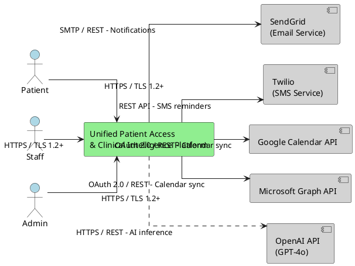
```plantuml
@startuml
left to right direction
skinparam packageStyle rectangle
skinparam linetype ortho

actor "Patient" as patient #LightBlue
actor "Staff" as staff #LightBlue
actor "Admin" as admin #LightBlue

rectangle "Unified Patient Access\n& Clinical Intelligence Platform" as system #LightGreen {
}

component "SendGrid\n(Email Service)" as email #LightGray
component "Twilio\n(SMS Service)" as sms #LightGray
component "Google Calendar API" as gcal #LightGray
component "Microsoft Graph API" as outlook #LightGray
component "OpenAI API\n(GPT-4o)" as openai #LightGray

patient --> system : HTTPS / TLS 1.2+
staff --> system : HTTPS / TLS 1.2+
admin --> system : HTTPS / TLS 1.2+

system --> email : SMTP / REST - Notifications
system --> sms : REST API - SMS reminders
system --> gcal : OAuth 2.0 / REST - Calendar sync
system --> outlook : OAuth 2.0 / REST - Calendar sync
system ..> openai : HTTPS / REST - AI inference
@enduml
```

### Component Architecture Diagram

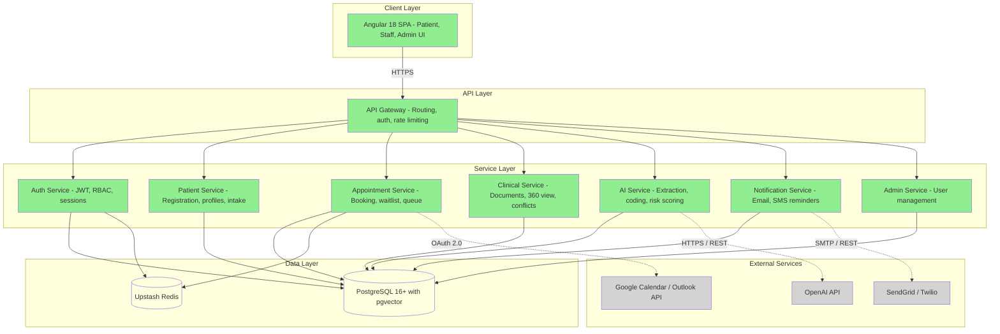
```mermaid
graph TB
  subgraph "Client Layer"
    FE[Angular 18 SPA - Patient, Staff, Admin UI]:::core
  end

  subgraph "API Layer"
    GW[API Gateway - Routing, auth, rate limiting]:::core
  end

  subgraph "Service Layer"
    AUTH[Auth Service - JWT, RBAC, sessions]:::core
    PAT[Patient Service - Registration, profiles, intake]:::core
    APT[Appointment Service - Booking, waitlist, queue]:::core
    CLIN[Clinical Service - Documents, 360 view, conflicts]:::core
    AI[AI Service - Extraction, coding, risk scoring]:::core
    NOTIF[Notification Service - Email, SMS reminders]:::core
    ADMIN[Admin Service - User management]:::core
  end

  subgraph "Data Layer"
    PG[(PostgreSQL 16+ with pgvector)]:::data
    REDIS[(Upstash Redis)]:::data
  end

  subgraph "External Services"
    OPENAI[OpenAI API]:::external
    MSG[SendGrid / Twilio]:::external
    CAL[Google Calendar / Outlook API]:::external
  end

  FE -->|HTTPS| GW
  GW --> AUTH
  GW --> PAT
  GW --> APT
  GW --> CLIN
  GW --> AI
  GW --> NOTIF
  GW --> ADMIN

  AUTH --> PG
  AUTH --> REDIS
  PAT --> PG
  APT --> PG
  APT --> REDIS
  CLIN --> PG
  AI --> PG
  NOTIF --> PG
  ADMIN --> PG

  AI -.->|HTTPS / REST| OPENAI
  NOTIF -.->|SMTP / REST| MSG
  APT -.->|OAuth 2.0| CAL

  classDef core fill:#90ee90
  classDef data fill:#ffffe0
  classDef external fill:#d3d3d3
```

### Deployment Architecture Diagram

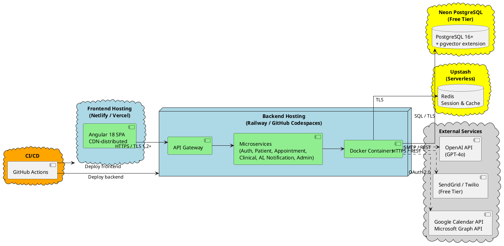
```plantuml
@startuml
left to right direction
skinparam linetype ortho

cloud "Frontend Hosting\n(Netlify / Vercel)" as fe_host #LightBlue {
  component [Angular 18 SPA\nCDN-distributed] as fe #LightGreen
}

node "Backend Hosting\n(Railway / GitHub Codespaces)" as be_host #LightBlue {
  component [API Gateway] as gw #LightGreen
  component [Microservices\n(Auth, Patient, Appointment,\nClinical, AI, Notification, Admin)] as svcs #LightGreen
  component [Docker Containers] as docker #LightGreen
}

cloud "Neon PostgreSQL\n(Free Tier)" as db_host #Yellow {
  database "PostgreSQL 16+\n+ pgvector extension" as pg
}

cloud "Upstash\n(Serverless)" as cache_host #Yellow {
  database "Redis\nSession & Cache" as redis
}

cloud "External Services" as ext #LightGray {
  component [OpenAI API\n(GPT-4o)] as openai
  component [SendGrid / Twilio\n(Free Tier)] as messaging
  component [Google Calendar API\nMicrosoft Graph API] as cal
}

cloud "CI/CD" as cicd #Orange {
  component [GitHub Actions] as ga
}

fe --> gw : HTTPS / TLS 1.2+
gw --> svcs
svcs --> docker
docker --> pg : SQL / TLS
docker --> redis : TLS
docker ..> openai : HTTPS / REST
docker ..> messaging : SMTP / REST
docker ..> cal : OAuth 2.0
ga --> fe_host : Deploy frontend
ga --> be_host : Deploy backend
@enduml
```

### Data Flow Diagram

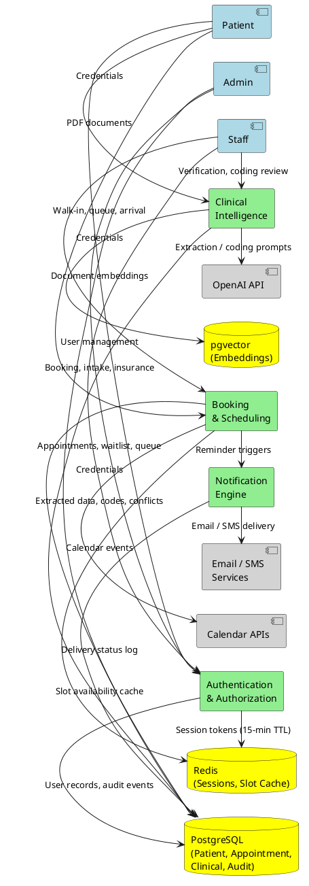
```plantuml
@startuml
left to right direction

!define PROCESS rectangle
!define DATASTORE database
!define EXTERNAL component

EXTERNAL "Patient" as patient #LightBlue
EXTERNAL "Staff" as staff #LightBlue
EXTERNAL "Admin" as admin #LightBlue

PROCESS "Authentication\n& Authorization" as auth #LightGreen
PROCESS "Booking\n& Scheduling" as booking #LightGreen
PROCESS "Clinical\nIntelligence" as clinical #LightGreen
PROCESS "Notification\nEngine" as notif #LightGreen

DATASTORE "PostgreSQL\n(Patient, Appointment,\nClinical, Audit)" as pg #Yellow
DATASTORE "pgvector\n(Embeddings)" as vector #Yellow
DATASTORE "Redis\n(Sessions, Slot Cache)" as redis #Yellow

EXTERNAL "OpenAI API" as openai #LightGray
EXTERNAL "Email / SMS\nServices" as messaging #LightGray
EXTERNAL "Calendar APIs" as calendar #LightGray

patient -> auth : Credentials
staff -> auth : Credentials
admin -> auth : Credentials
auth -> pg : User records, audit events
auth -> redis : Session tokens (15-min TTL)

patient -> booking : Booking, intake, insurance
staff -> booking : Walk-in, queue, arrival
booking -> pg : Appointments, waitlist, queue
booking -> redis : Slot availability cache
booking -> calendar : Calendar events

patient -> clinical : PDF documents
staff -> clinical : Verification, coding review
clinical -> pg : Extracted data, codes, conflicts
clinical -> vector : Document embeddings
clinical -> openai : Extraction / coding prompts

booking -> notif : Reminder triggers
notif -> messaging : Email / SMS delivery
notif -> pg : Delivery status log

admin -> pg : User management
@enduml
```

### Logical Data Model (ERD)

```mermaid
erDiagram
    Patient {
        uuid id PK
        string email UK
        string name
        string phone
        date dateOfBirth
        string passwordHash
        boolean emailVerified
        string status
        timestamp createdAt
    }
    User {
        uuid id PK
        string email UK
        string passwordHash
        string role
        string status
        timestamp lastLoginAt
        timestamp createdAt
    }
    Specialty {
        uuid id PK
        string name
        string description
    }
    Appointment {
        uuid id PK
        uuid patientId FK
        uuid specialtyId FK
        date date
        time timeSlotStart
        time timeSlotEnd
        string status
        string cancellationReason
        uuid createdBy FK
        timestamp createdAt
    }
    WaitlistEntry {
        uuid id PK
        uuid patientId FK
        uuid currentAppointmentId FK
        date preferredDate
        time preferredTimeSlot
        timestamp enrolledAt
        string status
    }
    IntakeRecord {
        uuid id PK
        uuid patientId FK
        uuid appointmentId FK
        string source
        jsonb demographics
        jsonb medicalHistory
        jsonb symptoms
        jsonb medications
        timestamp completedAt
    }
    ClinicalDocument {
        uuid id PK
        uuid patientId FK
        string fileName
        bigint fileSize
        string storagePath
        string processingStatus
        timestamp uploadedAt
    }
    ExtractedData {
        uuid id PK
        uuid documentId FK
        uuid patientId FK
        string dataType
        string fieldName
        string value
        decimal confidence
        int sourcePageNumber
    }
    DataConflict {
        uuid id PK
        uuid patientId FK
        string fieldName
        string value1
        uuid sourceDocumentId1 FK
        string value2
        uuid sourceDocumentId2 FK
        string resolutionStatus
        string resolvedValue
        uuid resolvedBy FK
    }
    MedicalCode {
        uuid id PK
        uuid patientId FK
        string codeType
        string code
        string description
        decimal confidence
        uuid sourceDocumentId FK
        string verificationStatus
        uuid verifiedBy FK
    }
    AuditLog {
        uuid id PK
        uuid userId FK
        string action
        string entityType
        uuid entityId
        jsonb details
        string ipAddress
        timestamp timestamp
    }
    Notification {
        uuid id PK
        uuid patientId FK
        uuid appointmentId FK
        string channel
        string templateType
        string status
        timestamp sentAt
        int retryCount
    }
    InsuranceValidation {
        uuid id PK
        uuid patientId FK
        string providerName
        string insuranceId
        string result
        timestamp validatedAt
    }
    QueueEntry {
        uuid id PK
        uuid patientId FK
        uuid appointmentId FK
        int position
        timestamp arrivalTime
        string status
    }
    CalendarSync {
        uuid id PK
        uuid patientId FK
        uuid appointmentId FK
        string provider
        string externalEventId
        string syncStatus
        timestamp syncedAt
    }
    NoShowRisk {
        uuid id PK
        uuid appointmentId FK
        decimal score
        jsonb factors
        timestamp calculatedAt
    }

    Patient ||--o{ Appointment : "books"
    Patient ||--o{ IntakeRecord : "completes"
    Patient ||--o{ ClinicalDocument : "uploads"
    Patient ||--o{ ExtractedData : "has"
    Patient ||--o{ DataConflict : "has"
    Patient ||--o{ MedicalCode : "has"
    Patient ||--o{ Notification : "receives"
    Patient ||--o{ InsuranceValidation : "validates"
    Patient ||--o{ QueueEntry : "queues"
    Patient ||--o{ CalendarSync : "syncs"
    Specialty ||--o{ Appointment : "categorizes"
    Appointment ||--o{ WaitlistEntry : "waitlists"
    Appointment ||--o{ Notification : "triggers"
    Appointment ||--|| NoShowRisk : "assessed_by"
    Appointment ||--o| QueueEntry : "has_queue"
    Appointment ||--o{ IntakeRecord : "links"
    ClinicalDocument ||--o{ ExtractedData : "produces"
    User ||--o{ AuditLog : "generates"
```

### AI Architecture

#### RAG Pipeline Diagram

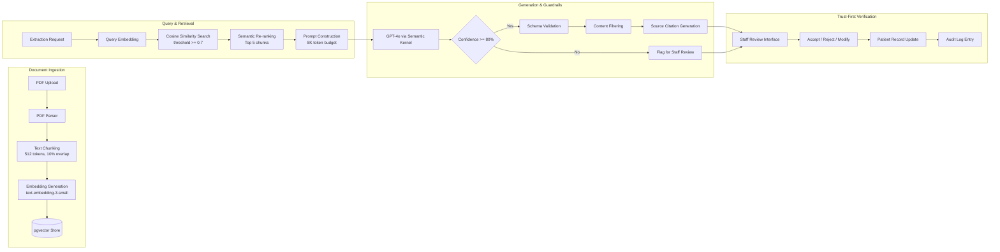
```mermaid
graph LR
  subgraph "Document Ingestion"
    A[PDF Upload] --> B[PDF Parser]
    B --> C[Text Chunking\n512 tokens, 10% overlap]
    C --> D[Embedding Generation\ntext-embedding-3-small]
    D --> E[(pgvector Store)]
  end

  subgraph "Query & Retrieval"
    F[Extraction Request] --> G[Query Embedding]
    G --> H[Cosine Similarity Search\nthreshold >= 0.7]
    H --> I[Semantic Re-ranking\nTop 5 chunks]
    I --> J[Prompt Construction\n8K token budget]
  end

  subgraph "Generation & Guardrails"
    J --> K[GPT-4o via Semantic Kernel]
    K --> L{Confidence >= 80%}
    L -->|Yes| M[Schema Validation]
    L -->|No| N[Flag for Staff Review]
    M --> O[Content Filtering]
    O --> P[Source Citation Generation]
  end

  subgraph "Trust-First Verification"
    P --> Q[Staff Review Interface]
    N --> Q
    Q --> R[Accept / Reject / Modify]
    R --> S[Patient Record Update]
    S --> T[Audit Log Entry]
  end

  classDef core fill:#90ee90
  classDef data fill:#ffffe0
  classDef external fill:#d3d3d3
```

## Use Case Sequence Diagrams

### UC-001: Patient Registration

**Source**: [spec.md#UC-001](.propel/context/docs/spec.md#UC-001)

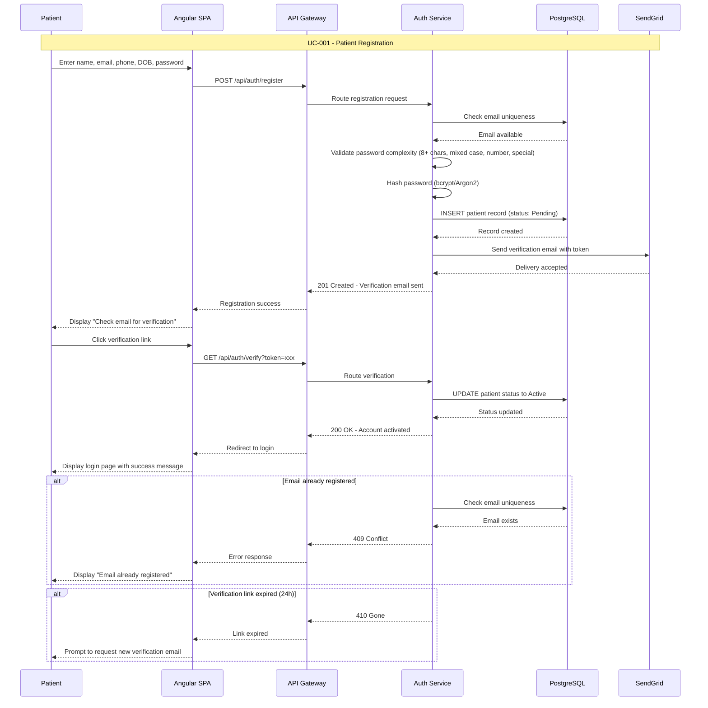
```mermaid
sequenceDiagram
    participant P as Patient
    participant FE as Angular SPA
    participant GW as API Gateway
    participant AUTH as Auth Service
    participant DB as PostgreSQL
    participant EMAIL as SendGrid

    Note over P,EMAIL: UC-001 - Patient Registration

    P->>FE: Enter name, email, phone, DOB, password
    FE->>GW: POST /api/auth/register
    GW->>AUTH: Route registration request
    AUTH->>DB: Check email uniqueness
    DB-->>AUTH: Email available

    AUTH->>AUTH: Validate password complexity (8+ chars, mixed case, number, special)
    AUTH->>AUTH: Hash password (bcrypt/Argon2)
    AUTH->>DB: INSERT patient record (status: Pending)
    DB-->>AUTH: Record created

    AUTH->>EMAIL: Send verification email with token
    EMAIL-->>AUTH: Delivery accepted
    AUTH-->>GW: 201 Created - Verification email sent
    GW-->>FE: Registration success
    FE-->>P: Display "Check email for verification"

    P->>FE: Click verification link
    FE->>GW: GET /api/auth/verify?token=xxx
    GW->>AUTH: Route verification
    AUTH->>DB: UPDATE patient status to Active
    DB-->>AUTH: Status updated
    AUTH-->>GW: 200 OK - Account activated
    GW-->>FE: Redirect to login
    FE-->>P: Display login page with success message

    alt Email already registered
        AUTH->>DB: Check email uniqueness
        DB-->>AUTH: Email exists
        AUTH-->>GW: 409 Conflict
        GW-->>FE: Error response
        FE-->>P: Display "Email already registered"
    end

    alt Verification link expired (24h)
        AUTH-->>GW: 410 Gone
        GW-->>FE: Link expired
        FE-->>P: Prompt to request new verification email
    end
```

### UC-002: User Login

**Source**: [spec.md#UC-002](.propel/context/docs/spec.md#UC-002)

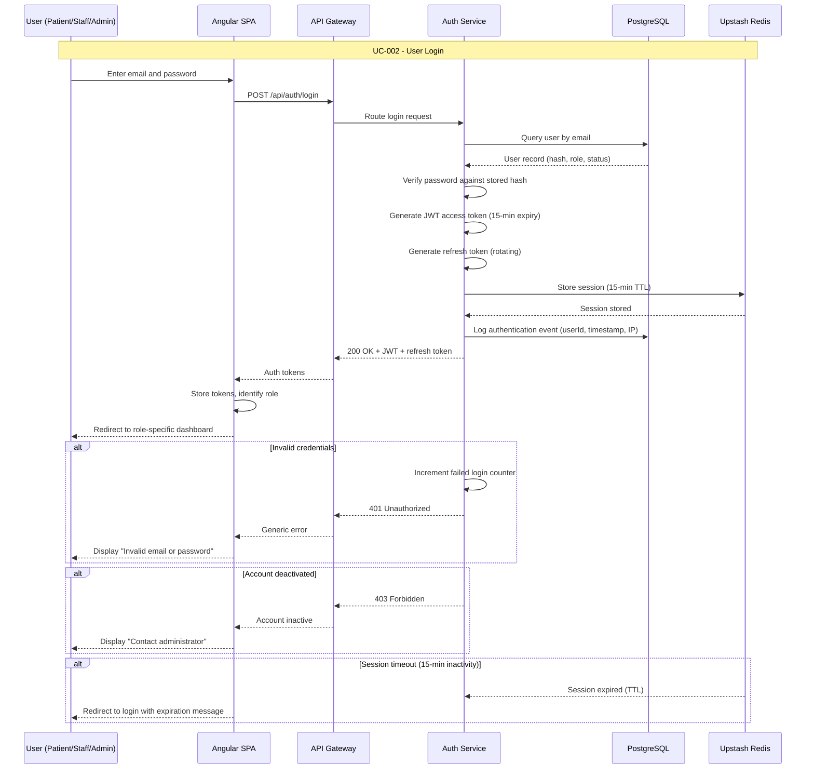
```mermaid
sequenceDiagram
    participant U as User (Patient/Staff/Admin)
    participant FE as Angular SPA
    participant GW as API Gateway
    participant AUTH as Auth Service
    participant DB as PostgreSQL
    participant REDIS as Upstash Redis

    Note over U,REDIS: UC-002 - User Login

    U->>FE: Enter email and password
    FE->>GW: POST /api/auth/login
    GW->>AUTH: Route login request
    AUTH->>DB: Query user by email
    DB-->>AUTH: User record (hash, role, status)

    AUTH->>AUTH: Verify password against stored hash
    AUTH->>AUTH: Generate JWT access token (15-min expiry)
    AUTH->>AUTH: Generate refresh token (rotating)
    AUTH->>REDIS: Store session (15-min TTL)
    REDIS-->>AUTH: Session stored
    AUTH->>DB: Log authentication event (userId, timestamp, IP)
    AUTH-->>GW: 200 OK + JWT + refresh token
    GW-->>FE: Auth tokens
    FE->>FE: Store tokens, identify role
    FE-->>U: Redirect to role-specific dashboard

    alt Invalid credentials
        AUTH->>AUTH: Increment failed login counter
        AUTH-->>GW: 401 Unauthorized
        GW-->>FE: Generic error
        FE-->>U: Display "Invalid email or password"
    end

    alt Account deactivated
        AUTH-->>GW: 403 Forbidden
        GW-->>FE: Account inactive
        FE-->>U: Display "Contact administrator"
    end

    alt Session timeout (15-min inactivity)
        REDIS-->>AUTH: Session expired (TTL)
        FE-->>U: Redirect to login with expiration message
    end
```

### UC-003: Book Appointment

**Source**: [spec.md#UC-003](.propel/context/docs/spec.md#UC-003)

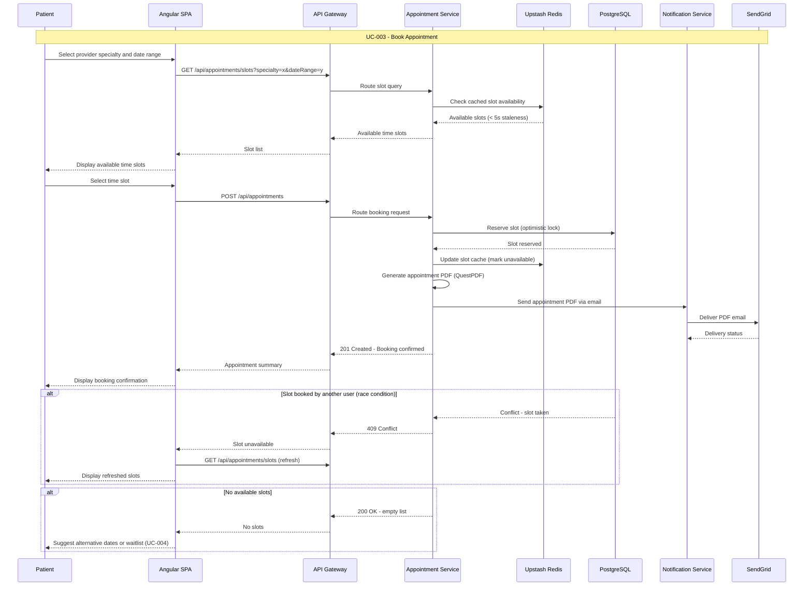
```mermaid
sequenceDiagram
    participant P as Patient
    participant FE as Angular SPA
    participant GW as API Gateway
    participant APT as Appointment Service
    participant REDIS as Upstash Redis
    participant DB as PostgreSQL
    participant NOTIF as Notification Service
    participant EMAIL as SendGrid

    Note over P,EMAIL: UC-003 - Book Appointment

    P->>FE: Select provider specialty and date range
    FE->>GW: GET /api/appointments/slots?specialty=x&dateRange=y
    GW->>APT: Route slot query
    APT->>REDIS: Check cached slot availability
    REDIS-->>APT: Available slots (< 5s staleness)
    APT-->>GW: Available time slots
    GW-->>FE: Slot list
    FE-->>P: Display available time slots

    P->>FE: Select time slot
    FE->>GW: POST /api/appointments
    GW->>APT: Route booking request
    APT->>DB: Reserve slot (optimistic lock)
    DB-->>APT: Slot reserved
    APT->>REDIS: Update slot cache (mark unavailable)
    APT->>APT: Generate appointment PDF (QuestPDF)
    APT->>NOTIF: Send appointment PDF via email
    NOTIF->>EMAIL: Deliver PDF email
    EMAIL-->>NOTIF: Delivery status
    APT-->>GW: 201 Created - Booking confirmed
    GW-->>FE: Appointment summary
    FE-->>P: Display booking confirmation

    alt Slot booked by another user (race condition)
        DB-->>APT: Conflict - slot taken
        APT-->>GW: 409 Conflict
        GW-->>FE: Slot unavailable
        FE->>GW: GET /api/appointments/slots (refresh)
        FE-->>P: Display refreshed slots
    end

    alt No available slots
        APT-->>GW: 200 OK - empty list
        GW-->>FE: No slots
        FE-->>P: Suggest alternative dates or waitlist (UC-004)
    end
```

### UC-004: Preferred Slot Swap

**Source**: [spec.md#UC-004](.propel/context/docs/spec.md#UC-004)

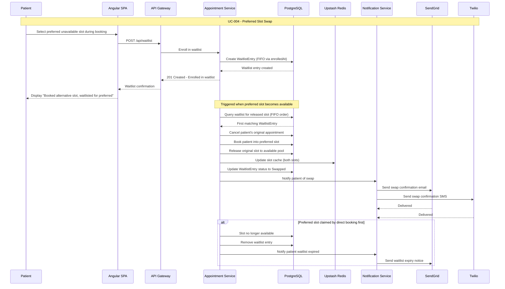
```mermaid
sequenceDiagram
    participant P as Patient
    participant FE as Angular SPA
    participant GW as API Gateway
    participant APT as Appointment Service
    participant DB as PostgreSQL
    participant REDIS as Upstash Redis
    participant NOTIF as Notification Service
    participant EMAIL as SendGrid
    participant SMS as Twilio

    Note over P,SMS: UC-004 - Preferred Slot Swap

    P->>FE: Select preferred unavailable slot during booking
    FE->>GW: POST /api/waitlist
    GW->>APT: Enroll in waitlist
    APT->>DB: Create WaitlistEntry (FIFO via enrolledAt)
    DB-->>APT: Waitlist entry created
    APT-->>GW: 201 Created - Enrolled in waitlist
    GW-->>FE: Waitlist confirmation
    FE-->>P: Display "Booked alternative slot, waitlisted for preferred"

    Note over APT,DB: Triggered when preferred slot becomes available

    APT->>DB: Query waitlist for released slot (FIFO order)
    DB-->>APT: First matching WaitlistEntry
    APT->>DB: Cancel patient's original appointment
    APT->>DB: Book patient into preferred slot
    APT->>DB: Release original slot to available pool
    APT->>REDIS: Update slot cache (both slots)
    APT->>DB: Update WaitlistEntry status to Swapped

    APT->>NOTIF: Notify patient of swap
    NOTIF->>EMAIL: Send swap confirmation email
    NOTIF->>SMS: Send swap confirmation SMS
    EMAIL-->>NOTIF: Delivered
    SMS-->>NOTIF: Delivered

    alt Preferred slot claimed by direct booking first
        APT->>DB: Slot no longer available
        APT->>DB: Remove waitlist entry
        APT->>NOTIF: Notify patient waitlist expired
        NOTIF->>EMAIL: Send waitlist expiry notice
    end
```

### UC-005: Cancel or Reschedule Appointment

**Source**: [spec.md#UC-005](.propel/context/docs/spec.md#UC-005)

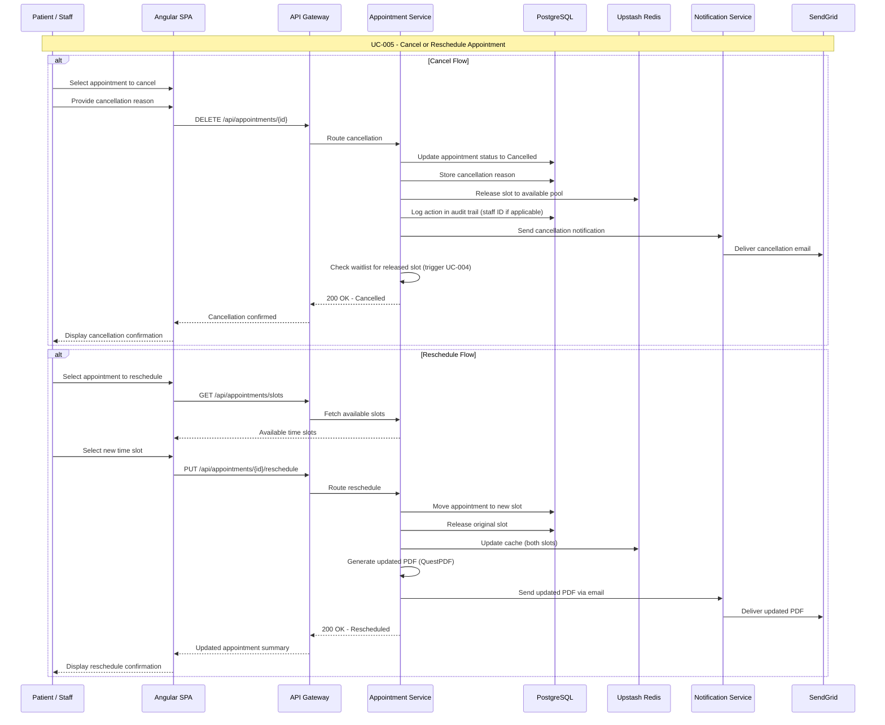
```mermaid
sequenceDiagram
    participant U as Patient / Staff
    participant FE as Angular SPA
    participant GW as API Gateway
    participant APT as Appointment Service
    participant DB as PostgreSQL
    participant REDIS as Upstash Redis
    participant NOTIF as Notification Service
    participant EMAIL as SendGrid

    Note over U,EMAIL: UC-005 - Cancel or Reschedule Appointment

    alt Cancel Flow
        U->>FE: Select appointment to cancel
        U->>FE: Provide cancellation reason
        FE->>GW: DELETE /api/appointments/{id}
        GW->>APT: Route cancellation
        APT->>DB: Update appointment status to Cancelled
        APT->>DB: Store cancellation reason
        APT->>REDIS: Release slot to available pool
        APT->>DB: Log action in audit trail (staff ID if applicable)
        APT->>NOTIF: Send cancellation notification
        NOTIF->>EMAIL: Deliver cancellation email
        APT->>APT: Check waitlist for released slot (trigger UC-004)
        APT-->>GW: 200 OK - Cancelled
        GW-->>FE: Cancellation confirmed
        FE-->>U: Display cancellation confirmation
    end

    alt Reschedule Flow
        U->>FE: Select appointment to reschedule
        FE->>GW: GET /api/appointments/slots
        GW->>APT: Fetch available slots
        APT-->>FE: Available time slots
        U->>FE: Select new time slot
        FE->>GW: PUT /api/appointments/{id}/reschedule
        GW->>APT: Route reschedule
        APT->>DB: Move appointment to new slot
        APT->>DB: Release original slot
        APT->>REDIS: Update cache (both slots)
        APT->>APT: Generate updated PDF (QuestPDF)
        APT->>NOTIF: Send updated PDF via email
        NOTIF->>EMAIL: Deliver updated PDF
        APT-->>GW: 200 OK - Rescheduled
        GW-->>FE: Updated appointment summary
        FE-->>U: Display reschedule confirmation
    end
```

### UC-006: AI Conversational Intake

**Source**: [spec.md#UC-006](.propel/context/docs/spec.md#UC-006)

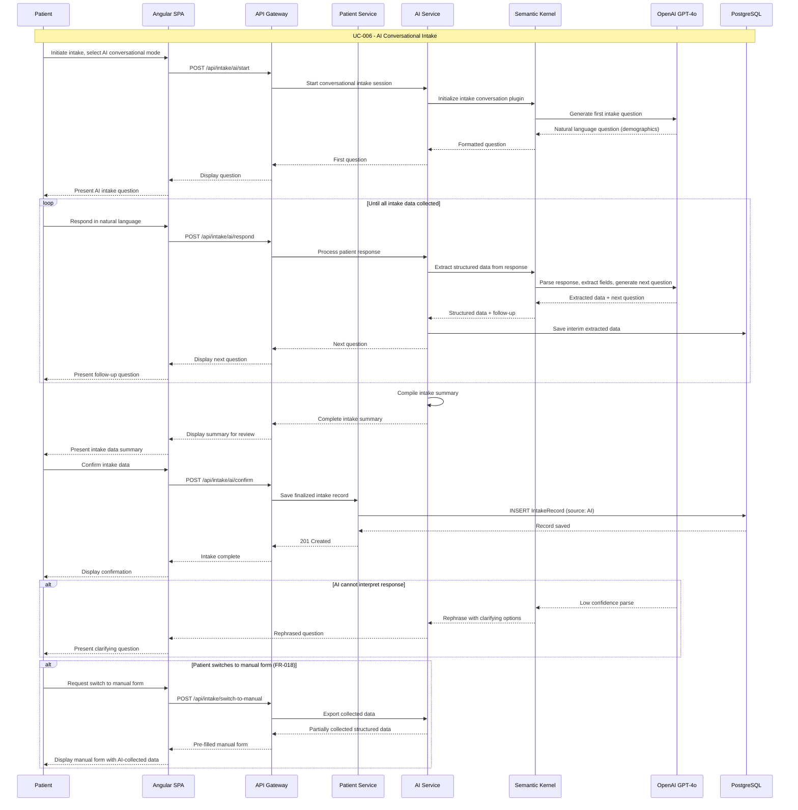
```mermaid
sequenceDiagram
    participant P as Patient
    participant FE as Angular SPA
    participant GW as API Gateway
    participant PAT as Patient Service
    participant AI as AI Service
    participant SK as Semantic Kernel
    participant LLM as OpenAI GPT-4o
    participant DB as PostgreSQL

    Note over P,DB: UC-006 - AI Conversational Intake

    P->>FE: Initiate intake, select AI conversational mode
    FE->>GW: POST /api/intake/ai/start
    GW->>AI: Start conversational intake session
    AI->>SK: Initialize intake conversation plugin
    SK->>LLM: Generate first intake question
    LLM-->>SK: Natural language question (demographics)
    SK-->>AI: Formatted question
    AI-->>GW: First question
    GW-->>FE: Display question
    FE-->>P: Present AI intake question

    loop Until all intake data collected
        P->>FE: Respond in natural language
        FE->>GW: POST /api/intake/ai/respond
        GW->>AI: Process patient response
        AI->>SK: Extract structured data from response
        SK->>LLM: Parse response, extract fields, generate next question
        LLM-->>SK: Extracted data + next question
        SK-->>AI: Structured data + follow-up
        AI->>DB: Save interim extracted data
        AI-->>GW: Next question
        GW-->>FE: Display next question
        FE-->>P: Present follow-up question
    end

    AI->>AI: Compile intake summary
    AI-->>GW: Complete intake summary
    GW-->>FE: Display summary for review
    FE-->>P: Present intake data summary

    P->>FE: Confirm intake data
    FE->>GW: POST /api/intake/ai/confirm
    GW->>PAT: Save finalized intake record
    PAT->>DB: INSERT IntakeRecord (source: AI)
    DB-->>PAT: Record saved
    PAT-->>GW: 201 Created
    GW-->>FE: Intake complete
    FE-->>P: Display confirmation

    alt AI cannot interpret response
        LLM-->>SK: Low confidence parse
        SK-->>AI: Rephrase with clarifying options
        AI-->>FE: Rephrased question
        FE-->>P: Present clarifying question
    end

    alt Patient switches to manual form (FR-018)
        P->>FE: Request switch to manual form
        FE->>GW: POST /api/intake/switch-to-manual
        GW->>AI: Export collected data
        AI-->>GW: Partially collected structured data
        GW-->>FE: Pre-filled manual form
        FE-->>P: Display manual form with AI-collected data
    end
```

### UC-007: Manual Form Intake

**Source**: [spec.md#UC-007](.propel/context/docs/spec.md#UC-007)

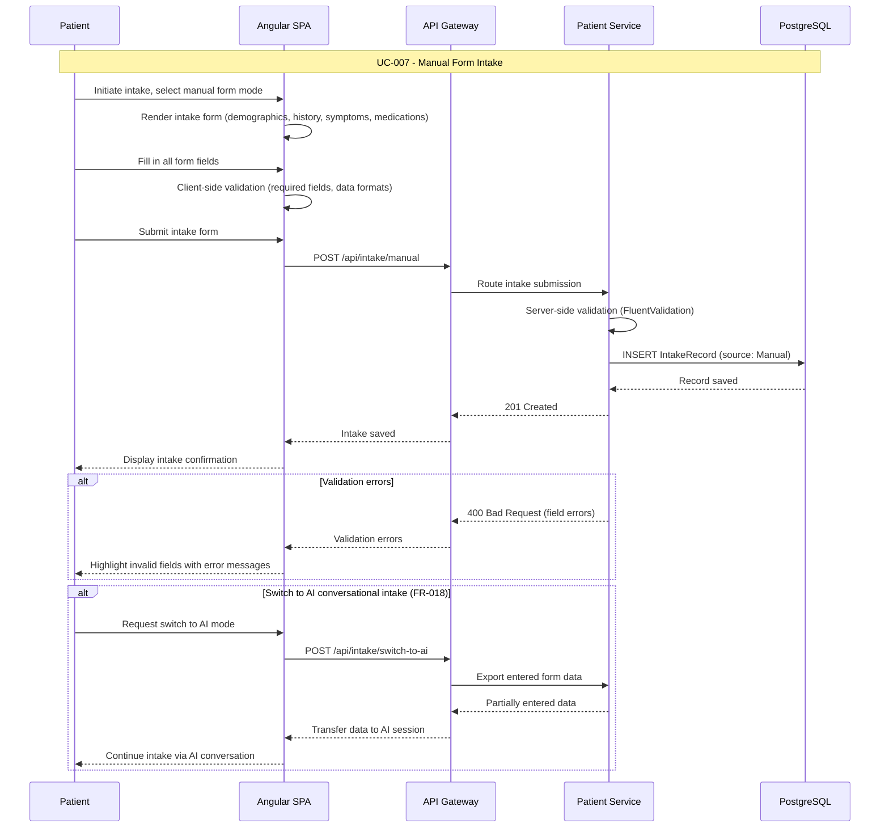
```mermaid
sequenceDiagram
    participant P as Patient
    participant FE as Angular SPA
    participant GW as API Gateway
    participant PAT as Patient Service
    participant DB as PostgreSQL

    Note over P,DB: UC-007 - Manual Form Intake

    P->>FE: Initiate intake, select manual form mode
    FE->>FE: Render intake form (demographics, history, symptoms, medications)
    P->>FE: Fill in all form fields
    FE->>FE: Client-side validation (required fields, data formats)

    P->>FE: Submit intake form
    FE->>GW: POST /api/intake/manual
    GW->>PAT: Route intake submission
    PAT->>PAT: Server-side validation (FluentValidation)
    PAT->>DB: INSERT IntakeRecord (source: Manual)
    DB-->>PAT: Record saved
    PAT-->>GW: 201 Created
    GW-->>FE: Intake saved
    FE-->>P: Display intake confirmation

    alt Validation errors
        PAT-->>GW: 400 Bad Request (field errors)
        GW-->>FE: Validation errors
        FE-->>P: Highlight invalid fields with error messages
    end

    alt Switch to AI conversational intake (FR-018)
        P->>FE: Request switch to AI mode
        FE->>GW: POST /api/intake/switch-to-ai
        GW->>PAT: Export entered form data
        PAT-->>GW: Partially entered data
        GW-->>FE: Transfer data to AI session
        FE-->>P: Continue intake via AI conversation
    end
```

### UC-008: Walk-in Booking

**Source**: [spec.md#UC-008](.propel/context/docs/spec.md#UC-008)

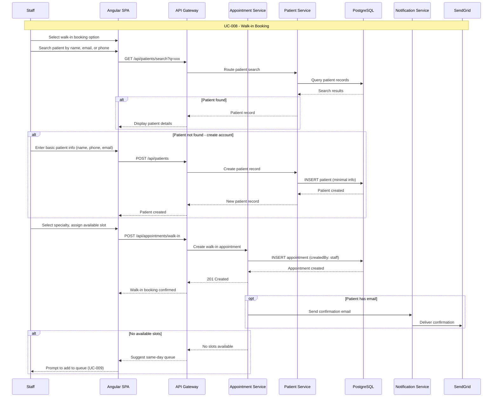
```mermaid
sequenceDiagram
    participant S as Staff
    participant FE as Angular SPA
    participant GW as API Gateway
    participant APT as Appointment Service
    participant PAT as Patient Service
    participant DB as PostgreSQL
    participant NOTIF as Notification Service
    participant EMAIL as SendGrid

    Note over S,EMAIL: UC-008 - Walk-in Booking

    S->>FE: Select walk-in booking option
    S->>FE: Search patient by name, email, or phone
    FE->>GW: GET /api/patients/search?q=xxx
    GW->>PAT: Route patient search
    PAT->>DB: Query patient records
    DB-->>PAT: Search results

    alt Patient found
        PAT-->>GW: Patient record
        GW-->>FE: Display patient details
    end

    alt Patient not found - create account
        S->>FE: Enter basic patient info (name, phone, email)
        FE->>GW: POST /api/patients
        GW->>PAT: Create patient record
        PAT->>DB: INSERT patient (minimal info)
        DB-->>PAT: Patient created
        PAT-->>GW: New patient record
        GW-->>FE: Patient created
    end

    S->>FE: Select specialty, assign available slot
    FE->>GW: POST /api/appointments/walk-in
    GW->>APT: Create walk-in appointment
    APT->>DB: INSERT appointment (createdBy: staff)
    DB-->>APT: Appointment created
    APT-->>GW: 201 Created
    GW-->>FE: Walk-in booking confirmed

    opt Patient has email
        APT->>NOTIF: Send confirmation email
        NOTIF->>EMAIL: Deliver confirmation
    end

    alt No available slots
        APT-->>GW: No slots available
        GW-->>FE: Suggest same-day queue
        FE-->>S: Prompt to add to queue (UC-009)
    end
```

### UC-009: Same-Day Queue Management

**Source**: [spec.md#UC-009](.propel/context/docs/spec.md#UC-009)

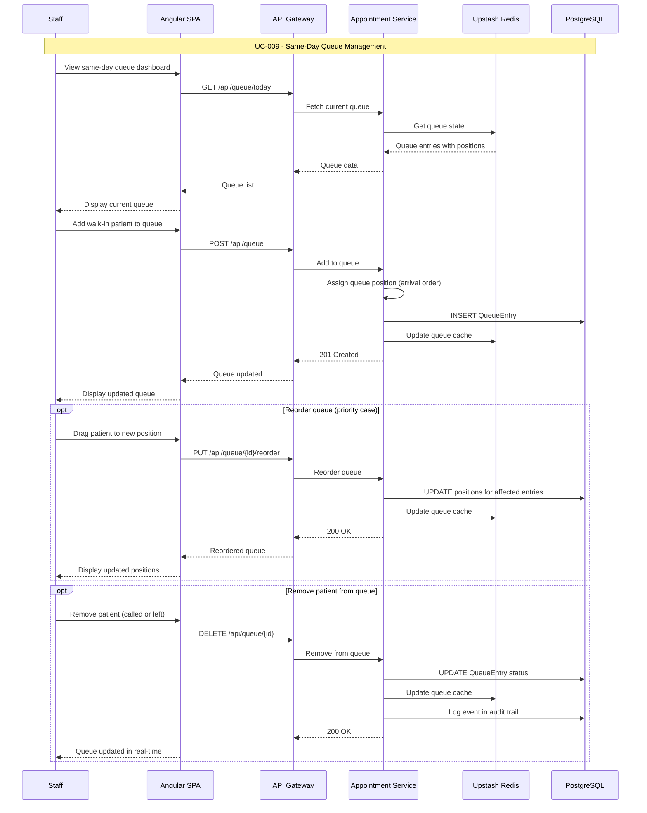
```mermaid
sequenceDiagram
    participant S as Staff
    participant FE as Angular SPA
    participant GW as API Gateway
    participant APT as Appointment Service
    participant REDIS as Upstash Redis
    participant DB as PostgreSQL

    Note over S,DB: UC-009 - Same-Day Queue Management

    S->>FE: View same-day queue dashboard
    FE->>GW: GET /api/queue/today
    GW->>APT: Fetch current queue
    APT->>REDIS: Get queue state
    REDIS-->>APT: Queue entries with positions
    APT-->>GW: Queue data
    GW-->>FE: Queue list
    FE-->>S: Display current queue

    S->>FE: Add walk-in patient to queue
    FE->>GW: POST /api/queue
    GW->>APT: Add to queue
    APT->>APT: Assign queue position (arrival order)
    APT->>DB: INSERT QueueEntry
    APT->>REDIS: Update queue cache
    APT-->>GW: 201 Created
    GW-->>FE: Queue updated
    FE-->>S: Display updated queue

    opt Reorder queue (priority case)
        S->>FE: Drag patient to new position
        FE->>GW: PUT /api/queue/{id}/reorder
        GW->>APT: Reorder queue
        APT->>DB: UPDATE positions for affected entries
        APT->>REDIS: Update queue cache
        APT-->>GW: 200 OK
        GW-->>FE: Reordered queue
        FE-->>S: Display updated positions
    end

    opt Remove patient from queue
        S->>FE: Remove patient (called or left)
        FE->>GW: DELETE /api/queue/{id}
        GW->>APT: Remove from queue
        APT->>DB: UPDATE QueueEntry status
        APT->>REDIS: Update queue cache
        APT->>DB: Log event in audit trail
        APT-->>GW: 200 OK
        FE-->>S: Queue updated in real-time
    end
```

### UC-010: Mark Patient Arrived

**Source**: [spec.md#UC-010](.propel/context/docs/spec.md#UC-010)

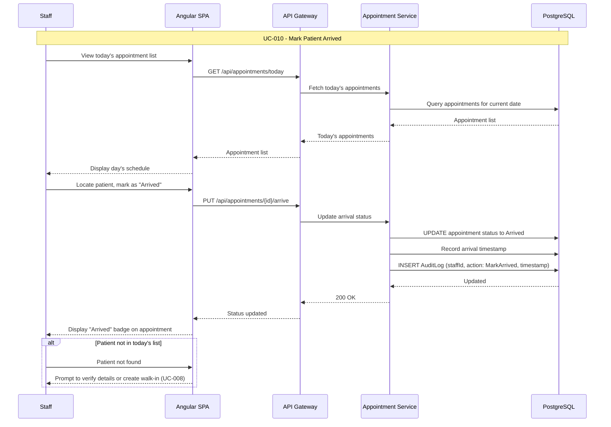
```mermaid
sequenceDiagram
    participant S as Staff
    participant FE as Angular SPA
    participant GW as API Gateway
    participant APT as Appointment Service
    participant DB as PostgreSQL

    Note over S,DB: UC-010 - Mark Patient Arrived

    S->>FE: View today's appointment list
    FE->>GW: GET /api/appointments/today
    GW->>APT: Fetch today's appointments
    APT->>DB: Query appointments for current date
    DB-->>APT: Appointment list
    APT-->>GW: Today's appointments
    GW-->>FE: Appointment list
    FE-->>S: Display day's schedule

    S->>FE: Locate patient, mark as "Arrived"
    FE->>GW: PUT /api/appointments/{id}/arrive
    GW->>APT: Update arrival status
    APT->>DB: UPDATE appointment status to Arrived
    APT->>DB: Record arrival timestamp
    APT->>DB: INSERT AuditLog (staffId, action: MarkArrived, timestamp)
    DB-->>APT: Updated
    APT-->>GW: 200 OK
    GW-->>FE: Status updated
    FE-->>S: Display "Arrived" badge on appointment

    alt Patient not in today's list
        S->>FE: Patient not found
        FE-->>S: Prompt to verify details or create walk-in (UC-008)
    end
```

### UC-011: Insurance Pre-Check

**Source**: [spec.md#UC-011](.propel/context/docs/spec.md#UC-011)

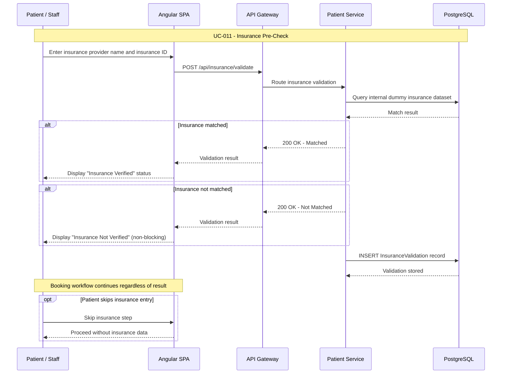
```mermaid
sequenceDiagram
    participant U as Patient / Staff
    participant FE as Angular SPA
    participant GW as API Gateway
    participant PAT as Patient Service
    participant DB as PostgreSQL

    Note over U,DB: UC-011 - Insurance Pre-Check

    U->>FE: Enter insurance provider name and insurance ID
    FE->>GW: POST /api/insurance/validate
    GW->>PAT: Route insurance validation
    PAT->>DB: Query internal dummy insurance dataset
    DB-->>PAT: Match result

    alt Insurance matched
        PAT-->>GW: 200 OK - Matched
        GW-->>FE: Validation result
        FE-->>U: Display "Insurance Verified" status
    end

    alt Insurance not matched
        PAT-->>GW: 200 OK - Not Matched
        GW-->>FE: Validation result
        FE-->>U: Display "Insurance Not Verified" (non-blocking)
    end

    PAT->>DB: INSERT InsuranceValidation record
    DB-->>PAT: Validation stored

    Note over U,FE: Booking workflow continues regardless of result

    opt Patient skips insurance entry
        U->>FE: Skip insurance step
        FE-->>U: Proceed without insurance data
    end
```

### UC-012: Upload Clinical Documents

**Source**: [spec.md#UC-012](.propel/context/docs/spec.md#UC-012)

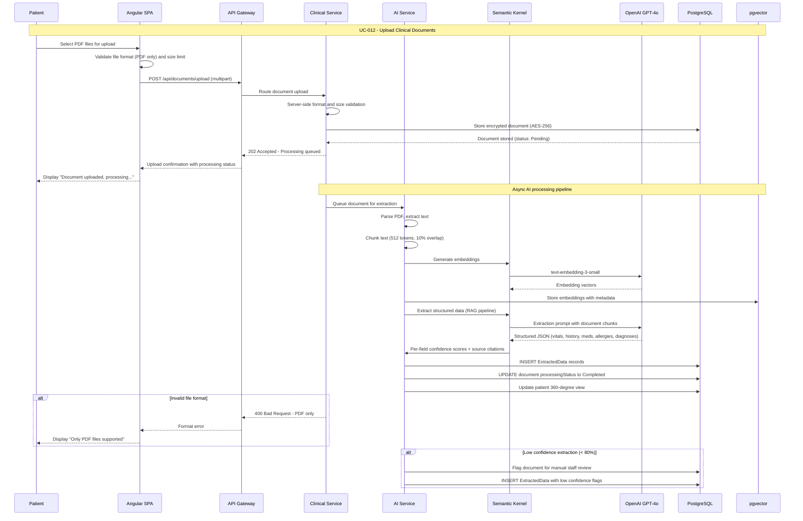
```mermaid
sequenceDiagram
    participant P as Patient
    participant FE as Angular SPA
    participant GW as API Gateway
    participant CLIN as Clinical Service
    participant AI as AI Service
    participant SK as Semantic Kernel
    participant LLM as OpenAI GPT-4o
    participant DB as PostgreSQL
    participant VEC as pgvector

    Note over P,VEC: UC-012 - Upload Clinical Documents

    P->>FE: Select PDF files for upload
    FE->>FE: Validate file format (PDF only) and size limit
    FE->>GW: POST /api/documents/upload (multipart)
    GW->>CLIN: Route document upload
    CLIN->>CLIN: Server-side format and size validation
    CLIN->>DB: Store encrypted document (AES-256)
    DB-->>CLIN: Document stored (status: Pending)
    CLIN-->>GW: 202 Accepted - Processing queued
    GW-->>FE: Upload confirmation with processing status
    FE-->>P: Display "Document uploaded, processing..."

    Note over CLIN,VEC: Async AI processing pipeline

    CLIN->>AI: Queue document for extraction
    AI->>AI: Parse PDF, extract text
    AI->>AI: Chunk text (512 tokens, 10% overlap)
    AI->>SK: Generate embeddings
    SK->>LLM: text-embedding-3-small
    LLM-->>SK: Embedding vectors
    AI->>VEC: Store embeddings with metadata
    AI->>SK: Extract structured data (RAG pipeline)
    SK->>LLM: Extraction prompt with document chunks
    LLM-->>SK: Structured JSON (vitals, history, meds, allergies, diagnoses)
    SK->>AI: Per-field confidence scores + source citations
    AI->>DB: INSERT ExtractedData records
    AI->>DB: UPDATE document processingStatus to Completed
    AI->>DB: Update patient 360-degree view

    alt Invalid file format
        CLIN-->>GW: 400 Bad Request - PDF only
        GW-->>FE: Format error
        FE-->>P: Display "Only PDF files supported"
    end

    alt Low confidence extraction (< 80%)
        AI->>DB: Flag document for manual staff review
        AI->>DB: INSERT ExtractedData with low confidence flags
    end
```

### UC-013: View 360-Degree Patient Profile

**Source**: [spec.md#UC-013](.propel/context/docs/spec.md#UC-013)

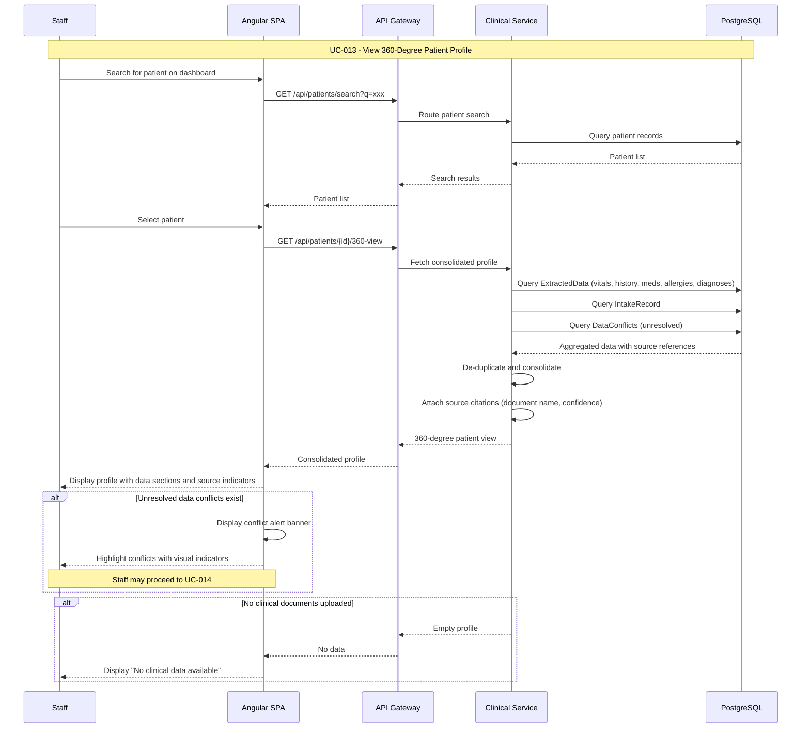
```mermaid
sequenceDiagram
    participant S as Staff
    participant FE as Angular SPA
    participant GW as API Gateway
    participant CLIN as Clinical Service
    participant DB as PostgreSQL

    Note over S,DB: UC-013 - View 360-Degree Patient Profile

    S->>FE: Search for patient on dashboard
    FE->>GW: GET /api/patients/search?q=xxx
    GW->>CLIN: Route patient search
    CLIN->>DB: Query patient records
    DB-->>CLIN: Patient list
    CLIN-->>GW: Search results
    GW-->>FE: Patient list
    S->>FE: Select patient

    FE->>GW: GET /api/patients/{id}/360-view
    GW->>CLIN: Fetch consolidated profile
    CLIN->>DB: Query ExtractedData (vitals, history, meds, allergies, diagnoses)
    CLIN->>DB: Query IntakeRecord
    CLIN->>DB: Query DataConflicts (unresolved)
    DB-->>CLIN: Aggregated data with source references
    CLIN->>CLIN: De-duplicate and consolidate
    CLIN->>CLIN: Attach source citations (document name, confidence)
    CLIN-->>GW: 360-degree patient view
    GW-->>FE: Consolidated profile
    FE-->>S: Display profile with data sections and source indicators

    alt Unresolved data conflicts exist
        FE->>FE: Display conflict alert banner
        FE-->>S: Highlight conflicts with visual indicators
        Note over S,FE: Staff may proceed to UC-014
    end

    alt No clinical documents uploaded
        CLIN-->>GW: Empty profile
        GW-->>FE: No data
        FE-->>S: Display "No clinical data available"
    end
```

### UC-014: Resolve Data Conflicts

**Source**: [spec.md#UC-014](.propel/context/docs/spec.md#UC-014)

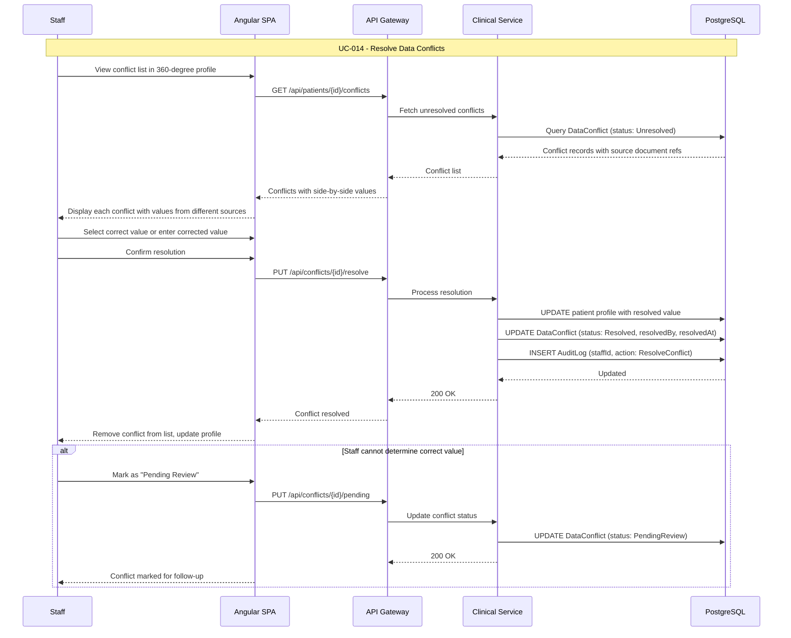
```mermaid
sequenceDiagram
    participant S as Staff
    participant FE as Angular SPA
    participant GW as API Gateway
    participant CLIN as Clinical Service
    participant DB as PostgreSQL

    Note over S,DB: UC-014 - Resolve Data Conflicts

    S->>FE: View conflict list in 360-degree profile
    FE->>GW: GET /api/patients/{id}/conflicts
    GW->>CLIN: Fetch unresolved conflicts
    CLIN->>DB: Query DataConflict (status: Unresolved)
    DB-->>CLIN: Conflict records with source document refs
    CLIN-->>GW: Conflict list
    GW-->>FE: Conflicts with side-by-side values
    FE-->>S: Display each conflict with values from different sources

    S->>FE: Select correct value or enter corrected value
    S->>FE: Confirm resolution
    FE->>GW: PUT /api/conflicts/{id}/resolve
    GW->>CLIN: Process resolution
    CLIN->>DB: UPDATE patient profile with resolved value
    CLIN->>DB: UPDATE DataConflict (status: Resolved, resolvedBy, resolvedAt)
    CLIN->>DB: INSERT AuditLog (staffId, action: ResolveConflict)
    DB-->>CLIN: Updated
    CLIN-->>GW: 200 OK
    GW-->>FE: Conflict resolved
    FE-->>S: Remove conflict from list, update profile

    alt Staff cannot determine correct value
        S->>FE: Mark as "Pending Review"
        FE->>GW: PUT /api/conflicts/{id}/pending
        GW->>CLIN: Update conflict status
        CLIN->>DB: UPDATE DataConflict (status: PendingReview)
        CLIN-->>GW: 200 OK
        FE-->>S: Conflict marked for follow-up
    end
```

### UC-015: Review Medical Codes

**Source**: [spec.md#UC-015](.propel/context/docs/spec.md#UC-015)

```mermaid
sequenceDiagram
    participant S as Staff
    participant FE as Angular SPA
    participant GW as API Gateway
    participant CODE as Medical Coding Service
    participant AI as AI Service
    participant SK as Semantic Kernel
    participant LLM as OpenAI GPT-4o
    participant DB as PostgreSQL

    Note over S,DB: UC-015 - Review Medical Codes

    S->>FE: Open medical coding review for patient
    FE->>GW: GET /api/patients/{id}/medical-codes
    GW->>CODE: Fetch AI-generated code suggestions
    CODE->>DB: Query MedicalCode (status: Pending)
    DB-->>CODE: ICD-10 and CPT suggestions

    alt No codes generated (insufficient data)
        CODE-->>GW: 200 OK - No suggestions
        GW-->>FE: Empty result
        FE-->>S: Display "Insufficient data for code suggestions"
    end

    CODE-->>GW: Code suggestions with confidence + sources
    GW-->>FE: ICD-10 and CPT lists
    FE-->>S: Display codes with confidence scores and source references

    loop For each suggested code
        S->>FE: Accept, reject, or modify code
        FE->>GW: PUT /api/medical-codes/{id}
        GW->>CODE: Update code verification status
        CODE->>DB: UPDATE MedicalCode (status, verifiedBy, verifiedAt)
        DB-->>CODE: Updated
    end

    S->>FE: Finalize code set
    FE->>GW: POST /api/patients/{id}/medical-codes/finalize
    GW->>CODE: Finalize all codes
    CODE->>DB: Batch update finalized codes
    CODE->>DB: INSERT AuditLog (staffId, action: FinalizeCodes)
    DB-->>CODE: Saved
    CODE-->>GW: 200 OK
    GW-->>FE: Codes finalized
    FE-->>S: Display finalization confirmation
```

### UC-016: Manage Users

**Source**: [spec.md#UC-016](.propel/context/docs/spec.md#UC-016)

```mermaid
sequenceDiagram
    participant A as Admin
    participant FE as Angular SPA
    participant GW as API Gateway
    participant ADMIN as Admin Service
    participant DB as PostgreSQL
    participant REDIS as Upstash Redis
    participant EMAIL as SendGrid

    Note over A,EMAIL: UC-016 - Manage Users

    A->>FE: Navigate to user management panel

    alt Create User
        A->>FE: Enter user details (name, email, role)
        FE->>GW: POST /api/admin/users
        GW->>ADMIN: Create user
        ADMIN->>DB: Check email uniqueness
        DB-->>ADMIN: Email available
        ADMIN->>DB: INSERT User record
        ADMIN->>EMAIL: Send invitation email
        ADMIN->>DB: INSERT AuditLog (adminId, action: CreateUser)
        ADMIN-->>GW: 201 Created
        GW-->>FE: User created
        FE-->>A: Display success

        alt Email already exists
            DB-->>ADMIN: Email exists
            ADMIN-->>GW: 409 Conflict
            FE-->>A: Display "Email already registered"
        end
    end

    alt Update User
        A->>FE: Modify user details (name, role, contact)
        FE->>GW: PUT /api/admin/users/{id}
        GW->>ADMIN: Update user
        ADMIN->>DB: UPDATE User record
        ADMIN->>DB: INSERT AuditLog (adminId, action: UpdateUser)
        ADMIN-->>GW: 200 OK
        FE-->>A: Display updated user
    end

    alt Deactivate User
        A->>FE: Deactivate user account
        FE->>GW: PUT /api/admin/users/{id}/deactivate
        GW->>ADMIN: Deactivate user
        ADMIN->>ADMIN: Verify not self-deactivation
        ADMIN->>DB: UPDATE User status to Deactivated
        ADMIN->>REDIS: Terminate active sessions
        ADMIN->>DB: INSERT AuditLog (adminId, action: DeactivateUser)
        ADMIN-->>GW: 200 OK
        FE-->>A: Display deactivated status

        alt Self-deactivation attempt
            ADMIN-->>GW: 403 Forbidden
            FE-->>A: Display "Cannot deactivate own account"
        end
    end
```

### UC-017: Receive Appointment Reminders

**Source**: [spec.md#UC-017](.propel/context/docs/spec.md#UC-017)

```mermaid
sequenceDiagram
    participant SCHED as Scheduler (Background)
    participant NOTIF as Notification Service
    participant DB as PostgreSQL
    participant EMAIL as SendGrid
    participant SMS as Twilio

    Note over SCHED,SMS: UC-017 - Receive Appointment Reminders

    SCHED->>NOTIF: Trigger reminder check (configured intervals)
    NOTIF->>DB: Query appointments approaching reminder window (24h, 2h)
    DB-->>NOTIF: Appointments requiring reminders

    loop For each upcoming appointment
        NOTIF->>DB: Verify appointment is still active (not cancelled)
        DB-->>NOTIF: Appointment active

        NOTIF->>NOTIF: Generate reminder content with appointment details

        NOTIF->>SMS: Send SMS reminder to patient phone
        SMS-->>NOTIF: Delivery status

        NOTIF->>EMAIL: Send email reminder to patient email
        EMAIL-->>NOTIF: Delivery status

        NOTIF->>DB: INSERT Notification (channel, status, sentAt)

        alt SMS delivery fails
            NOTIF->>DB: Log failure
            NOTIF->>SMS: Retry once
            SMS-->>NOTIF: Retry status
            alt Retry fails
                NOTIF->>DB: Log SMS failure, rely on email
            end
        end

        alt Email delivery fails
            NOTIF->>DB: Log failure
            NOTIF->>EMAIL: Retry once
            EMAIL-->>NOTIF: Retry status
            alt Retry fails
                NOTIF->>DB: Log email failure, rely on SMS
            end
        end
    end

    alt Appointment cancelled before reminder
        NOTIF->>DB: Verify appointment status
        DB-->>NOTIF: Status: Cancelled
        NOTIF->>NOTIF: Skip reminder generation
    end
```

### UC-018: Sync Calendar

**Source**: [spec.md#UC-018](.propel/context/docs/spec.md#UC-018)

```mermaid
sequenceDiagram
    participant P as Patient
    participant FE as Angular SPA
    participant GW as API Gateway
    participant APT as Appointment Service
    participant DB as PostgreSQL
    participant GCAL as Google Calendar API
    participant OUTLOOK as Microsoft Graph API

    Note over P,OUTLOOK: UC-018 - Sync Calendar

    P->>FE: Select "Sync to Calendar" from appointment details
    P->>FE: Choose provider (Google or Outlook)

    alt Google Calendar
        FE->>GW: POST /api/calendar/sync/google
        GW->>APT: Initiate Google Calendar sync

        opt Not previously authorized
            APT-->>FE: Redirect to Google OAuth 2.0 flow
            FE->>GCAL: Authorization request
            P->>GCAL: Grant calendar access
            GCAL-->>FE: Authorization code
            FE->>GW: Exchange code for token
            GW->>APT: Store OAuth tokens
        end

        APT->>GCAL: Create calendar event (date, time, provider, location)
        GCAL-->>APT: Event created (externalEventId)
        APT->>DB: INSERT CalendarSync (provider: Google, syncStatus: Synced)
        APT-->>GW: 200 OK
        GW-->>FE: Sync confirmed
        FE-->>P: Display "Synced to Google Calendar"
    end

    alt Outlook Calendar
        FE->>GW: POST /api/calendar/sync/outlook
        GW->>APT: Initiate Outlook sync

        opt Not previously authorized
            APT-->>FE: Redirect to Microsoft OAuth 2.0 flow
            FE->>OUTLOOK: Authorization request
            P->>OUTLOOK: Grant calendar access
            OUTLOOK-->>FE: Authorization code
            FE->>GW: Exchange code for token
            GW->>APT: Store OAuth tokens
        end

        APT->>OUTLOOK: Create calendar event (date, time, provider, location)
        OUTLOOK-->>APT: Event created (externalEventId)
        APT->>DB: INSERT CalendarSync (provider: Outlook, syncStatus: Synced)
        APT-->>GW: 200 OK
        GW-->>FE: Sync confirmed
        FE-->>P: Display "Synced to Outlook Calendar"
    end

    alt API rate limit exceeded
        GCAL-->>APT: 429 Too Many Requests
        APT->>DB: Queue sync request
        APT->>APT: Retry with exponential backoff
    end

    alt Authorization revoked or expired
        GCAL-->>APT: 401 Unauthorized
        APT-->>FE: Re-authorization required
        FE-->>P: Prompt to re-authorize calendar access
    end
```
