## Feature Goal

Build a unified, standalone healthcare platform that bridges patient scheduling and clinical data management into a single system. The platform combines a patient-centric appointment booking system with a Trust-First clinical intelligence engine to simplify scheduling, reduce no-show rates (from a 15% baseline), and eliminate manual extraction of patient data from unstructured clinical reports (reducing a 20-minute task to a 2-minute verification). The system serves three user roles: Patients, Staff (front desk/call center), and Admin, providing an end-to-end data lifecycle from initial booking through post-visit data consolidation.

## Business Justification

- Healthcare organizations lose revenue and underutilize schedules due to up to 15% no-show rates caused by complex booking processes and lack of smart reminders
- Clinical staff spend 20+ minutes per patient manually reading multi-format PDF reports to gather vitals, history, and medications, creating a primary bottleneck in clinical prep
- Existing market solutions are fragmented: booking tools lack clinical data context, and AI coding tools face a Black Box trust deficit requiring manual verification of unlinked data
- The platform bridges this gap by delivering an intelligent aggregator that improves both operational scheduling and clinical preparation
- The Trust-First approach differentiates from competitors by providing verified, source-linked data with explicit conflict highlighting
- Targets measurable ROI: reduced no-show rates, decreased staff administrative time, and an AI-Human Agreement Rate exceeding 98%

## Feature Scope

The platform scope (Phase 1) encompasses patient registration and authentication, appointment booking with waitlist and preferred slot swap, flexible patient intake (AI conversational or manual form), staff-managed walk-in bookings and same-day queues, automated multi-channel reminders (SMS/Email), Google and Outlook calendar sync, insurance pre-check against dummy records, clinical document upload and AI-powered data extraction, 360-degree patient view with conflict resolution, ICD-10 and CPT code mapping, no-show risk assessment, admin user management, and HIPAA-compliant security with immutable audit logging.

**Out of Scope (Phase 1):** Provider logins or provider-facing actions, payment gateway integration, family member profiles, patient self-check-in (mobile/web/QR), direct bi-directional EHR integration, full claims submission, and paid cloud infrastructure.

**Technology Stack:** Angular 18 (frontend), .NET 8 ASP.NET Core Web API (backend, microservices), Entity Framework Core (ORM), PostgreSQL (database), Upstash Redis (caching). Hosting on free/open-source platforms (Netlify, Vercel, GitHub Codespaces).

### Success Criteria

- [ ] Demonstrable reduction in no-show rate from the 15% baseline
- [ ] Decrease in staff administrative time per appointment
- [ ] High volume of patient dashboards created and appointments booked
- [ ] AI-Human Agreement Rate of >98% for suggested clinical data and medical codes
- [ ] Quantifiable Critical Conflicts Identified metric tracking prevented safety risks
- [ ] 100% HIPAA-compliant data handling, transmission, and storage
- [ ] 99.9% uptime target met
- [ ] Session auto-timeout enforced at 15 minutes of inactivity

## Functional Requirements

**AI Suitability Triage Summary:**

| Classification | Count | Description                                                              |
| -------------- | ----- | ------------------------------------------------------------------------ |
| DETERMINISTIC  | 30    | Rule-based, exact logic (auth, booking CRUD, reminders, audit)           |
| AI-CANDIDATE   | 7     | GenAI-suitable (conversational intake, document extraction, coding)      |
| HYBRID         | 7     | AI suggests, human confirms (360-view, conflict resolution, code review) |

### User Management and Authentication

- FR-001: [DETERMINISTIC] System MUST allow patients to self-register by providing name, email, phone number, and date of birth, with email verification before account activation
- FR-002: [DETERMINISTIC] System MUST authenticate users via email and password with role-based access enforcement for Patient, Staff, and Admin roles
- FR-003: [DETERMINISTIC] System MUST automatically terminate user sessions after 15 minutes of inactivity and redirect to the login page
- FR-004: [DETERMINISTIC] System MUST allow Admin users to create, read, update, and deactivate user accounts for all roles (Patient, Staff, Admin)
- FR-005: [DETERMINISTIC] System MUST store passwords using industry-standard hashing algorithms (e.g., bcrypt/Argon2) and enforce minimum complexity requirements (8+ characters, mixed case, number, special character)
- FR-006: [DETERMINISTIC] System MUST enforce role-based access control at the API level, restricting endpoints based on the authenticated user's role

### Appointment Booking

- FR-007: [DETERMINISTIC] System MUST allow authenticated patients to book appointments by selecting a provider specialty, preferred date, and available time slot
- FR-008: [DETERMINISTIC] System MUST display available appointment slots in real-time, filtering by provider specialty and date range
- FR-009: [DETERMINISTIC] System MUST allow patients and staff to cancel an existing appointment with a cancellation reason, updating slot availability immediately
- FR-010: [DETERMINISTIC] System MUST allow patients and staff to reschedule an existing appointment to a new available time slot, releasing the original slot
- FR-011: [DETERMINISTIC] System MUST generate a PDF containing appointment details (date, time, provider, location, instructions) and send it to the patient's registered email upon successful booking

### Waitlist and Preferred Slot Swap

- FR-012: [DETERMINISTIC] System MUST allow patients to select a preferred unavailable time slot while booking an available alternative slot, enrolling the patient in a waitlist for the preferred slot
- FR-013: [DETERMINISTIC] System MUST automatically swap the patient's appointment to the preferred slot when it becomes available, without requiring manual intervention
- FR-014: [DETERMINISTIC] System MUST release the patient's original booked slot back to the available pool immediately upon a successful preferred slot swap
- FR-015: [DETERMINISTIC] System MUST notify the patient via email and SMS when a preferred slot swap is completed, including updated appointment details

### Patient Intake

- FR-016: [AI-CANDIDATE] System MUST provide an AI-powered conversational intake interface that collects patient demographic, medical history, current symptoms, and medication information through natural language interaction
- FR-017: [DETERMINISTIC] System MUST provide a traditional manual intake form as an alternative to AI conversational intake, collecting the same data fields (demographics, medical history, symptoms, medications)
- FR-018: [HYBRID] System MUST allow patients to switch between AI conversational intake and manual form intake at any point during the intake process without data loss
- FR-019: [DETERMINISTIC] System MUST allow patients to review and edit all intake responses directly without requiring staff assistance

### Walk-in and Same-Day Queue Management

- FR-020: [DETERMINISTIC] System MUST restrict walk-in booking creation to authenticated Staff users only; patients MUST NOT be able to create walk-in bookings
- FR-021: [DETERMINISTIC] System MUST allow staff to optionally create a patient account during walk-in booking for patients without an existing account
- FR-022: [DETERMINISTIC] System MUST allow staff to manage a same-day appointment queue, including adding, reordering, and removing patients from the queue
- FR-023: [DETERMINISTIC] System MUST allow staff to mark a patient's appointment status as "Arrived"; this action MUST be restricted to Staff role only

### Reminders and Notifications

- FR-024: [DETERMINISTIC] System MUST send automated SMS reminders to patients at configurable intervals before their scheduled appointment (e.g., 24 hours, 2 hours before)
- FR-025: [DETERMINISTIC] System MUST send automated email reminders to patients at configurable intervals before their scheduled appointment
- FR-026: [DETERMINISTIC] System MUST allow staff to configure reminder timing rules (intervals, channels) for appointment reminders at the system level

### Calendar Sync

- FR-027: [DETERMINISTIC] System MUST allow patients to sync booked appointments to their Google Calendar using free Google Calendar API integration
- FR-028: [DETERMINISTIC] System MUST allow patients to sync booked appointments to their Outlook Calendar using free Microsoft Graph API integration

### Insurance Pre-Check

- FR-029: [DETERMINISTIC] System MUST perform soft validation of a patient's insurance provider name and insurance ID against an internal predefined set of dummy insurance records during the booking or intake process
- FR-030: [DETERMINISTIC] System MUST display the insurance validation result (matched/not matched) to the patient and staff, without blocking the booking workflow on a negative result

### Clinical Document Management

- FR-031: [DETERMINISTIC] System MUST allow patients to upload historical clinical documents in PDF format, with file size and format validation before acceptance
- FR-032: [AI-CANDIDATE] System MUST automatically extract structured patient data (vitals, medical history, medications, allergies, diagnoses) from uploaded PDF clinical documents using AI-powered document processing
- FR-033: [AI-CANDIDATE] System MUST ingest and process post-visit clinical notes to extract relevant patient data and update the patient's consolidated record

### 360-Degree Patient View

- FR-034: [HYBRID] System MUST aggregate data from all uploaded documents and processed clinical notes into a single, de-duplicated 360-degree patient view, with AI performing initial extraction and staff performing final verification
- FR-035: [HYBRID] System MUST explicitly identify and highlight critical data conflicts across documents (e.g., conflicting medication lists, differing allergy records) for staff review and resolution
- FR-036: [HYBRID] System MUST provide a verification workflow where staff can confirm, reject, or modify AI-extracted data points within the 360-degree patient view

### Medical Coding

- FR-037: [AI-CANDIDATE] System MUST extract and suggest applicable ICD-10 diagnosis codes from the aggregated patient data and clinical documents
- FR-038: [AI-CANDIDATE] System MUST map and suggest applicable CPT procedure codes based on the aggregated patient data and clinical documentation
- FR-039: [HYBRID] System MUST provide a review interface where staff can accept, reject, or modify AI-suggested ICD-10 and CPT codes before finalization

### No-Show Risk Assessment

- FR-040: [HYBRID] System MUST calculate a no-show risk score for each appointment using rule-based assessment factors (appointment history, lead time, reminder engagement), with AI augmenting the risk model based on historical patterns
- FR-041: [DETERMINISTIC] System MUST display the no-show risk score on the staff scheduling dashboard to inform scheduling decisions and targeted reminder strategies

### Security and Compliance

- FR-042: [DETERMINISTIC] System MUST encrypt all patient data at rest (AES-256 or equivalent) and in transit (TLS 1.2+) to ensure HIPAA-compliant data handling
- FR-043: [DETERMINISTIC] System MUST maintain an immutable audit log recording all user actions involving patient data (create, read, update, delete), including user ID, timestamp, action type, and affected record
- FR-044: [DETERMINISTIC] System MUST restrict access to patient data based on the authenticated user's role, ensuring patients can only access their own records and staff can access records within their authorized scope

## Use Case Analysis

### Actors and System Boundary

- **Patient**: End user who registers, books appointments, completes intake, uploads documents, and views their profile. Interacts via web browser.
- **Staff (Front Desk/Call Center)**: Administrative user who manages walk-ins, same-day queues, arrival tracking, verifies AI-extracted data, reviews medical codes, and resolves data conflicts. Interacts via staff dashboard.
- **Admin**: System administrator who manages user accounts (create, update, deactivate) across all roles. Interacts via admin panel.
- **Email Service (System)**: External system that sends appointment PDFs, reminders, and notifications.
- **SMS Service (System)**: External system that delivers SMS appointment reminders.
- **Google Calendar API (System)**: External system for calendar synchronization.
- **Outlook Calendar API (System)**: External system for calendar synchronization.
- **AI Processing Engine (System)**: Internal subsystem that performs document extraction, conversational intake, and medical coding.

### Use Case Specifications

#### UC-001: Patient Registration

- **Actor(s)**: Patient
- **Goal**: Create a new patient account on the platform
- **Preconditions**: Patient does not have an existing account; patient has a valid email address
- **Success Scenario**:
  1. Patient navigates to the registration page
  2. Patient enters name, email, phone number, date of birth, and password
  3. System validates input fields and password complexity
  4. System sends a verification email to the provided address
  5. Patient clicks the verification link in the email
  6. System activates the patient account
  7. System redirects patient to the login page with a success message
- **Extensions/Alternatives**:
  - 2a. Patient provides an email already associated with an existing account: System displays an error message indicating the email is already registered
  - 3a. Password does not meet complexity requirements: System displays specific password requirements and prompts re-entry
  - 5a. Verification link has expired (24-hour validity): System allows patient to request a new verification email
- **Postconditions**: Patient account is created and active; patient can log in

##### Use Case Diagram

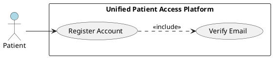

#### UC-002: User Login

- **Actor(s)**: Patient, Staff, Admin
- **Goal**: Authenticate and access the platform with role-appropriate permissions
- **Preconditions**: User has an active, verified account
- **Success Scenario**:
  1. User navigates to the login page
  2. User enters email and password
  3. System validates credentials against stored records
  4. System identifies the user's role (Patient, Staff, or Admin)
  5. System creates an authenticated session with a 15-minute inactivity timeout
  6. System redirects user to their role-specific dashboard
- **Extensions/Alternatives**:
  - 3a. Invalid credentials: System displays a generic error message ("Invalid email or password") and increments failed login counter
  - 3b. Account is deactivated: System displays a message to contact administrator
  - 5a. Session expires due to inactivity: System redirects to login page with a session expiration message
- **Postconditions**: User is authenticated with an active session; role-based access is enforced

##### Use Case Diagram

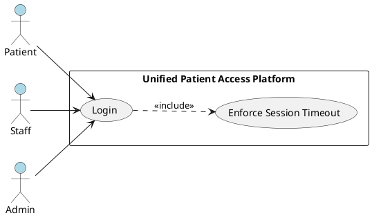

#### UC-003: Book Appointment

- **Actor(s)**: Patient
- **Goal**: Book an available appointment slot
- **Preconditions**: Patient is authenticated; available appointment slots exist
- **Success Scenario**:
  1. Patient selects provider specialty and preferred date range
  2. System displays available time slots for the selected criteria
  3. Patient selects an available time slot
  4. System confirms the booking and reserves the slot
  5. System generates an appointment details PDF
  6. System sends the PDF to the patient's registered email
  7. System displays booking confirmation with appointment summary
- **Extensions/Alternatives**:
  - 2a. No available slots for selected criteria: System suggests alternative dates or prompts waitlist enrollment (UC-004)
  - 4a. Selected slot was booked by another user during selection: System displays a conflict message and refreshes available slots
  - 6a. Email delivery fails: System logs the failure and displays a download link for the PDF on the confirmation page
- **Postconditions**: Appointment is booked; slot is marked unavailable; PDF sent to patient email

##### Use Case Diagram

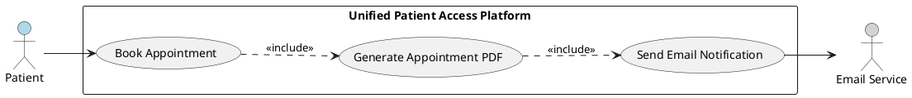

#### UC-004: Preferred Slot Swap

- **Actor(s)**: Patient
- **Goal**: Register a preferred unavailable slot and have the system auto-swap when it opens
- **Preconditions**: Patient is authenticated; patient has an active booking; a preferred slot is currently unavailable
- **Success Scenario**:
  1. During booking (UC-003), patient identifies a preferred unavailable time slot
  2. Patient selects the preferred slot for waitlist enrollment
  3. System books the patient into the available alternative slot
  4. System enrolls the patient in the waitlist for the preferred slot
  5. When the preferred slot becomes available, system automatically cancels the original booking
  6. System books the patient into the preferred slot
  7. System releases the original slot back to availability
  8. System notifies the patient via email and SMS of the completed swap
- **Extensions/Alternatives**:
  - 5a. Preferred slot is claimed by a direct booking before waitlist processing: System retains the original booking and removes the waitlist entry, notifying the patient
  - 5b. Multiple patients on the waitlist for the same slot: System processes in FIFO order; only the first patient gets the swap
- **Postconditions**: Patient's appointment is moved to the preferred slot; original slot is released; patient is notified

##### Use Case Diagram

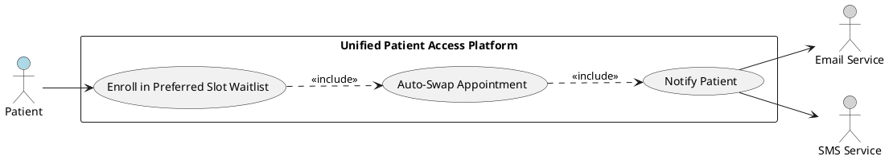

#### UC-005: Cancel or Reschedule Appointment

- **Actor(s)**: Patient, Staff
- **Goal**: Cancel or reschedule an existing appointment
- **Preconditions**: An active appointment exists for the patient
- **Success Scenario (Cancel)**:
  1. User selects the appointment to cancel
  2. User provides a cancellation reason
  3. System cancels the appointment and releases the time slot
  4. System notifies the patient via email of the cancellation
  5. System checks the waitlist for the released slot and triggers swap if applicable (UC-004)
- **Success Scenario (Reschedule)**:
  1. User selects the appointment to reschedule
  2. System displays available alternative time slots
  3. User selects a new time slot
  4. System moves the appointment to the new slot and releases the original
  5. System sends updated appointment PDF to patient's email
- **Extensions/Alternatives**:
  - 3a. (Reschedule) No alternative slots available: System suggests waitlist enrollment
  - 1a. Staff cancels on behalf of patient: System logs the staff user who performed the action in the audit trail
- **Postconditions**: Appointment is cancelled or moved to a new slot; original slot released; patient notified

##### Use Case Diagram

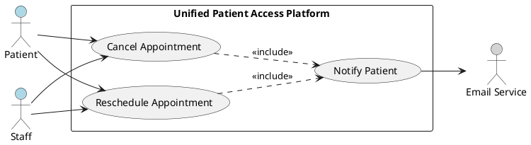

#### UC-006: AI Conversational Intake

- **Actor(s)**: Patient
- **Goal**: Complete patient intake through AI-powered conversational interface
- **Preconditions**: Patient is authenticated; patient has a booked appointment or is in the intake workflow
- **Success Scenario**:
  1. Patient initiates the intake process and selects AI conversational mode
  2. AI engine presents the first intake question in natural language
  3. Patient responds in natural language
  4. AI engine interprets the response, extracts structured data, and presents the next question
  5. Steps 3-4 repeat until all required intake data is collected (demographics, medical history, symptoms, medications)
  6. System displays a summary of collected data for patient review
  7. Patient confirms the intake data
  8. System saves the intake record to the patient's profile
- **Extensions/Alternatives**:
  - 3a. AI cannot interpret patient response: AI rephrases the question with clarifying options
  - 4a. Patient wants to switch to manual form: System transfers all collected data to the manual form (FR-018) and continues from there
  - 6a. Patient edits a response in the summary: System updates the specific field without restarting the intake
- **Postconditions**: Patient intake data is captured and stored; data is available for clinical processing

##### Use Case Diagram

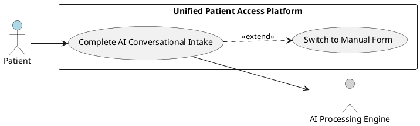

#### UC-007: Manual Form Intake

- **Actor(s)**: Patient
- **Goal**: Complete patient intake via traditional manual form
- **Preconditions**: Patient is authenticated; patient has a booked appointment or is in the intake workflow
- **Success Scenario**:
  1. Patient initiates the intake process and selects manual form mode
  2. System displays the intake form with all required fields (demographics, medical history, symptoms, medications)
  3. Patient fills in the form fields
  4. System validates required fields and data formats
  5. Patient reviews and submits the form
  6. System saves the intake record to the patient's profile
- **Extensions/Alternatives**:
  - 3a. Patient wants to switch to AI conversational intake: System transfers all entered data to the AI conversational interface (FR-018)
  - 4a. Validation errors on required fields: System highlights invalid fields with specific error messages
- **Postconditions**: Patient intake data is captured and stored; data is available for clinical processing

##### Use Case Diagram

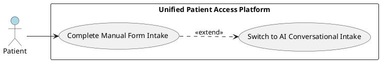

#### UC-008: Walk-in Booking

- **Actor(s)**: Staff
- **Goal**: Create an appointment for a walk-in patient
- **Preconditions**: Staff is authenticated; same-day slots or queue capacity is available
- **Success Scenario**:
  1. Staff selects the walk-in booking option
  2. Staff searches for the patient's existing account by name, email, or phone
  3. System displays patient record if found
  4. Staff selects provider specialty and assigns an available slot or adds to same-day queue
  5. System creates the appointment record
  6. System sends appointment confirmation email to the patient (if account exists)
- **Extensions/Alternatives**:
  - 2a. Patient has no existing account: Staff optionally creates a new patient account with basic information (name, phone, email)
  - 4a. No available slots: Staff adds the patient to the same-day queue (UC-009)
- **Postconditions**: Walk-in appointment is created; patient is in the queue or has a booked slot

##### Use Case Diagram

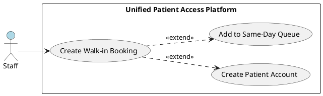

#### UC-009: Same-Day Queue Management

- **Actor(s)**: Staff
- **Goal**: Manage the same-day appointment queue
- **Preconditions**: Staff is authenticated; same-day queue is active
- **Success Scenario**:
  1. Staff views the current same-day queue on the dashboard
  2. Staff adds a walk-in patient to the queue
  3. System assigns a queue position based on arrival order
  4. Staff reorders patients in the queue as needed (e.g., priority cases)
  5. Staff removes a patient from the queue when they are called or leave
  6. System updates the queue display in real-time
- **Extensions/Alternatives**:
  - 4a. Staff moves a patient to a higher priority position: System adjusts all subsequent queue positions
  - 5a. Patient leaves before being seen: Staff removes patient and system logs the event
- **Postconditions**: Same-day queue is updated; queue state is persisted

##### Use Case Diagram

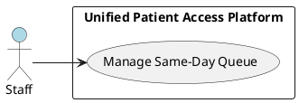

#### UC-010: Mark Patient Arrived

- **Actor(s)**: Staff
- **Goal**: Mark a patient as arrived for their appointment
- **Preconditions**: Staff is authenticated; patient has an active appointment for the current day
- **Success Scenario**:
  1. Staff views the day's appointment list on the dashboard
  2. Staff locates the patient's appointment
  3. Staff marks the appointment status as "Arrived"
  4. System updates the appointment status and records the arrival timestamp
  5. System logs the action in the audit trail with staff ID and timestamp
- **Extensions/Alternatives**:
  - 2a. Patient is not found in today's appointment list: Staff verifies the patient's appointment details or creates a walk-in booking (UC-008)
- **Postconditions**: Appointment status is "Arrived"; audit log is updated

##### Use Case Diagram

#### UC-011: Insurance Pre-Check

- **Actor(s)**: Patient, Staff
- **Goal**: Validate patient's insurance information against internal records
- **Preconditions**: Patient is in the booking or intake workflow; internal dummy insurance dataset is loaded
- **Success Scenario**:
  1. Patient or staff enters insurance provider name and insurance ID during booking or intake
  2. System searches the internal predefined insurance record set for a match
  3. System finds a matching record
  4. System displays "Insurance Verified" status to the user
  5. System stores the validation result with the appointment/intake record
- **Extensions/Alternatives**:
  - 3a. No matching record found: System displays "Insurance Not Verified" status but does NOT block the booking or intake workflow
  - 1a. Patient skips insurance entry: System allows progression without insurance data
- **Postconditions**: Insurance validation result is recorded; booking workflow continues regardless of result

##### Use Case Diagram

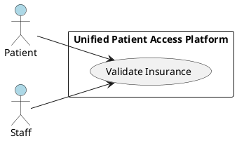

#### UC-012: Upload Clinical Documents

- **Actor(s)**: Patient
- **Goal**: Upload historical clinical documents for data extraction
- **Preconditions**: Patient is authenticated; patient has clinical PDF documents to upload
- **Success Scenario**:
  1. Patient navigates to the document upload section of their profile
  2. Patient selects one or more PDF files for upload
  3. System validates file format (PDF only) and file size (within configured limit)
  4. System uploads and stores the documents securely (encrypted at rest)
  5. System queues documents for AI-powered data extraction processing
  6. System displays upload confirmation with processing status indicator
  7. AI Processing Engine extracts structured data (vitals, history, medications, allergies, diagnoses) from documents
  8. System updates the patient's 360-degree view with extracted data
- **Extensions/Alternatives**:
  - 3a. Invalid file format: System rejects the upload and displays supported format message (PDF only)
  - 3b. File exceeds size limit: System rejects the upload and displays maximum file size
  - 7a. AI extraction fails or returns low-confidence results: System flags the document for manual staff review
- **Postconditions**: Documents are stored; AI extraction is initiated; patient profile is queued for update

##### Use Case Diagram

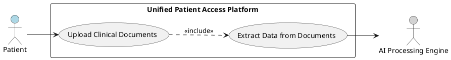

#### UC-013: View 360-Degree Patient Profile

- **Actor(s)**: Staff
- **Goal**: View the consolidated, de-duplicated patient profile with all extracted clinical data
- **Preconditions**: Staff is authenticated; patient has uploaded documents or completed intake; AI extraction has been processed
- **Success Scenario**:
  1. Staff searches for and selects a patient from the dashboard
  2. System displays the 360-degree patient view with aggregated data sections (vitals, medical history, medications, allergies, diagnoses)
  3. System indicates data source for each data point (document name, extraction confidence)
  4. System highlights any unresolved data conflicts with visual indicators
  5. Staff reviews the consolidated profile
- **Extensions/Alternatives**:
  - 2a. No documents have been uploaded for the patient: System displays an empty profile with a message indicating no clinical data available
  - 4a. Critical conflicts exist (e.g., conflicting medications): System displays conflict alert banner prompting staff resolution (UC-014)
- **Postconditions**: Staff has reviewed the patient's consolidated clinical profile

##### Use Case Diagram

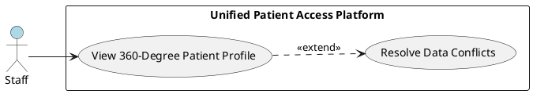

#### UC-014: Resolve Data Conflicts

- **Actor(s)**: Staff
- **Goal**: Review and resolve conflicting data across patient documents
- **Preconditions**: Staff is authenticated; 360-degree patient view contains flagged data conflicts
- **Success Scenario**:
  1. Staff views the conflict list within the 360-degree patient profile
  2. System displays each conflict with side-by-side values from different source documents
  3. Staff selects the correct value for each conflict or enters a corrected value
  4. Staff confirms the resolution
  5. System updates the patient profile with the resolved data
  6. System marks the conflict as resolved and logs the resolution in the audit trail
- **Extensions/Alternatives**:
  - 3a. Staff is unable to determine the correct value: Staff marks the conflict as "Pending Review" for follow-up
- **Postconditions**: Data conflicts are resolved; patient profile is updated; audit trail records the resolution

##### Use Case Diagram

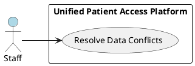

#### UC-015: Review Medical Codes

- **Actor(s)**: Staff
- **Goal**: Review and finalize AI-suggested ICD-10 and CPT codes
- **Preconditions**: Staff is authenticated; AI has processed patient data and generated code suggestions
- **Success Scenario**:
  1. Staff opens the medical coding review section for a patient
  2. System displays AI-suggested ICD-10 codes with confidence scores and source references
  3. System displays AI-suggested CPT codes with confidence scores and source references
  4. Staff reviews each suggested code against the patient's clinical data
  5. Staff accepts, rejects, or modifies each code suggestion
  6. Staff finalizes the code set
  7. System saves the finalized codes to the patient record and logs the review action
- **Extensions/Alternatives**:
  - 4a. Staff disagrees with an AI suggestion: Staff rejects the code and optionally enters the correct code manually
  - 2a. No codes generated (insufficient data): System displays a message indicating insufficient data for code suggestions
- **Postconditions**: Medical codes are finalized and stored; review action is logged in the audit trail

##### Use Case Diagram

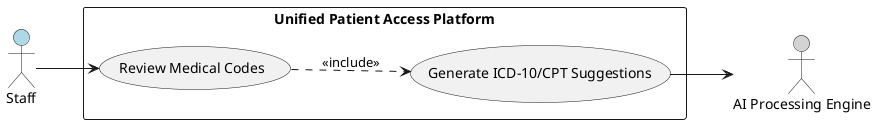

#### UC-016: Manage Users

- **Actor(s)**: Admin
- **Goal**: Create, update, or deactivate user accounts
- **Preconditions**: Admin is authenticated
- **Success Scenario**:
  1. Admin navigates to the user management panel
  2. Admin selects the desired action (create, update, or deactivate)
  3. For create: Admin enters user details (name, email, role) and system sends invitation email
  4. For update: Admin modifies user details (name, role, contact info) and saves
  5. For deactivate: Admin deactivates the account and system terminates any active sessions
  6. System logs the action in the audit trail
- **Extensions/Alternatives**:
  - 3a. Email already exists in the system: System displays error and prevents duplicate creation
  - 5a. Admin attempts to deactivate their own account: System prevents self-deactivation
- **Postconditions**: User account is created, updated, or deactivated; audit trail is updated

##### Use Case Diagram

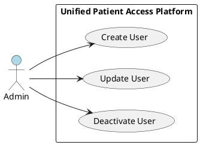

#### UC-017: Receive Appointment Reminders

- **Actor(s)**: Patient
- **Goal**: Receive timely reminders about upcoming appointments
- **Preconditions**: Patient has an active booked appointment; reminder configuration is active
- **Success Scenario**:
  1. System identifies appointments approaching configured reminder intervals (e.g., 24 hours, 2 hours before)
  2. System generates reminder content with appointment details
  3. System sends SMS reminder to patient's registered phone number
  4. System sends email reminder to patient's registered email address
  5. System logs reminder delivery status
- **Extensions/Alternatives**:
  - 3a. SMS delivery fails: System logs the failure and retries once; if still failing, relies on email channel
  - 4a. Email delivery fails: System logs the failure and retries once; if still failing, relies on SMS channel
  - 1a. Appointment is cancelled before reminder trigger: System skips reminder generation
- **Postconditions**: Patient has been notified of the upcoming appointment via configured channels

##### Use Case Diagram

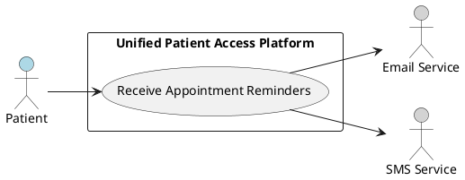

#### UC-018: Sync Calendar

- **Actor(s)**: Patient
- **Goal**: Sync a booked appointment to an external calendar (Google or Outlook)
- **Preconditions**: Patient is authenticated; patient has a booked appointment; patient has authorized calendar access
- **Success Scenario**:
  1. Patient selects "Sync to Calendar" from the appointment details
  2. Patient selects the calendar provider (Google Calendar or Outlook Calendar)
  3. System initiates OAuth authorization flow if not previously authorized
  4. Patient authorizes the application to access their calendar
  5. System creates a calendar event with appointment details (date, time, provider, location)
  6. System confirms successful sync to the patient
- **Extensions/Alternatives**:
  - 3a. Patient has previously authorized: System skips authorization and proceeds to event creation
  - 5a. Calendar API rate limit exceeded: System queues the sync request and retries with exponential backoff
  - 5b. Authorization is revoked or expired: System prompts patient to re-authorize
- **Postconditions**: Appointment event is created in the patient's external calendar

##### Use Case Diagram

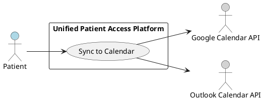

## Risks & Mitigations

| Risk                                                                                                                 | Impact   | Likelihood | Mitigation                                                                                                                                                                                                                  |
| -------------------------------------------------------------------------------------------------------------------- | -------- | ---------- | --------------------------------------------------------------------------------------------------------------------------------------------------------------------------------------------------------------------------- |
| AI extraction accuracy falls below the 98% agreement rate target, leading to incorrect patient data or medical codes | High     | Medium     | Mandatory staff verification workflow (FR-036, FR-039) ensures no AI-extracted data is finalized without human review; confidence scoring flags low-quality extractions for priority review                                 |
| HIPAA compliance gap discovered in data handling, storage, or transmission                                           | Critical | Low        | Encryption at rest (AES-256) and in transit (TLS 1.2+) per FR-042; immutable audit logging per FR-043; role-based access per FR-044; regular security reviews and penetration testing                                       |
| Free hosting platform limitations constrain scalability, uptime, or storage capacity                                 | Medium   | Medium     | Architecture designed for horizontal scaling; Redis caching layer (Upstash) reduces database load; CDN for static assets; monitoring to detect capacity limits early; migration plan to paid hosting documented for Phase 2 |
| External calendar API changes, rate limits, or deprecation disrupt sync functionality                                | Low      | Medium     | Graceful degradation pattern: calendar sync failure does not block booking workflow; retry logic with exponential backoff; fallback to ICS file download for manual import                                                  |
| Clinical document format variability (scanned images, inconsistent layouts) degrades extraction quality              | Medium   | High       | PDF format validation on upload (FR-031); supported format whitelist; clear user guidance on document requirements; extraction confidence scoring to route low-quality documents to manual review                           |

## Constraints & Assumptions

| Type       | Description                                                                                                                           | Rationale                                                                                                             |
| ---------- | ------------------------------------------------------------------------------------------------------------------------------------- | --------------------------------------------------------------------------------------------------------------------- |
| Constraint | Hosting must use free/open-source platforms only (no AWS, Azure, or paid cloud services)                                              | BRD Phase 1 budget restriction; paid cloud provisioned for future phases                                              |
| Constraint | Phase 1 excludes provider logins, payment integration, family profiles, patient self-check-in, EHR integration, and claims submission | Defined project scope boundary to deliver core value within resource constraints                                      |
| Constraint | Patient self-check-in (mobile, web, QR code) is explicitly excluded; only staff can mark patients as "Arrived"                        | Business decision to maintain centralized staff control over patient flow                                             |
| Assumption | Insurance pre-check validates against an internal predefined dummy dataset, not a real-time insurance provider API                    | Real-time insurance API integration deferred to future phase; dummy data sufficient for workflow validation           |
| Assumption | Clinical document uploads are limited to PDF format; other formats (DOCX, images) are not supported in Phase 1                        | PDF is the most common clinical document format; expanding format support deferred to reduce AI extraction complexity |
