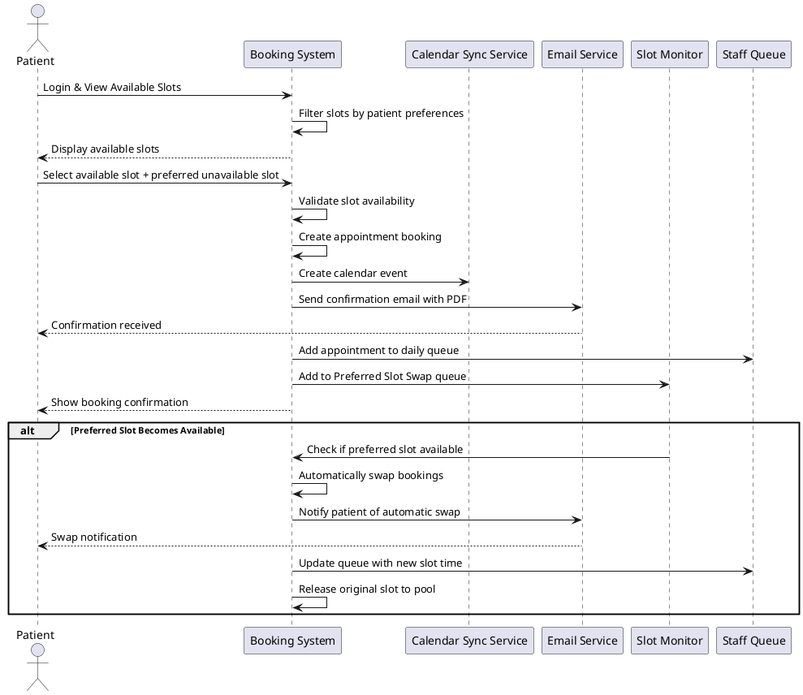
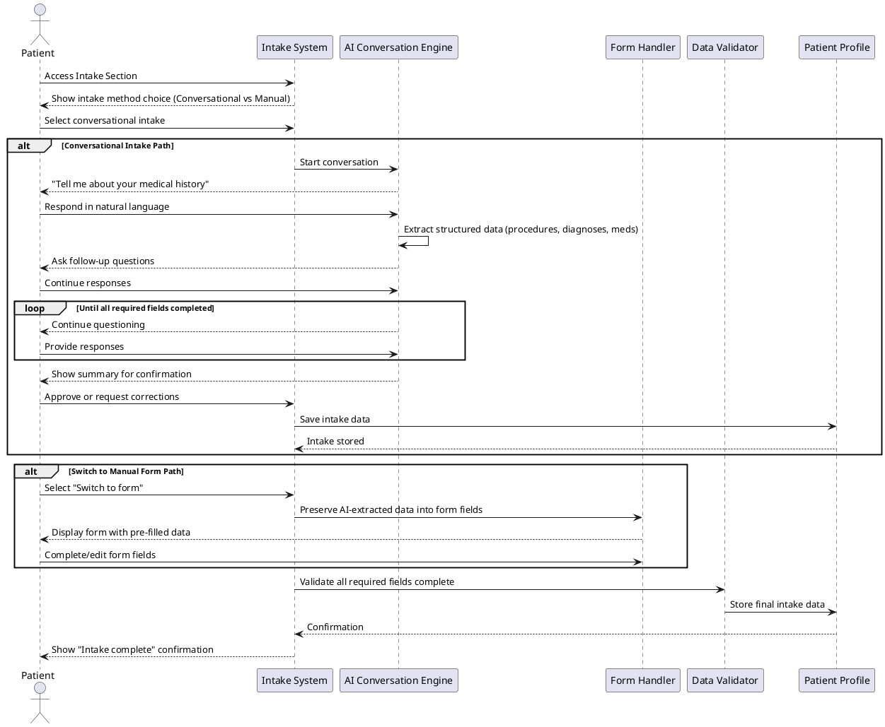
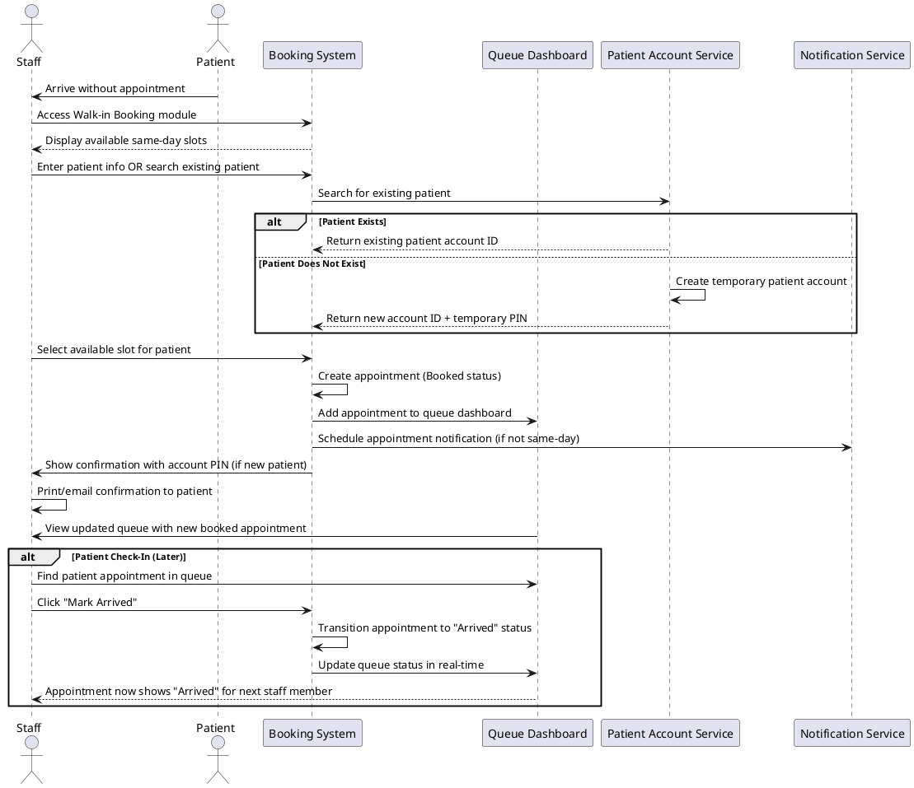
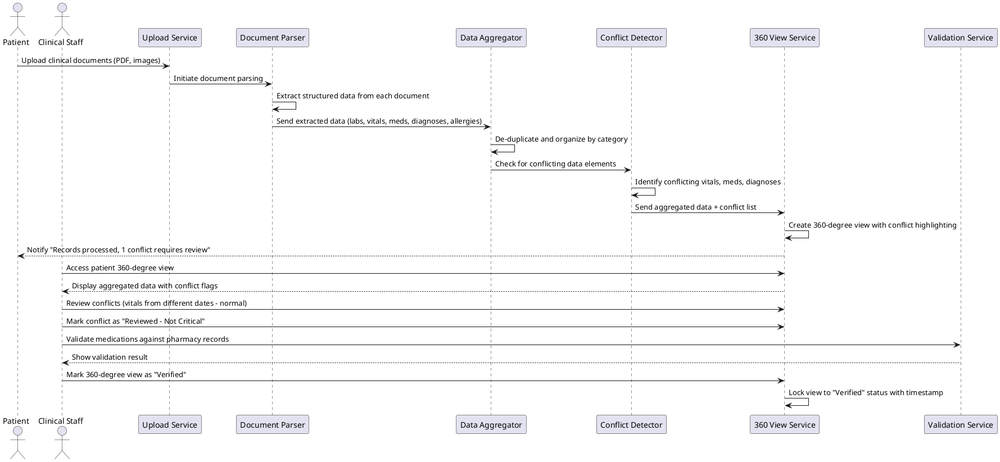
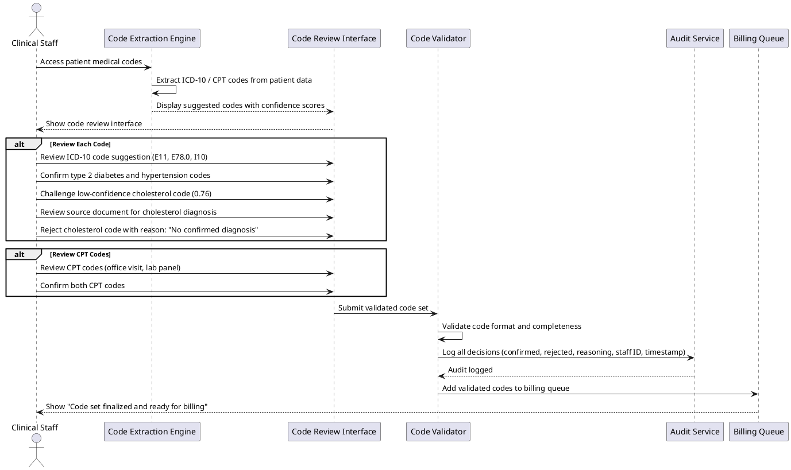
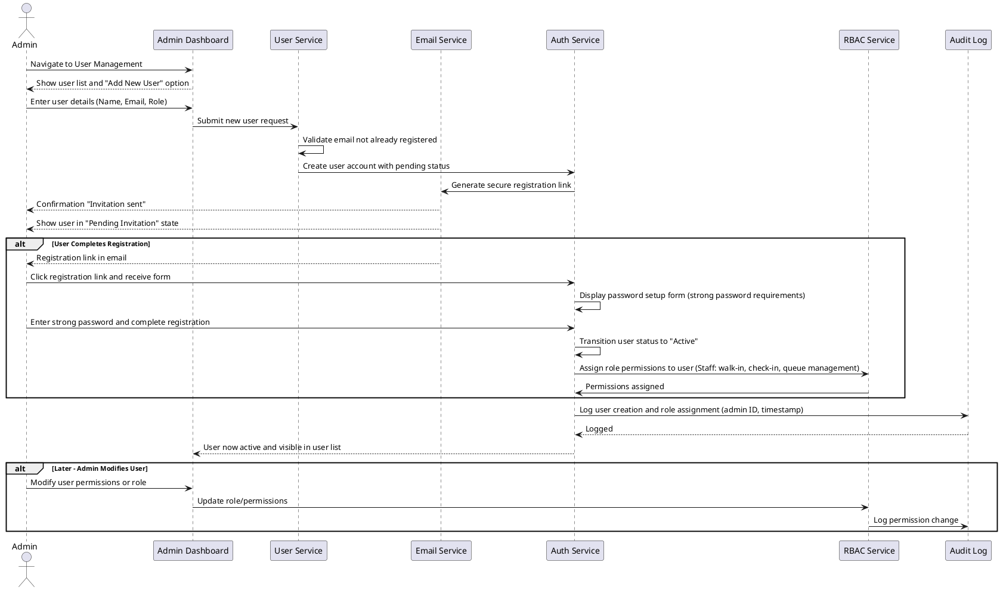
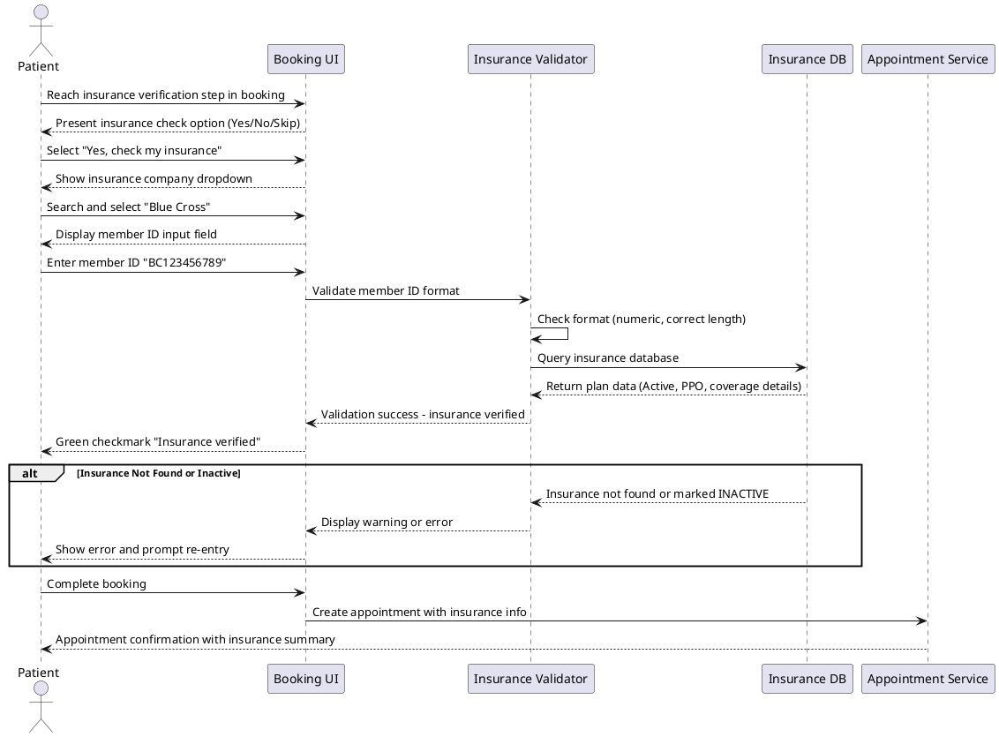
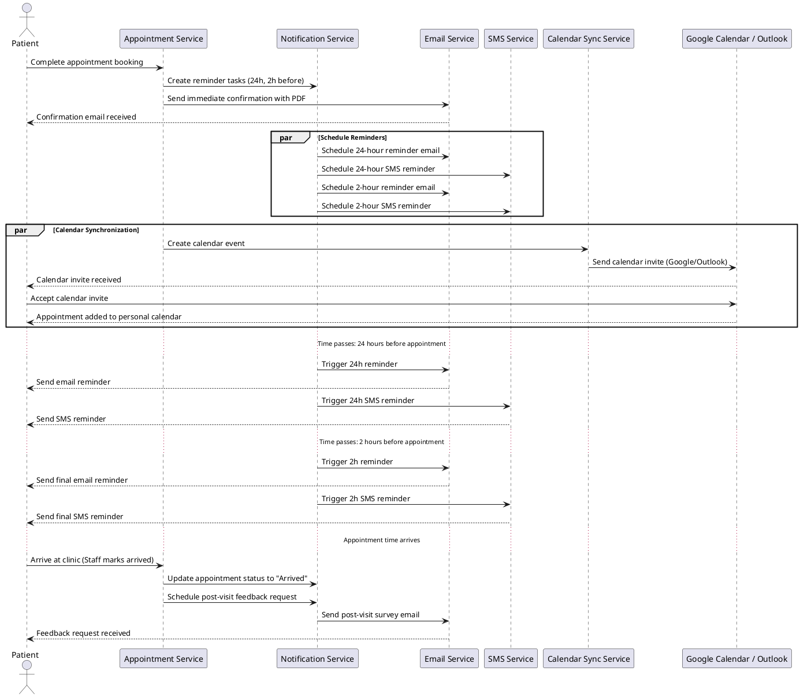

# Requirements Specification: Unified Patient Access & Clinical Intelligence Platform

## Feature Goal

Develop a unified, standalone healthcare platform that combines a modern patient-centric appointment booking system with a "Trust-First" clinical intelligence engine, enabling seamless end-to-end workflows from initial booking through post-visit data consolidation. The platform eliminates fragmented data collection, reduces no-show rates from the baseline 15% to <10%, and transforms manual clinical data extraction from 20+ minutes to a 2-minute verification task through intelligent aggregation and AI-assisted medical coding extraction.

## Business Justification

- **Operational Efficiency**: Reduction in no-show rates directly improves provider revenue and schedule utilization; automated data aggregation eliminates manual clinical prep bottlenecks
- **Clinical Safety**: Unified 360-degree patient view with conflict detection prevents medication reconciliation errors and claim denials
- **User Experience**: Flexible intake (conversational AI or manual), dynamic preferred slot swap, and intelligent reminders reduce booking friction and improve appointment adherence
- **Data Ownership**: Platform serves as de facto "single truth" for patient scheduling and clinical context, eliminating reconciliation between disparate systems
- **Market Differentiation**: "Trust-First" approach with AI-suggested codes and explicit data conflict highlighting addresses the "Black Box" trust deficit in existing AI coding solutions
- **Integration Ready**: Designed as aggregator ready for post-Phase 1 EHR and claims system integration

## Feature Scope

The platform spans three integrated subsystems serving three primary user roles:

**Subsystem 1: Patient Booking & Self-Service**

- Patients independently browse appointment availability, book preferred slots, set alternative preferred (unavailable) slots with automatic swap capability
- Flexible intake with choice between AI-conversational or traditional manual forms, editable at any time without human friction
- Receive multi-channel reminders (SMS/Email) and automatic calendar synchronization (Google/Outlook)
- Upload clinical history documents to build personal health profile

**Subsystem 2: Staff Operations & Queue Management**

- Staff (front desk/call center) exclusive capability to book walk-in appointments and manage same-day queues
- Staff-enforced patient check-in (no patient self-check-in apps, QR codes, or portal check-in)
- Immediate visibility into queue status and appointment state transitions

**Subsystem 3: Clinical Intelligence & Medical Coding**

- Automated parsing and aggregation of patient-uploaded clinical documents (PDFs, images) into unified 360-degree view
- AI-assisted extraction of ICD-10 and CPT codes with explicit conflict highlighting (competing medications, differing vital ranges)
- Clinical staff validation workflow with >98% AI-Human agreement rate as success target
- Insurance pre-check validation against predefined dummy records

### Success Criteria

- [ ] No-show rate reduced from 15% baseline to <10% within 90 days of launch
- [ ] Clinical staff reporting appointment prep time reduced from 20+ minutes to <2 minutes per patient (verification-only workflow)
- [ ] AI-suggested clinical codes achieving >98% agreement rate with clinical staff validation
- [ ] Patient satisfaction score ≥4.5/5 for appointment booking experience
- [ ] Staff reporting ≥80% reduction in administrative time per appointment booking
- [ ] ≥5,000 active patient dashboards created within first 60 days
- [ ] ≥10,000 appointments successfully booked through platform within first 90 days
- [ ] Zero HIPAA compliance incidents during Phase 1
- [ ] Platform uptime ≥99.9% with automatic 15-minute session timeout functioning correctly
- [ ] ≥2 critical data conflicts identified and flagged per 100 patient records (pilot target)

## Functional Requirements

### Module 1: Patient Account & Self-Service Intake (FR-101 to FR-107)

- **FR-101**: [DETERMINISTIC] System MUST allow patients to register with email and/or phone verification using industry-standard OTP delivery
- **FR-102**: [HYBRID] System MUST support AI-conversational patient intake with natural language understanding to gather medical history, medications, allergies, and previous procedures
- **FR-103**: [DETERMINISTIC] System MUST provide manual fallback intake form with structured fields for all conversational intake data points
- **FR-104**: [DETERMINISTIC] System MUST allow patients to switch between conversational and manual intake at any time without data loss
- **FR-105**: [DETERMINISTIC] System MUST allow patients to edit or correct intake data at any time without requiring staff assistance or approval
- **FR-106**: [DETERMINISTIC] System MUST validate patient-provided insurance company name and ID against internal predefined set of dummy insurance records
- **FR-107**: [DETERMINISTIC] System MUST display patient-completed intake summary in patient dashboard with option to update any field

### Module 2: Appointment Booking & Management (FR-201 to FR-211)

- **FR-201**: [DETERMINISTIC] System MUST retrieve and display available appointment slots based on provider schedule and capacity constraints
- **FR-202**: [DETERMINISTIC] System MUST calculate per-appointment no-show risk score based on predefined business rules (e.g., booking < 24 hours before, patient no-show history)
- **FR-203**: [DETERMINISTIC] System MUST allow patients to select and book any available appointment slot
- **FR-204**: [DETERMINISTIC] System MUST implement Dynamic Preferred Slot Swap feature allowing patients to book available slot while simultaneously expressing preference for specific unavailable slot
- **FR-205**: [DETERMINISTIC] System MUST continuously monitor for preferred slot availability and automatically swap appointment if preferred slot becomes available
- **FR-206**: [DETERMINISTIC] System MUST immediately release originally-booked slot back to general availability pool upon automatic swap completion
- **FR-207**: [DETERMINISTIC] System MUST maintain appointment waitlist with FIFO ordering and support automatic assignment to cancelled appointments
- **FR-208**: [DETERMINISTIC] System MUST generate appointment confirmation PDF and email to patient within 5 minutes of successful booking
- **FR-209**: [DETERMINISTIC] System MUST send multi-channel reminder notifications via SMS and Email at configurable intervals (default: 24 hours and 2 hours before appointment)
- **FR-210**: [DETERMINISTIC] System MUST support automatic calendar event creation and synchronization with Google Calendar and Microsoft Outlook
- **FR-211**: [DETERMINISTIC] System MUST enforce all appointment booking business rules including provider availability windows, maximum daily bookings, and minimum lead time requirements

### Module 3: Staff Operations & Centralized Check-In Control (FR-301 to FR-307)

- **FR-301**: [DETERMINISTIC] System MUST restrict walk-in appointment creation exclusively to Staff role users (front desk/call center personnel)
- **FR-302**: [DETERMINISTIC] System MUST allow Staff to create new patient account during walk-in booking process, or link existing patient to walk-in appointment
- **FR-303**: [DETERMINISTIC] System MUST display real-time queue dashboard to Staff showing all appointments for current day with status (Booked, Arrived, In-Progress, Completed, No-Show)
- **FR-304**: [DETERMINISTIC] System MUST restrict patient check-in capability exclusively to Staff users; system MUST NOT provide patient self-check-in options via mobile apps, QR codes, or web portal
- **FR-305**: [DETERMINISTIC] System MUST enforce that patient arrival status can only be changed by Staff through explicit "Mark Arrived" action
- **FR-306**: [DETERMINISTIC] System MUST allow Staff to transition appointment status through defined workflow: Booked → Arrived → Completed/No-Show/Cancelled
- **FR-307**: [DETERMINISTIC] System MUST maintain immutable audit trail of all appointment status transitions including timestamp, Staff user ID, and action description

### Module 4: Clinical Data Aggregation & 360-Degree Patient View (FR-401 to FR-408)

- **FR-401**: [DETERMINISTIC] System MUST allow patients to upload clinical documents including PDFs, image files (JPG, PNG), and scanned documents to build personal health record
- **FR-402**: [AI-CANDIDATE] System MUST parse multi-format clinical documents (PDF, image) and extract structured data elements including vitals (BP, heart rate, temperature), medications, allergies, diagnoses, procedures, and lab results
- **FR-403**: [AI-CANDIDATE] System MUST aggregate extracted data from multiple uploaded documents into unified 360-degree patient view organized by data category (vitals, medications, allergies, diagnoses, procedures, labs)
- **FR-404**: [DETERMINISTIC] System MUST implement de-duplication logic to identify and consolidate redundant data entries across multiple documents (e.g., same medication listed in multiple reports)
- **FR-405**: [HYBRID] System MUST visually highlight and explicitly flag critical data conflicts with severity levels (e.g., conflicting medication lists, vital sign ranges outside normal thresholds, contradictory diagnoses)
- **FR-406**: [DETERMINISTIC] System MUST maintain immutable audit trail showing source document and extraction timestamp for each data element in 360-degree view
- **FR-407**: [DETERMINISTIC] System MUST track AI extraction confidence scores for each data element and surface low-confidence extractions for clinical staff review
- **FR-408**: [DETERMINISTIC] System MUST allow clinical staff to validate, correct, or reject extracted data elements with change tracking and reasoning notes

### Module 5: Medical Coding & ICD-10/CPT Extraction (FR-501 to FR-504)

- **FR-501**: [AI-CANDIDATE] System MUST extract potential ICD-10 diagnosis codes from aggregated patient clinical data (medical history, diagnoses, symptoms documented in clinical notes and patient uploads)
- **FR-502**: [AI-CANDIDATE] System MUST extract potential CPT procedure codes from documented procedures, lab tests, and clinical encounters in patient records
- **FR-503**: [HYBRID] System MUST present extracted ICD-10 and CPT codes to clinical staff with confidence scores and source document references for validation review
- **FR-504**: [DETERMINISTIC] System MUST link each suggested medical code to its source document and specific data element for full traceability and audit purposes

### Module 6: Admin User & Role Management (FR-601 to FR-608)

- **FR-601**: [DETERMINISTIC] System MUST implement role-based access control (RBAC) with three role types: Patient (booking, intake, document upload), Staff (walk-in, check-in, queue management), Admin (user provisioning, reporting)
- **FR-602**: [DETERMINISTIC] System MUST enforce HIPAA-compliant data handling including encryption at rest (AES-256) and in transit (TLS 1.2+), and audit logging of all patient data access
- **FR-603**: [DETERMINISTIC] System MUST maintain immutable, tamper-evident audit logs for all user actions involving patient data, with retention ≥7 years
- **FR-604**: [DETERMINISTIC] System MUST enforce automatic session timeout after 15 minutes of user inactivity with warning notification at 14 minutes
- **FR-605**: [DETERMINISTIC] System MUST provide Admin dashboard for user account provisioning, deprovisioning, role assignment, and password reset
- **FR-606**: [DETERMINISTIC] System MUST allow Admins to create new Staff and Patient accounts with configurable default roles and permissions
- **FR-607**: [DETERMINISTIC] System MUST enforce role-based permission checks at both feature level (e.g., walk-in booking visible only to Staff) and data level (e.g., patients see only own appointments/documents)
- **FR-608**: [DETERMINISTIC] System MUST encrypt all personally identifiable information (PII) and protected health information (PHI) using industry-standard encryption algorithms with key rotation every 90 days

### Module 7: System Integration & Notifications (FR-701 to FR-704)

- **FR-701**: [DETERMINISTIC] System MUST generate and send appointment confirmation emails within 5 minutes of successful booking with appointment details, cancellation link, and insurance information
- **FR-702**: [DETERMINISTIC] System MUST send SMS reminders at configurable intervals (default: 24 hours and 2 hours pre-appointment) with appointment time, location, and cancellation/reschedule links
- **FR-703**: [DETERMINISTIC] System MUST support email notification preferences (reminders, confirmations, alerts) managed by patients in dashboard settings
- **FR-704**: [DETERMINISTIC] System MUST provide failed notification retry mechanism with exponential backoff (retry at 5 min, 15 min, 60 min intervals) before marking notification as failed

## Use Case Analysis

### Actors & System Boundary

- **Patient**: Primary user seeking to book appointments, provide health information via flexible intake, and access personal health records through 360-degree view
- **Staff (Front Desk / Call Center)**: Users exclusively handling walk-in bookings, patient check-in management, and queue operations
- **Admin**: Users managing system access, user provisioning, and user role assignment
- **External System - Calendar Provider**: Google Calendar / Microsoft Outlook systems that receive calendar invitations and sync appointment data
- **External System - Insurance Provider**: Predefined insurance record database used for soft validation of patient insurance information
- **Clinical Staff**: Internal users (subset of Staff/Admin roles) who validate extracted medical codes and patient data consolidations

### Use Case Specifications

#### UC-1: Patient Self-Service Appointment Booking with Preferred Slot Swap

**Actor(s)**: Patient

**Goal**: Patient wants to book an appointment at a preferred time slot, or if that slot is unavailable, book an available alternative while remaining on a preferred slot waiting list with automatic swap capability

**Preconditions**:

- Patient account is created and verified
- Patient has completed intake (conversational or manual form)
- At least one appointment slot is available in the system
- Patient has performed insurance pre-check or waived it

**Success Scenario**:

1. Patient logs into personal dashboard
2. System displays available appointment slots filtered by preferences (provider, date, time)
3. Patient identifies desired appointment slot and selects it
4. Patient optionally selects alternate preferred unavailable slot for automatic swap
5. System confirms booking and generates confirmation email with PDF attachment within 5 minutes
6. System adds preferred unavailable slot to Preferred Slot Swap queue
7. When preferred slot becomes available, system automatically swaps appointments: cancels current booking, creates new booking for preferred slot, and notifies patient of swap
8. Original slot is released back to availability pool
9. Patient receives appointment reminders (SMS/Email) 24 hours and 2 hours before new appointment time

**Extensions/Alternatives**:

- 3a. Patient selects slot but slot fills before confirmation: System displays "Slot unavailable - select alternative" and rerenders available slots
- 6a. Patient does not select preferred alternative slot: System completes booking without Preferred Slot Swap; booking remains final
- 7a. Patient has cancelled booking before preferred slot opens: System retains preferred slot selection; if patient rebooksanother appointment, preferred swap applies to new booking
- 4b. Patient wants to sync appointment to personal calendar: System creates calendar event and sends to patient's Google/Outlook account after booking confirmation

**Postconditions**:

- Appointment is booked and visible in Staff queue dashboard
- Patient receives email confirmation with appointment PDF
- Automatic reminders are scheduled for 24 hours and 2 hours before appointment
- If Preferred Slot Swap enabled, system continuously monitors for swap opportunity

##### Use Case Diagram - Patient Appointment Booking with Preferred Slot Swap

---

#### UC-2: Patient Flexible Intake - Conversational AI or Manual Form Selection

**Actor(s)**: Patient

**Goal**: Patient wants to provide required health information either through natural language conversation with AI or by filling traditional form, with option to switch methods or edit at any time

**Preconditions**:

- Patient account is created and verified
- Patient has not completed intake, or is editing existing intake

**Success Scenario**:

1. Patient accesses intake section of dashboard
2. System presents choice: "Start conversational intake with AI assistant" or "Use manual intake form"
3. Patient selects conversational intake
4. AI chatbot starts conversation: "Hello! I'm here to help gather your health information. Let's start with your medical history. Have you had any surgeries or major medical conditions?"
5. Patient responds in natural language
6. AI processes response, extracts structured data (procedures, diagnoses, medications), and continues with follow-up questions
7. After gathering all required fields, AI summarizes collected information and asks for confirmation
8. Patient reviews summary and can approve or request corrections
9. System stores completed intake as Patient profile
10. Patient can return to dashboard and edit any intake field (e.g., "Update medications") without chatbot assistance

**Extensions/Alternatives**:

- 2a. Patient selects manual intake form instead: System displays structured form with fields for medical history, medications, allergies, procedures
- 2b. Patient prefers manual and switches during conversation: System offers "Switch to form" button; AI-collected data is preserved in form fields
- 8a. Patient wants to edit specific conversation response: Patient clicks "Edit" on particular exchange; AI resumes conversation from that point with correction
- 10a. Patient wants to edit previous intake weeks later: Patient modifies any field directly in dashboard; system does NOT require re-running AI conversation

**Postconditions**:

- Patient intake data is complete and stored in Patient profile
- Patient can proceed to appointment booking
- All intake responses are auditable with timestamp showing conversational vs manual entry

##### Use Case Diagram - Patient Flexible Intake

---

#### UC-3: Staff Walk-In Appointment Management

**Actor(s)**: Staff (Front Desk / Call Center)

**Goal**: Staff wants to rapidly book a walk-in patient appointment, manage their queue position, and check in the patient when they arrive

**Preconditions**:

- Staff user is logged in with Staff role permissions
- At least one available appointment slot exists
- Patient may or may not have pre-existing account

**Success Scenario**:

1. Patient arrives at clinic without appointment
2. Staff accesses "Walk-in Booking" section (visible only to Staff role)
3. System displays available same-day appointment slots
4. Staff enters patient name and contact information (or searches for existing patient)
5. System finds no existing patient account
6. Staff selects available appointment slot and confirms booking
7. System creates appointment in booked state and generates temporary patient account with unique PIN
8. Staff prints or emails appointment confirmation to patient with account PIN
9. Staff returns to dashboard and sees new appointment displayed in queue under "Booked" status
10. When patient is ready to be seen, Staff clicks "Mark Arrived" for that appointment
11. Appointment moves to "Arrived" status and another Staff member can begin patient assessment

**Extensions/Alternatives**:

- 4a. Staff searches for existing patient by name/ID: System finds existing patient account and auto-populates contact info
- 6a. No same-day slots available: System displays waitlist option; Staff can add patient to waitlist for potential same-day opening
- 7a. Patient already has account: System links walk-in appointment to existing patient account instead of creating new account
- 9a. Multiple Staff users viewing queue: System updates queue in near-real-time (≤3 second refresh) so all Staff see current status

**Postconditions**:

- Walk-in appointment is added to system and visible in Staff queue
- Patient (new or existing) has confirmed appointment
- Appointment reminder emails/SMS scheduled, or deferred due to same-day nature
- Temporary patient account created (if new patient) with access to view appointment and update intake
- Appointment eligible for automatic status transitions (Arrived → Completed/No-Show)

##### Use Case Diagram - Staff Walk-In Booking

---

#### UC-4: Clinical Data Aggregation - Upload, Parse, and View 360-Degree Patient Record

**Actor(s)**: Patient (for upload), Clinical Staff (for validation)

**Goal**: Patient uploads historical clinical documents; system parses and consolidates into unified 360-degree patient view; clinical staff validates extracted data and flags conflicts

**Preconditions**:

- Patient account is created and intake is complete
- Patient has historical clinical documents (PDFs, images) to upload
- Clinical Staff user is logged in with appropriate role

**Success Scenario**:

1. Patient navigates to "Upload Clinical Records" section in dashboard
2. Patient selects and uploads 3 historical PDFs: prior year lab results, recent cardiology report, medication reconciliation from previous visit
3. System ingests documents and initiates background parsing process
4. System extracts structured data: lab values (CBC, metabolic panel), vital signs (BP=140/90, HR=82), medications (Lisinopril 10mg, Metformin 1000mg), diagnoses (Type 2 Diabetes, Hypertension), allergies (Penicillin, Sulfa drugs)
5. System creates 360-degree patient view organized by category: Vitals, Medications, Allergies, Diagnoses, Lab Results
6. System identifies potential conflict: conflicting BP readings in two documents (140/90 vs 128/85 from different dates)
7. System flags conflict with visual indicator (yellow warning icon) and tooltip: "Conflicting vital readings from different visit dates"
8. Patient receives email: "Your clinical records have been processed. 1 data conflict requires review."
9. Clinical Staff member accesses patient record and views 360-degree view with flagged conflicts
10. Clinical Staff reviews conflicting vitals, notes they're from different visit dates (normal variation), and marks as "Reviewed - Not Critical"
11. Clinical Staff validates extracted medications against patient's current pharmacy records (if available) and confirms accuracy with "Data Verified" status
12. 360-degree view is now locked as "Verified" and ready for clinical decision-making

**Extensions/Alternatives**:

- 2a. Patient uploads mixed format documents: System processes PDFs, scanned images (JPG, PNG), and automatically detects format and applies appropriate parsing engine
- 6a. Critical medication conflict detected: System flags with red alert (e.g., "Conflicting dopamine doses in two medications") and prevents clinical staff from marking verified without explicit conflict resolution
- 9a. Additional documents uploaded later: System re-parses all documents and updates 360-degree view incrementally, preserving clinical staff's previous validation notes
- 10a. Clinical staff needs to correct extracted data: Staff manually edits specific data element (e.g., corrects misread medication dose) and saves correction with timestamp and note

**Postconditions**:

- Patient clinical documents are parsed and stored in system
- 360-degree aggregated view is created and accessible to clinical staff
- Data conflicts are identified, flagged, and require review before "Verified" status
- Audit trail shows which documents contributed to each data element
- Clinical staff can begin medical coding process based on verified data elements

##### Use Case Diagram - Clinical Data Aggregation

---

#### UC-5: Medical Code Extraction and Staff Review/Validation

**Actor(s)**: Clinical Staff

**Goal**: System extracts ICD-10 and CPT codes from patient clinical data; clinical staff reviews, validates, and confirms codes for medical billing and claims

**Preconditions**:

- Patient 360-degree clinical view is created and verified
- Clinical Staff user is logged in
- Patient clinical data contains sufficient information to suggest medical codes

**Success Scenario**:

1. Clinical Staff navigates to patient record and clicks "Review Medical Codes" tab
2. System displays extracted ICD-10 diagnoses: "E11 - Type 2 diabetes mellitus" (confidence: 0.92), "I10 - Essential hypertension" (confidence: 0.88), "E78.0 - Pure hypercholesterolemia" (confidence: 0.76)
3. System displays extracted CPT procedures: "99213 - Office visit, established patient" (confidence: 0.95), "80053 - Comprehensive metabolic panel" (confidence: 0.89)
4. Clinical Staff reviews each suggested code:
   - Type 2 diabetes: Confirms, patient clearly documented with daily Metformin
   - Hypertension: Confirms, BP readings support diagnosis
   - Hypercholesterolemia: Questions (confidence only 0.76) - reviews source document, finds mention of "lipid panel recommended" but no confirmed diagnosis; rejects this code
   - Office visit: Confirms, encounter documented
   - Metabolic panel: Confirms, lab results present
5. For each rejected code, System prompts Staff to enter reason: "No confirmed lipid panel diagnosis in current records"
6. System shows: "ICD-10: 2 confirmed, 1 rejected. CPT: 2 confirmed. Final Code List Ready for Billing"
7. Staff clicks "Finalize Code Set" and system locks codes for billing workflow
8. System generates audit log: All code decisions reviewed by Staff user [ID], timestamp, reasoning for rejections

**Extensions/Alternatives**:

- 3a. Low confidence codes detected: System highlights codes <0.70 confidence with yellow warning icon; Staff can request AI re-analysis with additional context
- 4a. Staff needs to add additional code: Staff searches code database and manually adds code with justification notes
- 6a. Additional patient data available: Staff adds new document/information; system re-extracts codes and shows updates

**Postconditions**:

- Medical codes are reviewed and validated by clinical staff
- Code set is locked and ready for billing submission
- Audit trail shows all code decisions with reasoning and staff user ID
- Accuracy metrics are tracked for AI model improvement (confidence scores vs. actual staff decisions)

##### Use Case Diagram - Medical Code Review

---

#### UC-6: Admin User Provisioning and Role Management

**Actor(s)**: Admin

**Goal**: Admin wants to provision new Staff and Patient accounts, assign roles and permissions, and manage user access

**Preconditions**:

- Admin user is logged in with Admin role
- New user email address is available

**Success Scenario**:

1. Admin navigates to "User Management" dashboard
2. Admin clicks "Add New User"
3. Admin enters: Name="Jane Doe", Email="jane.doe@clinic.com", Role="Staff"
4. System validates email is not already registered
5. Admin clicks "Send Invitation"
6. System generates temporary secure link and sends email to Jane: "You have been invited to register for [Platform Name]. Click here to set your password..."
7. Jane receives email and clicks invitation link
8. System displays password setup form (requires strong password: min 12 chars, uppercase, number, special char)
9. Jane sets password and completes registration
10. System confirms Jane's Staff role in system:
    - Walk-in booking: Enabled
    - Patient check-in: Enabled
    - Admin dashboard: Disabled
    - Queue management: Enabled
11. Admin views User List and confirms Jane appears with Staff role
12. Admin can later modify Jane's permissions or deactivate account if needed

**Extensions/Alternatives**:

- 3a. Admin assigns Admin role instead: System confirms admin privileges and requires additional mandatory 2FA setup
- 6a. Bulk user import: Admin uploads CSV with multiple users; system provisioning all users in batch with templated invitation
- 10a. Admin needs to create Patient role: Administrative system prevents Patients from being created via Admin panel (Patients self-register)
- 12a. Admin deactivates user: System immediately revokes access, logs action, and preserves all audit history for deactivated user

**Postconditions**:

- New Staff user account is created with assigned role
- User receives invitation email with secure registration link
- User permissions are enforced at authentication and enforced across system
- All user creation and role assignment is auditable with admin user ID and timestamp

##### Use Case Diagram - Admin User Provisioning

---

#### UC-7: Insurance Pre-Check Validation

**Actor(s)**: Patient

**Goal**: Patient wants to verify their insurance is accepted and validate their insurance ID during booking, ensuring coverage clarity before appointment

**Preconditions**:

- Patient account is created
- Predefined insurance database contains dummy records
- Patient is in booking flow

**Success Scenario**:

1. Patient reaches booking step "Insurance Verification"
2. System displays: "Insurance Pre-Check - Is insurance coverage required for this appointment? (Optional)"
3. Patient selects "Yes, check my insurance"
4. System displays searchable dropdown of insurance companies (Blue Cross, Aetna, Cigna, Medicare, Medicaid, etc.)
5. Patient types "Blue Cross" and selects from dropdown
6. Patient enters insurance member ID: "BC123456789"
7. System validates member ID format (must be numeric, 9-12 digits for Blue Cross)
8. System queries internal predefined insurance database and returns: "Blue Cross ID BC123456789 - Plan Type: PPO - Status: ACTIVE"
9. System displays green checkmark: "Your insurance is verified and accepted. Coverage verified for appointment type."
10. Patient clicks "Continue Booking"
11. Appointment confirmation email includes insurance information summary

**Extensions/Alternatives**:

- 3a. Patient selects "No, skip insurance check": System marks insurance check as waived and proceeds with booking
- 6a. Invalid member ID format: System displays error "Member ID must be 9-12 numeric digits" and prompts re-entry
- 8a. Insurance plan not found in database: System displays "Insurance plan not found in our system. Please verify plan name and ID, or contact clinic directly"
- 8b. Insurance found but marked INACTIVE in database: System displays yellow warning "Insurance plan found but marked inactive. Eligible for appointment but payments may be denied."

**Postconditions**:

- Patient insurance is validated and recorded in appointment record
- Insurance check result (verified/waived/failed) is stored and included in appointment confirmation
- Clinical staff can see insurance status in queue dashboard for billing reference

##### Use Case Diagram - Insurance Pre-Check

---

#### UC-8: Automated Appointment Reminders and Calendar Synchronization

**Actor(s)**: Patient (recipient), System (sender)

**Goal**: System automatically sends appointment reminders via SMS and Email, and synchronizes appointment with patient's personal calendar (Google, Outlook) to reduce no-show rates and improve calendar integration

**Preconditions**:

- Patient appointment is booked and confirmed
- Patient has provided email and/or phone number for notifications
- Patient has opted in to reminders in notification preferences
- Patient has authorized (or will authorize) calendar sync connection

**Success Scenario**:

1. Patient completes appointment booking for Tuesday, April 30, 2:00 PM
2. System creates appointment confirmation task and calendar sync task
3. System immediately sends confirmation email with PDF attachment containing full appointment details
4. 24 hours before appointment (Monday 2:00 PM):
   - System sends email reminder: "Appointment Reminder: Tomorrow at 2:00 PM with Dr. Smith. Location: Clinic, 123 Main St. Reply to confirm or reschedule: [link]"
   - System sends SMS reminder: "Appointment reminder: Tomorrow 2:00 PM. Location: 123 Main St. Reply CONFIRM or CANCEL"
5. 2 hours before appointment (Tuesday 12:00 PM):
   - System sends final email reminder: "Your appointment is in 2 hours at 2:00 PM. Arrive 10 minutes early."
   - System sends SMS reminder: "Appointment in 2 hours at 2:00 PM. Arrive early."
6. If patient has authorized Google Calendar sync, system creates calendar event: "Appointment - Dr. Smith" and sends calendar invitation
7. Patient's Google Calendar automatically shows appointment with location and reminder notifications
8. At appointment time, Staff marks patient as "Arrived" or "No-Show" in system
9. Post-appointment, system sends follow-up: "Thank you for attending. How was your visit? [Feedback form]"

**Extensions/Alternatives**:

- 2a. Patient has not opted into reminders: System respects preference and skips reminder notifications; still performs calendar sync if authorized
- 4a. SMS delivery fails (invalid number): System retries at 5 min, 15 min, 60 min intervals; if still failing, sends email notification "Your reminder could not be delivered via SMS"
- 6a. Patient revokes calendar sync authorization: System stops sending calendar invites but continues email/SMS reminders
- 8a. Patient reschedules appointment: System updates calendar event and sends updated reminders based on new appointment time

**Postconditions**:

- Patient receives timely appointment reminders via preferred channels
- Patient's personal calendar is synchronized with appointment details
- Appointment reminder metrics are logged for no-show rate analysis
- Failed reminder deliveries trigger alternate notification method or alert to clinical staff

##### Use Case Diagram - Automated Reminders & Calendar Sync

---

## Risks & Mitigations

### Risk 1: HIPAA Compliance & Data Security Breach

**Risk Description**: Improper handling, encryption, or access control of patient health information (PHI) could result in regulatory violations, fines, and loss of trust.

**Mitigation Strategy**:

- Implement AES-256 encryption at rest and TLS 1.2+ in transit for all PHI
- Conduct HIPAA compliance audit before Phase 1 launch
- Implement immutable audit logging for all patient data access (retention ≥7 years)
- Enforce role-based access control (RBAC) at feature and data level
- Establish security incident response plan with breach notification procedures within 60 days

### Risk 2: AI Medical Code Extraction Accuracy Below Target

**Risk Description**: AI-generated ICD-10 and CPT codes fail to meet >98% agreement with clinical staff, leading to incorrect billing and compliance issues.

**Mitigation Strategy**:

- Start with high-confidence suggestions only (confidence score ≥0.85) in Phase 1
- Require clinical staff validation of ALL extracted codes (no auto-approval)
- Train AI model on enterprise-specific clinical documentation patterns using de-identified internal data
- Establish feedback loop: track staff-rejected codes and retrain model monthly
- Set accuracy target at >95% minimum for Phase 1 (vs. stated >98%); defer >98% to Phase 2 after sufficient validation data

### Risk 3: Data Conflict False Positives Leading to Workflow Friction

**Risk Description**: De-duplication and conflict detection logic incorrectly flags legitimate data variations (e.g., same vitals from different visit dates) as critical conflicts, overwhelming clinical staff and reducing adoption.

**Mitigation Strategy**:

- Implement date-aware de-duplication (only merge documents within 30 days; flag older conflicting data with timestamp context)
- Use severity levels (Critical, Minor, Informational) to distinguish true conflicts from normal variations
- Allow clinical staff to quickly dismiss false-positive conflicts with one-click "Reviewed - Not Critical" action
- Conduct usability testing with clinical staff on conflict highlighting UI before launch
- Monitor conflict flag volume and adjust thresholds based on staff feedback

### Risk 4: Preferred Slot Swap Feature Algorithmic Errors

**Risk Description**: Incorrect slot swap logic or race conditions cause double-booking, unreleased original slots, or swaps that fail silently, breaking patient trust.

**Mitigation Strategy**:

- Implement comprehensive unit and integration tests for slot swap state machine (all transitions: book, add-to-swap, swap, release)
- Use database transaction locks to prevent race conditions during simultaneous slot operations
- Establish automatic rollback on swap failure with patient notification email
- Add manual override for staff to manually complete swaps if automated system fails
- Monitor swap events and failure rates daily; alert on >1% failure rate

### Risk 5: Multi-Channel Reminder Delivery Failure Leading to Increased No-Show Rate

**Risk Description**: Email or SMS delivery failures due to invalid contact info, carrier issues, or service outages prevent reminders from reaching patients, negating no-show reduction strategy.

**Mitigation Strategy**:

- Implement exponential backoff retry mechanism (5 min, 15 min, 60 min) for failed deliveries
- Provide dual-channel redundancy: if SMS fails, automatic fallback to email (and vice versa)
- Validate phone numbers and emails at booking with verification step (OTP for new numbers)
- Partner with reliable SMS/Email providers (Twilio, SendGrid) with ≥99.5% SLA
- Track delivery rates and alert staff if >5% failure rate for actionable issues

---

## Constraints & Assumptions

### Technical Constraints

- **Technology Stack Lock**: Platform must use Angular 18 (frontend), ASP.NET Core 8 / Entity Framework Core (backend), PostgreSQL (database). No alternative stacks permitted during Phase 1.
- **Hosting Constraints**: Platform must deploy exclusively on free or open-source-friendly hosting (Netlify, Vercel, GitHub Codespaces, self-hosted). AWS, Azure, and other paid cloud services explicitly out of scope.
- **Free/Open-Source Only**: All auxiliary processing, utilities, and third-party tools must be free and open-source. No paid SaaS tools for document parsing, AI models, or database hosting.
- **Session Management**: Strict 15-minute session timeout with automatic logout; no session persistence across restarts.
- **Database**: PostgreSQL on free tier (Render, Railway, or self-hosted); must support ACID transactions and row-level security for RBAC enforcement.

### Business Constraints

- **Phase 1 Scope Exclusion**: No provider logins, no direct EHR integration, no payment gateway, no family member profiles, no bi-directional claims submission. These defer to Phase 2+.
- **Insurance Pre-Check**: Limited to soft validation against predefined dummy insurance records (not real insurance verification API). Real-time eligibility checking deferred to Phase 2.
- **Document Parsing**: Multi-format support (PDF, images) required, but initial AI model trained on synthetic data; real clinical accuracy improves post-Phase 1 with enterprise data.
- **Timeline**: Phase 1 must launch within 6 months with core features (booking, intake, clinical aggregation, medical codes) functional but not all edge cases handled.

### Stakeholder Assumptions

- **Patient Adoption Assumption**: Patients will voluntarily upload historical clinical documents if incentivized (e.g., faster appointment prep, improved clinical outcomes messaging). No mandate assumed.
- **Staff Capacity Assumption**: Staff can handle AI code validation workflow without additional headcount; 2-minute per-patient verification time is achievable with proper UI/UX design.
- **AI Trust Assumption**: Clinical staff will validate AI-generated code suggestions only if confidence scores and source document traceability are clearly presented (not "black box" model).
- **Calendar Sync Assumption**: Majority of patients (>70%) use Google or Outlook calendars; mobile calendar app sync (iOS Calendar, Outlook app) will auto-sync via calendar provider.

### Data & Integration Assumptions

- **Multi-Format Document Parsing**: System assumes uploaded PDFs and images can be reliably parsed using open-source OCR and PDF libraries (Tesseract, pdfplumber). Highly scanned/handwritten documents may have >10% extraction error rate.
- **External System Availability**: Google Calendar, Outlook, and SMS/Email service providers assume ≥99.5% uptime; no SLA compensation if providers experience outages.
- **Patient Data Fidelity**: Assume patients will provide accurate medical histories and contact information. No real-time verification against external medical records or pharmacy systems.
- **Predefined Insurance Database**: Assume predefined insurance records can be manually curated and updated quarterly without requiring real-time insurance validation API.

---

## References & Compliance Standards

- **HIPAA Compliance**: All requirements follow Health Insurance Portability and Accountability Act requirements for Protected Health Information (PHI) handling, encryption, audit logging, and breach notification.
- **ICD-10 & CPT Standards**: Medical code extraction follows ICD-10-CM diagnosis code standards and CPT procedure code standards for US healthcare billing.
- **OWASP Top 10**: Platform built with security guardrails addressing injection prevention, broken authentication, sensitive data exposure, XML external entities, broken access control, security misconfiguration, cross-site scripting, insecure deserialization, using components with known vulnerabilities, and insufficient logging/monitoring.
- **Accessibility Standards**: Platform will follow WCAG 2.1 Level AA standards for web accessibility to ensure patients and staff with disabilities can use all features.
- **State Regulations**: Platform complies with state telemedicine and virtual health regulations where applicable (deferred to Phase 2 for actual telehealth visit features).
